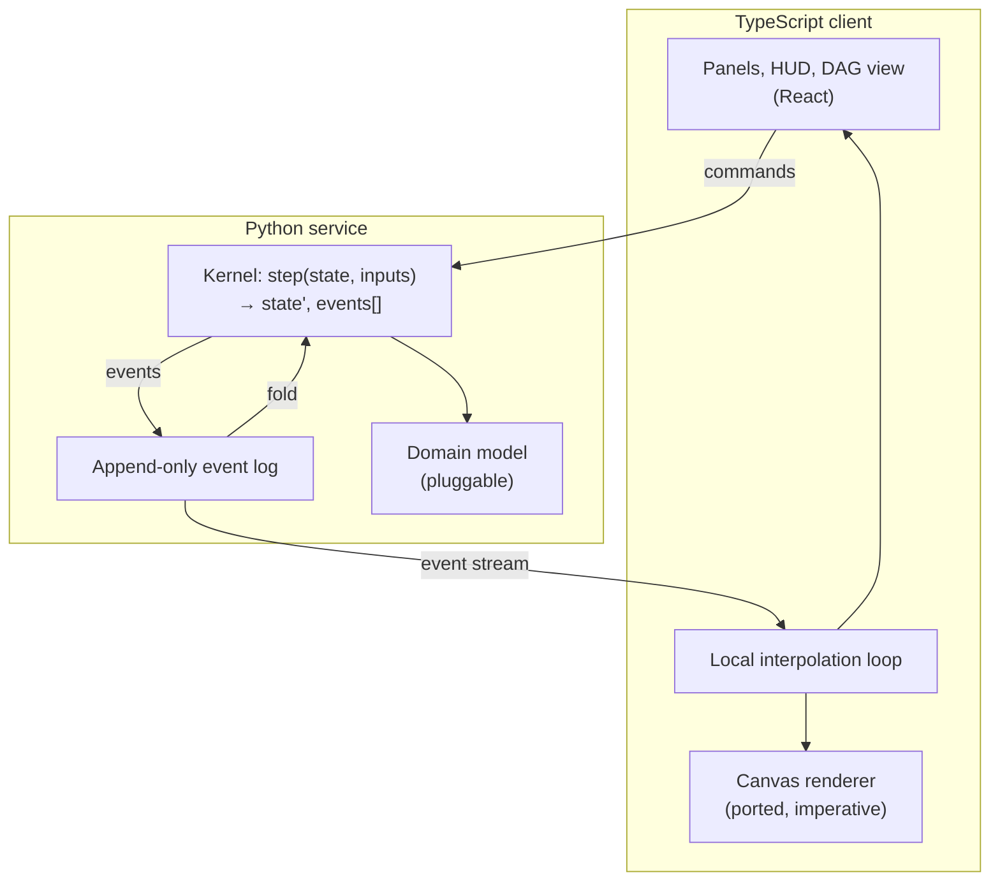
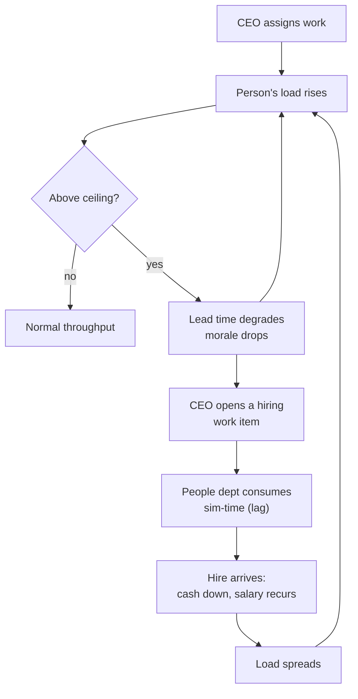

# Company OS — Platform Requirements (Phase 1)

## Summary

Rebuild the Company OS prototype as a real Python service plus a TypeScript client, with the simulation reshaped into an event-sourced kernel the CEO acts inside one continuous world. Phase 1 adds what the prototype lacks to make a run mean something: recurring departmental workload, a capacity-and-hiring loop, an animated workflow DAG, a live HUD carrying trajectories and pressure signals, a bounded run that can end in insolvency, and a report at the end that resolves back to the events that produced it. Phases 2–4 (agent team, company initialization, e-commerce strategy) are recorded as roadmap constraints Phase 1 must not foreclose, not as buildable scope.

---

## Problem Frame

`company-os.html` already proves the mechanic. Work stalls at decision points until the CEO answers, delegation is visible as a director walking to his specialist's desk, bypassing that director costs morale and records him as not knowing, and deliverables carry provenance. `test/harness.js` asserts these against the shipped code.

Four walls stop it from becoming a product. Nothing persists, so every run is Day 1. All state is one client-side object, so LLM agents with per-department memory have nowhere to live and no place to keep API keys. Every metric moves by a flat authored delta, so the simulation replays consequences someone wrote rather than producing outcomes nobody scripted. And the world runs dry: the eight authored work items total 176 hours of effort, which roughly six non-director staff clear in three or four business days, so there is no sustained pressure for a capacity mechanic to act against and nothing to project across a year.

The prototype's authored data structures are the starting schema of the service that replaces it: `ROOM_PLAN`, `PEOPLE`, `ITEMS`, `METRICS`, the `VOICE` conversation table, and the `S` state object. The port is a reshaping of working code, not a greenfield build.

One caveat bounds that claim. The floorplan, desk slots, seat assignments, and spawn point are not authored — they are generated at runtime from the browser viewport, and a resize re-plans the floor and clears in-flight paths. The service has to author what the client currently derives.

---

## Key Decisions

**Python backend, TypeScript frontend.** The backend and agent layer are Python for the Phase 2 agent ecosystem and Phase 4's numeric modeling. The cost is real and accepted: roughly 600 lines of working simulation logic get rewritten, and the kernel can never be shared with the client. The salvage is that `test/harness.js`'s 29 assertions are a behavioral specification — port the assertions, not the code.

*Rejected alternative: a TypeScript kernel with a Python sidecar.* Keeping the simulation in TypeScript on the server and calling Python only for the Phase 2 agent layer and the Phase 4 domain model would avoid the rewrite, keep the kernel shareable with the client, and let the floor planner and pathfinder exist once for both sides. The decision-points-only agent rule makes that process boundary cheap. It is rejected on operator preference for a single backend language, not on a Phase 1 need — no Phase 1 requirement demands that the kernel itself be Python, and the floorplan and pathfinding code the split would have shared is an additional port cost not counted in the 600 lines.

**The kernel is event-sourced.** Advancement is a pure function from state and inputs to a new state plus an ordered list of events. Persisted state is the fold of an append-only log. This is kept even though Phase 1 has no commit boundary that needs it, because it is what makes Phase 4's strategy branching a timeline action rather than an architectural change, and because it makes "why did the simulation say that" answerable by traversing the log.

**One continuous world.** There is no sandbox mode and no committed run. The CEO walks, talks, and assigns in the same world the clock runs in; Start unpauses. Phase 4 branching therefore becomes an explicit "fork from day N" action over the log, not an implicit snapshot at a mode boundary.

**The deterministic engine drives time; agents decide.** "Every character is an agent" resolves to: the engine advances the clock, moves people, and burns effort, while agents are invoked only at decision points, conversations, and reassignments. Continuous time multiplied by per-tick model calls fails on both latency and cost. The prototype's existing stall-at-checkpoint mechanic is the hook — an agent turn is the same shape as a pending CEO decision, so Phase 2 adds a producer rather than redesigning the loop.

**Capacity is a soft ceiling.** Over-assignment is permitted and degrades throughput and morale; it does not lock assignment. A hard block teaches a rule, while a penalty makes the CEO weigh the cost against hiring. Hiring through the People department introduces a lag before relief arrives.

This is the first mechanic in the simulation intended to produce outcomes nobody scripted, and that only holds if the degraded signals feed back. In the prototype morale and lead time are written and displayed but read by nothing — only `visibility` gates behavior. R38 closes the return path, and R42 gives the CEO a response that does not cost cash, so overload is a tradeoff rather than a rule that always resolves by hiring.

**The renderer is preserved, not rebuilt.** The canvas and sprite code carries over as an imperative TypeScript module outside the UI framework's render cycle. Rebuilding runtime-generated sprite sheets, baked lighting, and depth sorting as components would degrade the one part of the prototype that is already finished.

**Movement is transmitted as intent.** Because the server is authoritative and pathfinding is logical, the server sends an actor, a resolved path, and a start sim-time. The client interpolates at display framerate. Per-frame position streaming is never on the table.

**The client owns the CEO; the server owns everyone else.** Staff follow server-resolved paths. The CEO does not: the client owns their position and moves them free-form from WASD or arrow keys, exactly as the prototype does, and walking within talk range opens a conversation. This is a deliberate exception to server authority, taken because the CEO's avatar is the product's primary input device and a round-trip per keypress would degrade the one interaction the product is built around.

The exception is safe here because the MVP is single-user and local-first — there is no adversary, and the CEO has no incentive to misreport their own position. The residual risk is a bug rather than an attack: a position-versus-state race could silently mis-record tacit knowledge, which is the product's differentiator. So the resolution command carries the CEO's claimed position and the server validates it against the target's position at that tick, rejecting impossible claims. That is a correctness guard, not a trust boundary, and it becomes a real trust boundary only if hosting ever arrives.

**The world grid is fixed at genesis.** Grid dimensions, room rectangles, desk slots, and the spawn point are chosen once when a run is created and recorded in the log, so the server can own seats and resolve paths. The client adapts to its viewport by choosing an integer zoom and panning a camera, never by re-planning the floor. The prototype does the opposite — it re-derives the whole world from the window on every resize — so this is a real change, and it is what makes persistence, replay, and mid-path resume coherent.

**The office is both stage and audit surface.** The pixel office is where the CEO acts, and replaying it is how a decision's origin becomes legible. This is what keeps the office on the founder-decision-support path instead of making it decoration.

**The DAG answers what the office cannot.** The office shows who is doing what, one room at a time. The DAG shows the prerequisite and unlock chain across departments at a glance — which work is gated on which deliverable, and which path through the backlog is blocked. Without that question to answer it would be a second work-status view competing with the office, so it carries its own exit test rather than shipping as polish.

**The DAG takes the stage; a strip keeps it present.** Acting and orienting are different jobs at different cadences, so the two views do not want equal weight at the same time — a split leaves both cramped and a panel tab leaves the graph unusable. The DAG therefore replaces the office on the stage when opened. What makes that safe is the chain strip: the graph collapsed to one pip per item, carrying the same status encoding, visible in both modes. A severed chain shows while the CEO is still standing in the office, so the DAG is opened to learn what is downstream of the stoppage, never to learn that something stopped. Requiring the encoding to survive that collapse is also what forced it to be legible without colour.

**Work is recurring load plus discrete projects.** Each department carries a baseline workload that regenerates every business day — tickets, invoices, order entry — and consumes capacity whether or not the CEO does anything. The authored work items sit on top as projects competing for the same hours. This is what makes the ceiling real: baseline load is the floor the department already sits near, so every project is a choice to push past it. Without it the capacity mechanic has nothing to act against, because the authored backlog empties in under a week.

One metric stops being authored as a result. `manualHours` is derived from the sum of every department's recurring draw rather than set by hand, so automating work lowers it by actually removing hours from a department's day instead of applying a written delta. That is a direct answer to the third wall for one of the five metrics, and its cost is real: the harness assertions that pin exact metric arithmetic get rewritten rather than ported.

**A run is bounded and can be lost.** A run has a configured horizon and ends when it is reached, or immediately if cash crosses zero, whichever comes first. The horizon gives Phase 4 a common point at which to diff strategy branches; insolvency makes the burn rate genuinely dangerous rather than a number that drifts.

**Phase 1 has no revenue, so the draw carries the payback.** Nothing in Phase 1 increases cash — the prototype starts at 4800K, burns a flat 18K per day, and its only cash-bearing decisions cost 120K, 60K and 40K. Revenue arrives in Phase 4 behind the R15 interface. Left there, the economy is one-directional: returning work to the backlog is free while hiring costs cash forever, so the rational CEO never hires, F3 is a flow nobody runs, and insolvency reads as "you hired" rather than as a decision.

The fix uses two requirements that already exist. A department's recurring draw is staffed work, so it carries into the daily fixed cost — which means a decision that reduces the draw under R49 also reduces the burn. Automating work now pays back in cash rather than only in a metric, hiring is an investment against a shortened runway, and the horizon must be authored below the no-hire runway or insolvency arrives first and the horizon is unreachable. It also gives the report a payback line to show.

**The report is what leaves the app; the HUD is what you steer by.** At termination a run produces a report folded from the event log, and every claim in it resolves to the event that produced it, playable back in the office. This is the surface the event-sourced kernel and the office-as-audit-surface decision were both for — without it, both bought a capability nothing uses. During the run the HUD carries trajectories rather than bare numbers, plus runway, per-department capacity heat, and decision pressure. Its composition is the CEO's to configure, and that preference is not simulation state: it never enters the event log, or replays would start carrying someone's panel layout.

**Decision supply, not just work supply, bounds the horizon.** R47 makes capacity consumption sustainable, but nothing regenerates decisions: the eight authored items carry nine checkpoints between them, all reachable in the first days of a run. A horizon of months would therefore be hundreds of sim-days of burn and capacity heat with nothing for the CEO to decide, emptying both the decision-pressure signal and the report's decision section. So the Phase 1 horizon is bounded to the span the authored checkpoint supply actually covers, and long-horizon decision supply is a Phase 3 dependency — Phase 3 is where the work that actually flows arrives.

**Phase 1 numbers are authored, not modeled.** Capacity ceilings, degradation curves, morale movements, salary levels, and every metric delta are tuning constants, not the output of a model. The credibility mechanic that would justify them is Phase 4. Every surface that shows load, morale, or a metric delta says so, because a founder shown a red department will otherwise read a projection where none exists. The prototype stated on screen what was not real; Phase 1 keeps that discipline exactly where it starts adding authoritative-looking numbers.

**The scripted conversation layer ports as-is.** `VOICE` and `ASK_MAP` move to the server unchanged, so F2's in-person path keeps working. Real conversation is Phase 2. Naming this matters because the prototype's README ranks the conversation API as the highest-value next move, and this document reorders it — without an explicit owner the layer would be neither ported nor deferred.

**Phase 1 trades away zero-install distribution.** Today the product is one file that opens offline with no build step and no dependencies. After Phase 1 a demo needs Python, Node, a build, and a running server. That is a real regression for a demo surface and for drive-by contributors, so `company-os.html` stays runnable as the zero-install demo artifact until the ported renderer meets the visual-parity criterion.

### Stack

| Component | Pick | Why |
|---|---|---|
| Backend | FastAPI | Async-native for the live loop and later agent calls; typed request models |
| Persistence | SQLAlchemy over SQLite, Postgres-compatible | Clone-and-run for an open-source MVP; no migration when hosting arrives |
| Transport | WebSocket for the event stream, REST for commands and run management | Events are push; CEO actions are request/response and want plain status codes |
| Frontend | React + Vite + TypeScript | Largest contributor pool for an open-source project; Vite keeps the canvas module unbundled from framework concerns |
| Client state | Thin store (Zustand or equivalent) | Panels read streamed state; no reducer ceremony over a server-authoritative model |
| Renderer | Existing canvas module, ported | Already complete and already tested |

### Architecture

---

## Actors

- A1. **CEO** — the human player. Walks, talks, assigns, resolves decision points, hires, reassigns mid-run.
- A2. **Director** — a department head. Receives delegated work and walks it to a specialist. Records whether they were informed.
- A3. **Specialist** — staff who execute work items and raise decision points they cannot resolve.
- A4. **Kernel** — advances the clock, moves actors, burns effort, applies effects, emits events.
- A5. **Agent (Phase 2)** — an LLM-backed decision maker bound to a person, invoked at decision points and conversations. Not built in Phase 1; the kernel's input contract must accommodate it.

---

## Requirements

### Simulation kernel

- R1. Advancement is a pure function: given a state and pending inputs, it returns the next state and an ordered list of events.
- R2. Every state mutation is expressed as an event appended to an ordered log, and persisted state is the fold of that log.
- R3. Every value the kernel cannot recompute enters it as an input event appended to the log — seeded-generator draws, wall-clock reads, and in Phase 2 each agent decision with its prompt and model identifier. Replay reads those values from the log rather than regenerating them.
- R4. The kernel runs headless with no rendering or transport dependency, so tests, the live loop, and a fast-forward can all drive it.
- R5. Work does not progress while a decision checkpoint is unresolved.
- R6. A checkpoint resolved in person records tacit knowledge; the same checkpoint resolved from the tray does not.
- R7. Deliverables record their provenance — the work item, the assignee, and the decisions that shaped them.
- R8. Unlock gates hold: an item gated on a prerequisite item or a visibility threshold stays unavailable until the gate clears.
- R9. The log and kernel permit forking a run at an arbitrary event index. The fork interface itself is out of Phase 1 scope.
- R35. Sim-time advances only in fixed quanta recorded at run creation. Every event carries its tick index, and continuous quantities — the clock, burned effort — are derived from tick count rather than accumulated from a wall-clock delta. Elapsed real time decides only how many quanta to run.
- R36. Grid dimensions, room rectangles, desk slots, and the spawn point are chosen once at run genesis and recorded in the log.
- R37. The pending-input contract is producer-agnostic: a decision resolution carries a resolver identity and never assumes human origin. In Phase 1 every decision point is human-resolved, because no other resolver exists; marking which decision classes escalate to the CEO versus resolve autonomously is a Phase 2 capability this contract exists to permit.
- R38. At least one degraded signal feeds back as a kernel input. Morale below a threshold for a named number of consecutive business days reduces a person's effective effort burn rate, and a longer run below it triggers attrition that removes the lowest-morale non-director in that department, so load can rise without a CEO action.
- R56. Morale is per-person state; the company `morale` metric is the roster aggregate. R38's thresholds read the individual's value, so a single overloaded specialist cannot slow every employee or trigger attrition among people who were never overloaded.
- R57. The burn-rate multiplier R38 applies has a floor, and hiring work items are exempt from morale-driven degradation. Without both, the recovery lever slows exactly when it is needed and a single attrition event can start a spiral no CEO action can arrest.
- R58. Sim-time quantities derived from tick count include actor position and arrival, not only the clock and burned effort. Walk speed is expressed in tiles per sim-hour so a path's arrival tick is computable from its start sim-time, which R34's replay and R44's validation both require.

### Backend service

- R10. The server owns the authoritative clock and state; the client never mutates simulation state directly.
- R11. The client receives simulation events as a stream and issues CEO actions as commands.
- R12. A run persists across process restarts and browser reloads, resuming at the same sim-time.
- R13. Staff movement is transmitted as intent — an actor, a resolved path, and a start sim-time — never as per-frame positions.
- R43. The client owns the CEO's position and drives it from WASD or arrow keys; walking within talk range opens a conversation. The client submits that position as an input event per R3 on each tick quantum in which it changed, so resume and R53 replay reproduce the CEO's track rather than placing them only at decision moments. CEO movement scales with the speed multiplier, so a walk costs the same sim-time and keeps the same relative speed against staff at every multiplier.
- R44. A decision resolution carries the CEO's claimed position and the tick index the client was rendering. The server validates against the target's position at that recorded tick and rejects only claims outside a stated staleness window, so a correct in-person resolution is not rejected because the target stepped away while the command was in flight.
- R14. Time is continuous and pausable, with speed multipliers, in one world and one clock. There is no separate setup mode.
- R15. Metric effects apply through a replaceable domain-model interface, so Phase 4 can substitute a demand model without touching the kernel.
- R39. The server binds to `127.0.0.1` by default. Binding to any non-loopback address is entering the deferred hosting-and-authentication scope, not a configuration knob available in Phase 1 — the command surface lets a client hire, reassign, and steer a run, and nothing authenticates it.
- R40. A rejected command surfaces a user-facing reason rather than failing silently.
- R50. A run's horizon is chosen once at genesis and recorded in the log alongside the tick quantum and grid, immutable for the life of the run and inherited unchanged by any fork. A run terminates when the horizon is reached.
- R51. A run terminates if cash crosses zero. Insolvency is evaluated at tick boundaries: the quantum in which cash crosses completes in full, and termination is the last event of that quantum.
- R52. Termination produces a run report folded from the event log: metric trajectories, the decisions taken and their consequences, deliverables produced, and where capacity bound. Per decision it records the resolution path — in person or from the tray — the tacit line surfaced if any, and which directors were bypassed or left uninformed. In Phase 1 every metric number is authored tuning, so that provenance trail is the report's most defensible content.
- R53. Every claim in the report resolves to the event that produced it, and that event is playable back in the office.
- R61. The report names the rules version it was produced under, since runs are disposable across tuning changes, and carries R41's authored-tuning marking on every number — its reader is not the operator and has no access to this document's caveats.

### Frontend client

- R16. The pixel renderer is an imperative TypeScript module living outside the UI framework's render cycle.
- R17. The client interpolates actor movement locally at display framerate between server events.
- R18. Visual parity with the prototype holds at a given grid size: floorplan generation, four facings by three walk frames, depth sorting, baked lighting, integer-zoom nearest-neighbour scaling. Parity is judged against the same grid, not against a floor refitted to each window.
- R19. Panels, metrics, and the activity log render from streamed state.
- R54. The live HUD carries each metric's trajectory rather than only its current value, plus runway in days at the current burn, per-department capacity heat on the load ramp, and decision pressure — how many decisions are pending and how long each has waited.
- R62. Each metric declares its favourable direction, and trajectory treatment follows it: falling is the win for `manualHours` and lead time, rising for cash, morale and visibility. A uniform rising-is-good rule would render R49's automation gain as a regression. A trajectory with fewer than two points renders as a flat neutral state, not an empty chart.
- R63. Decision pressure renders in neutral chrome, never the reserved amber. It aggregates the same fact the beam signals, so the intuitive colour is the one hue the design system reserves for a person waiting on the CEO.
- R55. HUD composition is configurable: the CEO chooses which visualizations are present and in what order, from a defined default arrangement. Runway and decision pressure cannot be removed — a CEO who hid them could lose a run to insolvency with no on-screen warning. This preference is not simulation state, is never written to the event log, and persists in client-local storage keyed per user rather than per run.

### Capacity and hiring

A department means a director plus their direct reports — the reporting line, not the room. A room in `ROOM_PLAN` is a seating unit; the roster deliberately mismatches the two, seating Priya in Accounting while she reports to the Administration director. R28's bypass rule already reads the reporting line, so membership follows it everywhere.

That definition yields four load-bearing departments on the Phase 1 roster — Sales, Administration, Customer Support and People — because no reporting line roots in an accounting director. A work item's department is its assignee's, so the two items authored as `dept: 'accounting'` belong to Administration. Draw, aggregate load and the DAG's owning-department signal all count those four.

- R20. A person holds an ordered queue of assigned items and burns effort on the head item only. Workload is the sum of remaining effort in that queue plus their share of the department's baseline draw, measured against their available hours.
- R21. A department surfaces the aggregate load of its members on a green-through-red scale that never passes through the amber reserved for a pending decision.
- R22. Load above the ceiling is permitted and degrades throughput and morale; it never blocks assignment. Over-ceiling load multiplies the head item's burn rate down rather than splitting effort across the queue.
- R23. Hiring is a work item routed through the People department and consumes sim-time before the hire arrives.
- R24. A hire costs cash on arrival and adds a recurring salary to the daily fixed cost.
- R25. The floor planner guarantees a hire a desk inside their own department, adding a desk row or tightening spacing as the roster grows. When the department's room cannot fit another desk, the hire is refused with a reason rather than seated on an arbitrary tile.
- R41. Every surface that shows load, morale, a metric delta, or any forward-looking derived value — runway and trajectories included — marks it as authored tuning rather than a modeled projection. The rule travels with the report, whose reader is not the operator.
- R47. Each department carries a recurring baseline workload that regenerates every business day and consumes capacity whether or not the CEO assigns anything. The draw is allocated across the department's members as hours deducted from each member's available hours before queue effort burns, so it enters R20's workload measure directly. Draw unconsumed at day end expires rather than accumulating — it raises that day's load signal only, so the ceiling is a pressure rather than a trapdoor.
- R48. Authored work items are discrete projects layered on top of baseline load and compete with it for the same hours.
- R49. Department draws are authored from department capacity, and `manualHours` is derived from their sum converted to the unit the metric displays. A decision that automates work lowers it by reducing a department's draw. The metric's starting value and display scale are re-authored as a consequence, replacing the prototype's authored 420 h/mo against a maximum of 500.
- R59. Every authored option effect that currently moves `manualHours` instead names the department and the recurring-draw reduction it produces, in the unit the metric displays. Fourteen effects do so today, and their prompt copy quotes the figures verbatim, so the copy is generated from that number rather than authored separately — otherwise the report's decision consequences will not reconcile with its own `manualHours` trajectory.
- R60. A department's recurring draw is staffed work and carries into the daily fixed cost, so reducing a draw under R49 also reduces the burn rate.

### Mid-run steering

- R26. The CEO may reassign an in-flight work item to another member of the same department — same reporting line — while the clock runs.
- R27. Cross-department reassignment is rejected.
- R28. Assigning directly to a specialist while bypassing their director costs morale and records the director as not knowing.
- R42. The CEO may return an assigned or in-flight item to the backlog while the clock runs, retaining effort already burned. This is the response to overload that costs no cash.

### Workflow DAG view

- R29. A DAG view renders work items as nodes and prerequisite and unlock relations as edges, folded from the same state as the office.
- R30. Node appearance reflects live status — backlog, assigned, in progress, blocked on a decision, complete — and animates on transition. Status is encoded by border form plus a glyph, not by fill colour: the plate already spends colour on the department stripe and the load bar. Hue is a secondary cue only, and each state reuses an existing semantic slot for the meaning it already carries. Blocked never uses the amber reserved for a person waiting on the CEO.
- R31. The DAG surfaces the capacity signal of each node's owning department, on the same scale as the office, so an overloaded path is visible without opening the office.
- R45. Edge appearance derives from the source node's status: solid when upstream delivered, dashed when upstream is still open, severed when a decision blocks that path. Reading the graph tells the CEO where work can flow without opening a node.
- R46. The stage renders either the office or the DAG, toggled, so each gets the full stage rather than half of it. A chain strip persists in both modes, showing one pip per work item in dependency order under the same status encoding, so a blocked chain is visible without leaving the office.

### Testing and parity

- R32. The 29 assertions in `test/harness.js` are ported to a Python suite asserting against the kernel.
- R33. Sprite-grid validation is retained alongside the ported renderer.
- R34. A replay test asserts that re-folding a persisted log yields state identical to the original run.

### The capacity loop

---

## Key Flows

- F1. **Assign and stall**
  - **Trigger:** CEO assigns a work item to a specialist.
  - **Actors:** A1, A3, A4
  - **Steps:** Kernel emits an assignment event; the specialist walks to their desk and burns effort; at the checkpoint threshold the kernel emits a decision-raised event and freezes that item's progress.
  - **Outcome:** Work is visibly blocked in both the office and the DAG until the CEO answers.
  - **Covered by:** R1, R5, R13, R30

- F2. **Resolve in person versus from the tray**
  - **Trigger:** A decision point is open.
  - **Actors:** A1, A3
  - **Steps:** CEO either walks within talk range and resolves in conversation, or resolves from the tray without moving.
  - **Outcome:** Both apply the option's effects; only the in-person path records the tacit-knowledge line, and only that path makes it queryable later.
  - **Covered by:** R6, R7

- F3. **Overload and hire**
  - **Trigger:** CEO assigns work to a department already near its ceiling.
  - **Actors:** A1, A2, A3, A4
  - **Steps:** Load crosses the ceiling; the department signals red in both views; throughput degrades and morale drops; CEO opens a hiring item; the People department consumes sim-time; the hire arrives, is seated, and takes load.
  - **Outcome:** Cash falls, daily fixed cost rises, and lead time recovers only after the lag.
  - **Covered by:** R20, R21, R22, R23, R24, R25, R31

- F4. **Reassign mid-run**
  - **Trigger:** CEO reassigns an in-flight item while the clock runs.
  - **Actors:** A1, A2, A3
  - **Steps:** Command is validated against the item's department; on success the prior assignee stops, effort already burned is retained, and the new assignee walks to their desk and resumes.
  - **Outcome:** Progress carries over; a cross-department attempt is rejected without mutating state.
  - **Covered by:** R26, R27

- F5. **Resume a run**
  - **Trigger:** CEO reopens the client after a reload or a server restart.
  - **Actors:** A1, A4
  - **Steps:** Server folds the persisted log; client subscribes and receives current state plus in-flight movement intents.
  - **Outcome:** The run resumes at the same sim-time with actors mid-path where they were.
  - **Covered by:** R2, R12, R13

---

## Acceptance Examples

- AE1. **Covers R5.** Given a work item at its checkpoint threshold with the decision unresolved, when the clock advances a full business day, then the item's completed effort is unchanged and no deliverable is produced.
- AE2. **Covers R6.** Given an open decision point, when the CEO resolves it from the tray, then the option's effects apply and no tacit-knowledge record exists for that checkpoint.
- AE3. **Covers R22.** Given a department above its load ceiling, when the CEO assigns another item to it, then the assignment succeeds, lead time degrades, and morale drops.
- AE4. **Covers R27, R40.** Given an in-flight item owned by Sales, when the CEO reassigns it to a member of Accounting, then the command is rejected with a surfaced reason and the item's assignee and progress are unchanged.
- AE5. **Covers R23, R24.** Given a hiring item opened on day 3, when the hire's sim-time elapses, then a new person is seated, cash drops by the hiring cost, and the daily fixed cost increases.
- AE6. **Covers R28.** Given a specialist whose director is idle, when the CEO assigns directly to the specialist, then morale drops and the director is recorded as not knowing about that item.
- AE7. **Covers R3, R34, R35.** Given a completed run's persisted log, when the log is re-folded from its recorded inputs and tick indices, then the resulting state is identical to the original.
- AE8. **Covers R30, R31, R45, R46.** Given an item that moves backlog → assigned → in progress → blocked on a decision → complete, when each transition lands, then the DAG node reflects the new status within one event, plays its transition animation, shows its owning department's load on the same scale the office shows, and its outgoing edges change with it. The chain strip reflects the same transition while the stage is still rendering the office.
- AE12. **Covers R30.** Given the five node states rendered with every status hue replaced by one value, when a reader compares them, then all five remain distinguishable by border form alone.
- AE13. **Covers R47, R49.** Given a department with baseline load and no assigned projects, when a business day elapses, then that department's capacity is consumed and `manualHours` reflects its draw without any decision having been taken.
- AE14. **Covers R51, R52.** Given cash above zero, when a day's fixed costs and salaries take it below zero, then the run terminates at that point and a report is produced.
- AE15. **Covers R53.** Given a metric movement shown in the report, when the reader follows it, then the event that caused it is located in the log and playable in the office.
- AE16. **Covers R52.** Given one decision resolved in person and another resolved from the tray, when the report is produced, then each records its resolution path and the tray-resolved one is marked as carrying no tacit line.
- AE17. **Covers R49, R60.** Given a decision that automates a department's work, when it resolves, then that department's recurring draw falls, `manualHours` falls with it, and the daily fixed cost falls too.
- AE18. **Covers R56, R57.** Given one overloaded specialist whose morale crosses the threshold, when the sustained period elapses, then only that person's burn rate degrades, no one outside their department is affected, and any hiring item in flight burns at its undegraded rate.
- AE19. **Covers R62.** Given `manualHours` falling over ten sim-days, when its trajectory renders, then the fall is presented as favourable.
- AE20. **Covers R43.** Given the CEO walked across the floor without resolving anything, when the browser reloads, then the CEO resumes at the position they occupied rather than at the spawn point.
- AE9. **Covers R42.** Given a department above its ceiling with an in-flight item, when the CEO returns that item to the backlog, then effort already burned is retained, the department's load falls, and cash is unchanged.
- AE10. **Covers R37.** Given an open decision point, when a stub non-human resolver closes it through the pending-input contract, then the effects apply and the kernel's advancement contract is unchanged.
- AE11. **Covers R25.** Given a department whose room has no free desk slot, when a hire for that department arrives, then either the planner has added a desk inside that room or the hire is refused with a reason — never seated outside the department.

---

## Phase Roadmap

Phases 2–4 are not Phase 1 scope. They are recorded because Phase 1's architecture is chosen to keep them additive.

- **Phase 2 — agent team.** Each person becomes an LLM-backed agent with tools and a memory scope: agent-private, department-shared, or company-public. Information crosses scopes only through events — a conversation, a meeting, a document — so "who knew what when" is queryable from the log. Agents are invoked at decision points, conversations, and reassignments, never per tick. Each agent decision enters the log as an input event per R3; an input-hash cache of model outputs is a cost optimization only and carries no role in determinism, since a cache eviction or a model-version bump must not change a replay. API keys are supplied out of band through the environment or a git-ignored local file, and never persist in kernel state or the event log.
- **Phase 3 — initialization.** Before a run starts, the system learns the company: org chart, department structure, field, and the work that actually flows. This lands as a genesis event that configures the world, replacing the invented Halstead Industrial sample data.
- **Phase 4 — e-commerce scenario.** The CEO chooses promotion, advertising, and product-mix strategies, and the simulation projects forward. This requires a real domain model (demand response, ad spend to acquisition cost to conversion, inventory) behind the R15 interface, plus a fork-from-day-N interface over the log so strategies can be compared as branches of one run. Comparison is a diff of two run reports at the shared horizon, which is what R50 exists to guarantee.

---

## Success Criteria

- Behavioral parity: every assertion ported from `test/harness.js` passes against the Python kernel, except the effort-burn-timed ones — the checkpoint-reached, item-completed and days-advanced checks. Those depend on queue effort being the whole burn rate, which R22, R38, R47 and R48 each change, so they are rewritten against the new rate rather than ported. The harness pins no `manualHours` arithmetic at all; it asserts `visibility`, `morale` and `cash`, so R49 exempts nothing.
- The horizon is reachable: it is authored below the no-hire runway, so a run that hires past its means terminates on insolvency while a run that does not reaches the horizon.
- Decision supply holds across the run: the CEO faces at least one decision per sim-week for the horizon's duration. Baseline load alone satisfies "available work" while generating no decisions, so work volume is not a proxy for this.
- The report answers "why did this number move" for every metric movement it shows, by resolving to a replayable event.
- Visual parity: the ported renderer is indistinguishable from the prototype at the same grid size and zoom, judged by side-by-side screenshots at a fixed window size rather than by recollection.
- A run survives a server restart and a browser reload without losing sim-time, actor positions, or decision history.
- Re-folding a persisted log under the same rules version reproduces the run exactly.
- Adding a Phase 2 agent as a decision-point producer requires no change to the kernel's advancement contract, demonstrated by AE10's stub resolver in Phase 1.
- The capacity loop measurably changes outcomes: from one seed and one item set, two different assignment orderings produce materially different day-N lead time, morale, and cash, with the divergence traceable to load events in the log.
- The DAG reflects every status transition within one event and shows the same load scale as the office, per AE8.
- A contributor can clone the repository and reach a running simulation without provisioning external services.

---

## Scope Boundaries

### Deferred for later

- LLM agents, memory scopes, and agent tools — Phase 2. The scripted `VOICE` / `ASK_MAP` content is not deferred; it ports as-is so F2 keeps working.
- Org-chart and company-data import — Phase 3.
- A real demand and elasticity model for e-commerce strategy — Phase 4, behind the R15 interface.
- A fork-from-day-N interface and side-by-side strategy comparison — Phase 4. Phase 1 only guarantees the log permits it.
- Accounts, authentication, hosting, and multi-tenancy. The MVP is single-user and local-first.
- Multiple simultaneous CEOs in one world.
- Org structures deeper than director → specialist. The current floor planner has two bands and would need a third.

### Outside this product's identity

- A management simulation game. Considered and rejected: credibility of outcomes matters more than play, so the product optimizes for a decision a founder can defend rather than for progression and balance.
- A turn-based report generator with no office. Considered and rejected: setting levers and reading a weekly report is cheaper and is how commercial business simulators work, but it discards the in-person mechanic that makes a decision's origin legible.
- A general-purpose agent framework. The agent layer serves this simulation; it is not a substrate for arbitrary agent applications.

---

## Dependencies / Assumptions

- The MVP validates the idea rather than a named customer. There is no user-zero interview behind these requirements, and the founder-decision-support framing is a stated intent, not a validated one.
- Phase 3 assumes a real org chart and real company data can be obtained in a usable shape. Nothing in Phase 1 depends on this holding.
- Phase 4's credibility depends on a domain model that does not exist yet. The R15 interface is the hedge: Phase 1 ships flat authored deltas behind the same seam.
- The capacity loop's numbers are unmodeled. Ceilings, degradation curves, salary levels, and hiring lag are tuning parameters, and the mechanic's value depends on them landing somewhere plausible. Phase 1 runs are therefore disposable across tuning changes: a parameter edit is a rules-version change, and logs recorded under an earlier version are not expected to replay.
- Behavioral parity pins the invented Halstead sample data — the harness asserts visibility starts at 6% and that five directives are available at start. Phase 3's genesis event replaces that data, so the parity suite needs reworking at that point rather than carrying forward unchanged.
- Agent cost per run in Phase 2 is unknown. The decision-points-only invocation rule is the mitigation, and it may still prove too expensive for long runs.
- The two economy fixes pull against each other, and both are kept deliberately. R60's draw-to-cash relationship is itself unmodeled tuning — a second parameter set with the same credibility gap Phase 4 is meant to close — and bounding the horizon to the authored checkpoint supply may leave insolvency rarely reachable, so R51 could go unexercised in practice. The alternative was an economy where inaction dominates, which is worse. Both parameters need a tuning pass together rather than separately, and if R51 never fires in playtesting that is a signal the horizon or the burn is mis-sized, not that the termination rule is wrong.

---

## Outstanding Questions

### Deferred to Planning

- How workload is computed numerically — effort against available hours, and where the ceiling sits.
- Event schema and versioning strategy for the log, including how a schema change affects existing runs.
- WebSocket message shape and how the client reconciles a missed event window after a disconnect.
- Whether the live loop runs as a background task per active run or advances on client demand.
- How much of the floor planner and pathfinder moves to Python versus staying client-side for rendering only.
- DAG layout algorithm and how it stays stable as items unlock.
- SQLite versus Postgres for the initial target, and whether the log lives in a table or an append-only file.

---

## Sources / Research

- `company-os.html` — the whole prototype. Lines 4–814 are styles, 815–951 the page skeleton, 952 onward the script.
- `company-os.html:973` `ROOM_PLAN` — eight rooms with department, floor style, and desk count.
- `company-os.html:1170` `PEOPLE` — the roster, with `dept`, `mgr`, `rank`, and `slot` driving placement and reporting lines.
- `company-os.html:1279` `ITEMS` — work items with effort, checkpoints, per-option effects, tacit-knowledge lines, and unlock chains.
- `company-os.html:1486` `METRICS` and `company-os.html:1494` `S` — the five metrics and the entire runtime state object.
- `company-os.html:1763` — `HOURS_PER_SEC = 0.6` with a nine-hour business day, giving 15 real seconds per sim-day at ×1.
- `company-os.html:1899`–`2600` — the art and drawing layer: sprite sheets, palettes, floor and wall painting, depth-sorted drawing.
- `test/harness.js` — 29 checks driving the real simulation code against a DOM stub. The behavioral specification for the port.
- `test/sprites.js` — validates every pixel-art grid.
- `README.md` "Making it a product" ranks the conversation API first, then persistence, then org import. This document reorders deliberately: without persistence and a server, agents have nowhere to live and no place to hold API keys, so the conversation layer ports as scripted content and real conversation waits for Phase 2.
- `test/harness.js` contains 30 `check(` call sites, of which 29 execute — one sits in a branch not taken on the default path. The "29 assertions" figure throughout this document is the runtime count and matches `README.md`.

---

## Deferred / Open Questions

### From 2026-08-12 review

- **Net-new mechanics bundled into a phase framed as a behavioral port** — Capacity and hiring (R20–R25); Workflow DAG view (R29–R31) (P1, scope-guardian, confidence 75)

  The Summary frames Phase 1 as a rebuild of proven behavior where correctness is anchored by the existing assertion suite, but nine of the requirements describe mechanics with zero prototype precedent and a different risk profile — the document itself concedes their tuning numbers are unmodeled. Scheduling them inside the same delivery unit as the spec-anchored port work means the whole milestone slips if the capacity numbers or the DAG layout do not land, even when the port is done and tested. Splitting into a port milestone and a new-mechanics milestone would let them slip independently, at the cost of two milestones to track.

- **Append-only event log conflicts with real employee data retention and deletion** — Key Decisions (event-sourced kernel) / Phase 3 (P2, security-lens, confidence 75)

  Phase 3 ingests a real org chart with real named employees, and the kernel's core commitment is that persisted state is the fold of an append-only log with replay-for-audit as an explicit product value. Once personal data enters that log there is no mechanism for correcting, redacting, or deleting an individual's data — an employee leaving, or a deletion request — without breaking the replay-identity guarantee. A tombstone or redaction path would resolve it but weakens the audit property the log exists for, so the tradeoff is a product decision rather than an implementation detail.

### From 2026-08-13 review

- **Is the run report a standalone export or an in-app screen?** — R52, R53 (P1, design-lens, confidence 75)

  The report is described as what leaves the app, but every claim in it must be playable back in the office — a live-renderer capability that otherwise exists only inside the running application. A standalone artifact with an embedded minimal replay view matches the zero-install ethos already applied to `company-os.html` and is the only version a founder can actually hand to someone; an in-app screen tied to a live server is far cheaper but narrows "playable" to "while this run is still open." The two imply materially different builds for R52 and R53, and the choice decides whether the report is a deliverable or a view.

- **What may the report contain about real named employees?** — R52 / Phase 3 (P1, security-lens, confidence 75)

  Phase 1's report is fed by invented sample data, but Phase 3 replaces the roster with real people, at which point the same report becomes an exportable file carrying per-person workload and performance history — and its whole purpose is to be handed to someone else. Nothing states whether individual-level detail is included by default, whether the CEO can scope or redact before exporting, or what retention is expected of a report already shared. Deciding it now costs nothing; deciding it after R52's shape is built risks either rework or a shipped export path with no privacy control. Related: the append-only-log-versus-deletion entry above.
