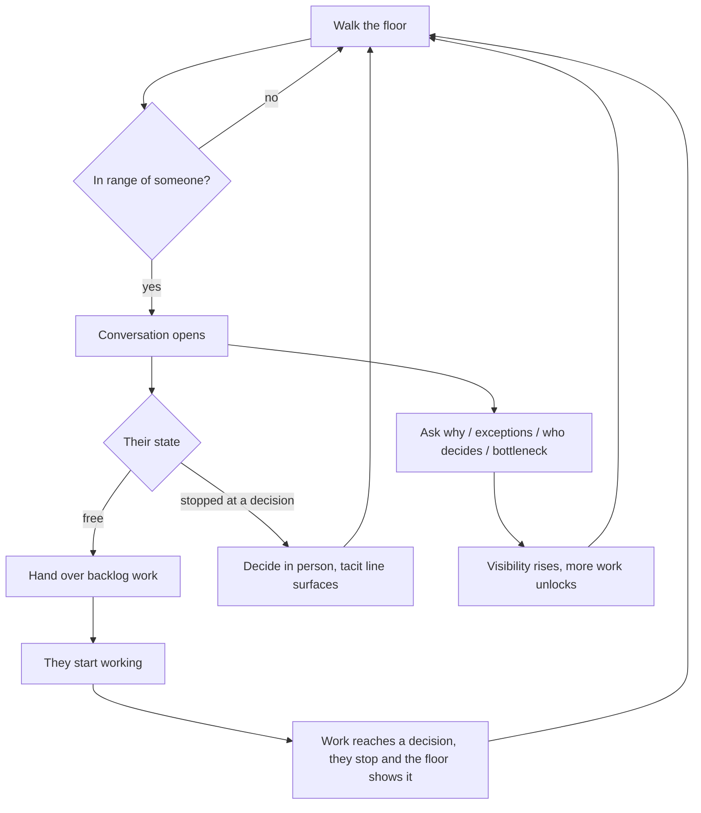

# Phase 2 — The playable loop

## Summary

Make the ported client playable: drive the CEO with WASD, walk up to someone and the
conversation opens, hand them work from inside that conversation, and get summoned back when
their work reaches a decision only the CEO can make. Standing next to someone also lets the CEO
ask the four questions that surface what the tray never shows, which raises Visibility and
unlocks further work.

The phase exists to produce a verdict. Its output is a loop good enough to play end to end and
decide whether this product is worth continuing.

---

## Problem Frame

Phase 1 delivered a correct, durable, tested simulation kernel and no way to play it. The office
renders, the HUD moves, the DAG folds — but the CEO is not an actor on the floor. Keystrokes are
sent and applied server-side; the resulting position never comes back to the client. There is no
conversation surface at all, so the in-person route — the mechanic every metric in this product
is built to reward — is unreachable. The tray's resolve button is the only decision path that
exists, and it is the one the design intends you to regret.

The prototype does all of this today, in one file, with no build step. So the ported system is
not yet an improvement on it in the only dimension a player can feel.

Three requirements caused this by being written and never assigned to an implementation unit: the
CEO avatar and conversation surface, the gRPC client leg, and the report surface. Nothing built
them and no test missed them.

---

## Key Decisions

**The tray keeps its resolve button.** Walking over can only prove itself against a route it
beats. Removing the cheap path would make the loop pure and the verdict meaningless, because
there would be nothing to compare against. The kernel already prices the difference: in person
yields the tacit line, morale +2 and visibility +2; from the tray, morale −1 and no tacit line.

**The ask box is in; encourage is out.** Both need kernel work that Phase 1 never built. Asking
carries the product's central claim and feeds Visibility, which gates unlocks — so it changes the
loop. Encouraging moves a number. One new command buys the mechanic under judgment.

**Free text, not four buttons.** The ask box takes typed questions matched to intent, as the
prototype does. Buttons would remove the guessing that fixed answers create, but free text needs
no rework when the hearing API replaces the scripted replies — that change swaps the producer,
not the surface. Misses are therefore inevitable, so each person deflects in their own voice and a
miss still reveals character rather than reading as a dead end.

**The client owns the CEO's position and the kernel checks it.** The kernel's position echo
arrives about once per sim-hour, far too rarely to render from, so client-side prediction is the
only shape that yields responsive movement. Reconciliation against the echo is what keeps
prediction honest.

**Proximity alone opens the conversation.** No click and no keypress. Being near someone is the
whole gesture, which is what makes the physical act of crossing the floor the interface.

**Pause stops the player too.** Every input is a command, and a paused run has no tick boundary to
apply one at. The prototype lets the CEO walk while the world is frozen; matching that would mean
position no longer derives purely from ticked inputs, which is the replay guarantee the kernel was
built around. So pause freezes both, and the screen says so — a button that silently swallows
input reads as a broken build.

**Parity is judged by feel, not audited.** The bar is whether the loop plays, not whether frames
match the prototype pixel for pixel.

---

## The loop

---

## Requirements

**Moving the CEO**

- R1. The CEO renders as an actor on the office floor, depth-sorted with the staff and the props,
  and is drawn in the app's accent colour so they stay findable among the staff at a glance.
- R2. WASD and the arrow keys drive the CEO, and a held direction moves them until it is released.
- R3. The client predicts the CEO's position each tick and reconciles against the kernel's
  periodic echo, snapping on a mismatch and surfacing a divergence indicator.
- R4. Walking costs sim-time at the clock's current rate, so crossing the floor is a cost paid
  against work in progress.

**The conversation**

- R5. Standing within 1.9 tiles of the nearest person opens a conversation with them, and leaving
  that range closes it. Nothing else opens it.
- R6. The conversation names the person, their title, their department and their current state.
- R7. When the person is stopped at a decision, the conversation shows the prompt, the options,
  and the line they say only in person, badged as such.
- R8. The line said only in person never appears in the tray or the work panel. It is reachable
  only by standing there.
- R9. Resolving from the conversation records the decision as taken in person; resolving from the
  tray records that it was not.
- R10. Each route states its cost before the choice, not after it.
- R11. The clock keeps running while a conversation is open.

**Assigning work**

- R12. When the person is free, the conversation offers the available backlog work they or their
  reports could take, and handing one over starts them working.
- R13. Handing work straight to a specialist bypasses their director and records the director as
  uninformed; routing through the director does not.
- R14. The work panel keeps its assignment buttons, so the conversation is not the only route to
  assigning.

**Asking**

- R15. The conversation accepts a free-text question. Four intents carry answers: why,
  exceptions, who decides, and bottleneck.
- R16. A question matching none of the four returns a deflection in that person's own voice,
  naming what they can talk about. Each person has their own line, so a miss still says something
  about them.
- R17. The first time a person answers one of the three tacit questions, Visibility rises. Asking
  the same question again returns the answer and pays nothing.
- R18. Answers persist on the person, so returning to them shows what they have already said.
- R19. Which questions a person has answered is run state, and survives reload and restart.

**Being summoned**

- R20. When work reaches a decision the person stops, and the floor shows that they are waiting
  without any panel being open.
- R21. The tray lists everyone waiting, so the CEO can choose who to walk to next.
- R22. Work does not progress while a decision is unresolved.

**Time and pause**

- R23. Pausing stops the world and the CEO together. While the run is paused nothing the player
  does lands, and the screen says so rather than ignoring them in silence.
- R24. A conversation already open stays readable while paused, so stopping the clock to read a
  decision is still worth doing.

**Starting and replaying a run**

- R25. The client can start a run and attach to what it started, so a session begins by opening
  the page rather than by running a command.
- R26. When a run ends, starting another is reachable from the same screen, so two runs can be
  compared in one sitting.

---

## Key Flows

- F1. Assign work in person
  - **Trigger:** The CEO wants a backlog item started.
  - **Steps:** Walk to a free person; the conversation opens; the work they or their reports could
    take is listed; hand one over.
  - **Outcome:** They start working. Handing it to a specialist directly records their director as
    uninformed.
  - **Covered by:** R5, R12, R13

- F2. Summoned to a decision
  - **Trigger:** Assigned work reaches a checkpoint.
  - **Steps:** The person stops and the floor signals it; the tray names them; the CEO walks over;
    the conversation shows the prompt, the options and the line said only in person; the CEO picks
    an option there.
  - **Outcome:** Work resumes. The decision is recorded as in person, with the tacit line attached
    and Visibility raised.
  - **Covered by:** R7, R8, R9, R20, R21, R22

- F3. Ask what the tray never shows
  - **Trigger:** The CEO is standing next to anyone.
  - **Steps:** Type a question; the intent is matched; the person answers.
  - **Outcome:** A first tacit answer raises Visibility, which can unlock work that was gated on
    it. Repeat asks answer without paying again.
  - **Covered by:** R15, R16, R17, R18, R19

- F4. Settle from the tray instead
  - **Trigger:** Someone is waiting and the CEO does not want to spend the walk.
  - **Steps:** Open the tray; pick an option; settle from there.
  - **Outcome:** Work resumes with no tacit line recorded and morale down. This is the route the
    in-person path is measured against.
  - **Covered by:** R9, R10, R21

---

## Acceptance Examples

- AE1. Covers R5. Given the CEO is out of range of everyone, when they walk within 1.9 tiles of a
  person, then that conversation opens; and when they walk back out of range, it closes.
- AE2. Covers R7, R9. Given a person stopped at a decision, when the CEO resolves it from the
  conversation, then the decision is recorded as taken in person and the tacit line is attached to
  the deliverable.
- AE3. Covers R8, R9. Given the same decision, when the CEO settles it from the tray, then no
  tacit line is recorded and the tacit line was never displayed.
- AE4. Covers R17. Given a person who has never been asked why, when the CEO asks why, then
  Visibility rises; when the CEO asks why again, then the same answer returns and Visibility does
  not move.
- AE5. Covers R16. Given an open conversation, when the CEO types a question matching none of the
  four intents, then the reply names what can be asked.
- AE6. Covers R13. Given a backlog item whose specialist reports to a director, when the CEO hands
  it straight to the specialist, then the director is recorded as uninformed and morale falls.
- AE7. Covers R19. Given a person who has answered two questions, when the run is reloaded, then
  those two questions still count as answered and pay nothing on a repeat ask.
- AE8. Covers R3. Given a client prediction perturbed away from the kernel's, when the next
  position echo arrives, then the position snaps and the divergence is surfaced rather than
  silently tolerated.
- AE9. Covers R11, R22. Given an open conversation with a person stopped at a decision, when time
  passes without the CEO choosing, then the clock advances and that person's work stays where it
  was.
- AE10. Covers R23, R24. Given a paused run, when the CEO holds a movement key, then nothing moves
  and the screen states that the run is paused; a conversation already open is still readable.
- AE11. Covers R25. Given no run in progress, when the player starts one from the client, then the
  client attaches to the run it created and the office renders without a page reload.

---

## Success Criteria

- A run can be played from start to finish entirely from the floor: every assignment made and
  every decision taken inside a conversation, never opening the tray or the work panel.
- The same run can be played entirely from the panels, so the two routes can be compared directly.
- The two routes produce measurably different Visibility and morale over a run, so the in-person
  mechanic's value is observable rather than asserted.
- The loop sustains itself: after assigning work there is always someone worth walking to, and the
  run reaches its horizon without the player running out of things to do.
- Walking feels worth doing on a floor of ten people at ×1 and ×3 clock rates.

---

## Scope Boundaries

### Deferred for later

- Encourage, and the once-a-day morale it grants.
- Click-to-walk, and the walk-over buttons in the org panel.
- The conversation's working-state card — the progress bar and the friction line — and the stop
  this work action.
- Surfacing the run report. It is built and unreachable; exposing it can wait until there is a
  loop worth reporting on.
- The gRPC client leg, and with it a working `docker compose up`. Phase 2 runs single-process.
- The hearing API. Scripted replies stand in, and swapping the producer is a later phase.
- Retiring `company-os.html`. It stays the reference for the interaction until the port is judged
  good.
- Screenshot-based visual parity verification.

### Known holes we are accepting

- **In person is a claim, not a check.** The client asserts that the CEO was standing there and
  the kernel trusts it, so the tray could claim the in-person route and collect its rewards.
  Origin R44 — validating the claimed position against the target's position at that tick — stays
  open. This is acceptable while one honest client plays solo, and must close before any client we
  do not control can drive a run.
- **Four answers per person is the whole script.** The ask box runs dry once each person has
  answered its four questions. The mechanic is being judged at that depth on purpose; a verdict
  that it feels thin may be a verdict about the script rather than the mechanic.

---

## Dependencies / Assumptions

- Single-process is the run path for this phase. The compose topology stays unable to accept
  commands.
- The kernel commands the loop needs already exist and are tested: assignment through a director
  and around one, in-person and tray resolution, returning work, and held-direction input.
- The scripted replies are already on the server, four per person. The ask mechanic needs a
  command, per-person asked state, and an event. The one piece of new content is a deflection line
  per person for R16, ten in total.
- The roster is ten people: four directors and six staff. Every one of them already has all four
  scripted replies, so no one is unaskable.
- A run is 20 sim-days, which is about five minutes of wall-clock at ×1 and under two at ×3. A
  verdict therefore costs a sitting, not an afternoon, and several runs can be compared.
- Visibility gains from asking feed the existing unlock gate, so asking opens work without any new
  gating rule.
- The player is the team judging the loop. No onboarding, no saved games, no second player.

---

## Outstanding Questions

### Deferred to planning

- Whether the ask event carries the answer text or the client re-derives it from the roster and
  the asked intent.
- Whether the conversation is an overlay on the office or takes a place in the existing panel
  rail.
- How the conversation behaves when two people are nearly equidistant, so it does not flicker
  between them.

---

## Sources / Research

The interaction being ported, and the state of each piece today.

| Location | What it holds |
|---|---|
| `company-os.html:1872` | Talk range, and the proximity rule that opens and closes the conversation |
| `company-os.html:2974` | The conversation panel, and its blocked / working / idle states |
| `company-os.html:3049` | The four ask intents, which three are tacit, and the fallback on a miss |
| `backend/packages/simcore/people.py:179` | The scripted replies, four slots per person, already ported and unread |
| `backend/packages/simcore/step.py:1258` | The kernel's CEO movement from a held-direction bitmask |
| `backend/packages/simcore/step.py:1683` | The price of each decision route: morale and visibility, in person versus tray |
| `backend/packages/simcore/step.py:1297` | The unlock gate that Visibility feeds |
| `frontend/src/render/interpolate.ts:125` | The client-side movement predictor, written, golden-tested, and called only by tests |
| `frontend/src/net/store.ts:355` | Where the kernel's position echo arrives and is discarded |
| `frontend/src/ui/stage.ts:55` | The actor projection the renderer reads, which covers staff only |
| `frontend/src/ui/Panels.tsx:292` | The tray's resolve, which reports the in-person route as not taken |
| `docs/brainstorms/2026-08-12-company-os-platform-requirements.md` | Origin requirements, including R43 and R44 on CEO movement and in-person validation |
