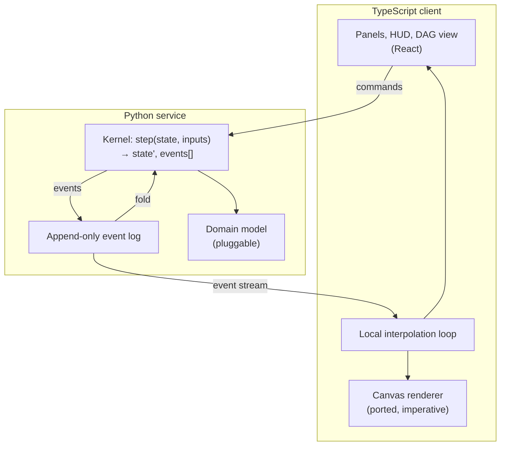
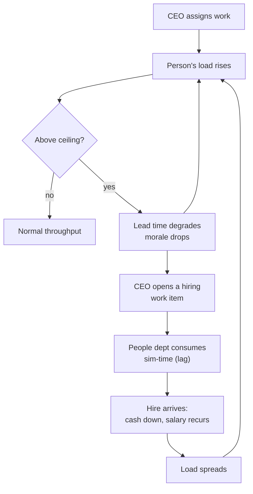

# Company OS — Platform Requirements (Phase 1)

## Summary

Rebuild the Company OS prototype as a real Python service plus a TypeScript client, with the simulation reshaped into an event-sourced kernel the CEO acts inside one continuous world. Phase 1 adds two mechanics the prototype lacks: an animated workflow DAG and a workload-and-hiring capacity loop. Phases 2–4 (agent team, company initialization, e-commerce strategy) are recorded as roadmap constraints Phase 1 must not foreclose, not as buildable scope.

---

## Problem Frame

`company-os.html` already proves the mechanic. Work stalls at decision points until the CEO answers, delegation is visible as a director walking to his specialist's desk, bypassing that director costs morale and records him as not knowing, and deliverables carry provenance. `test/harness.js` asserts these against the shipped code.

Three walls stop it from becoming a product. Nothing persists, so every run is Day 1. All state is one client-side object, so LLM agents with per-department memory have nowhere to live and no place to keep API keys. And every metric moves by a flat authored delta, so the simulation replays consequences someone wrote rather than producing outcomes nobody scripted.

The prototype's own data structures are already the schema of the service that replaces it: `ROOM_PLAN`, `PEOPLE`, `ITEMS`, `METRICS`, and the `S` state object. The port is a reshaping of working code, not a greenfield build.

---

## Key Decisions

**Python backend, TypeScript frontend.** The backend and agent layer are Python for the Phase 2 agent ecosystem and Phase 4's numeric modeling. The cost is real and accepted: roughly 600 lines of working simulation logic get rewritten, and the kernel can never be shared with the client. The salvage is that `test/harness.js`'s 29 assertions are a behavioral specification — port the assertions, not the code.

**The kernel is event-sourced.** Advancement is a pure function from state and inputs to a new state plus an ordered list of events. Persisted state is the fold of an append-only log. This is kept even though Phase 1 has no commit boundary that needs it, because it is what makes Phase 4's strategy branching a timeline action rather than an architectural change, and because it makes "why did the simulation say that" answerable by traversing the log.

**One continuous world.** There is no sandbox mode and no committed run. The CEO walks, talks, and assigns in the same world the clock runs in; Start unpauses. Phase 4 branching therefore becomes an explicit "fork from day N" action over the log, not an implicit snapshot at a mode boundary.

**The deterministic engine drives time; agents decide.** "Every character is an agent" resolves to: the engine advances the clock, moves people, and burns effort, while agents are invoked only at decision points, conversations, and reassignments. Continuous time multiplied by per-tick model calls fails on both latency and cost. The prototype's existing stall-at-checkpoint mechanic is the hook — an agent turn is the same shape as a pending CEO decision, so Phase 2 adds a producer rather than redesigning the loop.

**Capacity is a soft ceiling.** Over-assignment is permitted and degrades throughput and morale; it does not lock assignment. A hard block teaches a rule, while a penalty makes the CEO weigh the cost against hiring. This is the first mechanic in the simulation that generates emergent behavior: load creates a feedback loop, and hiring through the People department introduces a lag before relief arrives.

**The renderer is preserved, not rebuilt.** The canvas and sprite code carries over as an imperative TypeScript module outside the UI framework's render cycle. Rebuilding runtime-generated sprite sheets, baked lighting, and depth sorting as components would degrade the one part of the prototype that is already finished.

**Movement is transmitted as intent.** Because the server is authoritative and pathfinding is logical, the server sends an actor, a resolved path, and a start sim-time. The client interpolates at display framerate. Per-frame position streaming is never on the table.

**The office is both stage and audit surface.** The pixel office is where the CEO acts, and replaying it is how a decision's origin becomes legible. This is what keeps the office on the founder-decision-support path instead of making it decoration.

### Stack

| Component | Pick | Why |
|---|---|---|
| Backend | FastAPI | Async-native for the live loop and later agent calls; typed request models |
| Persistence | SQLAlchemy over SQLite, Postgres-compatible | Clone-and-run for an open-source MVP; no migration when hosting arrives |
| Transport | WebSocket for the event stream, REST for commands and run management | Events are push; CEO actions are request/response and want plain status codes |
| Frontend | React + Vite + TypeScript | Largest contributor pool for an open-source project; Vite keeps the canvas module unbundled from framework concerns |
| Client state | Thin store (Zustand or equivalent) | Panels read streamed state; no reducer ceremony over a server-authoritative model |
| Renderer | Existing canvas module, ported | Already complete and already tested |

### Architecture

---

## Actors

- A1. **CEO** — the human player. Walks, talks, assigns, resolves decision points, hires, reassigns mid-run.
- A2. **Director** — a department head. Receives delegated work and walks it to a specialist. Records whether they were informed.
- A3. **Specialist** — staff who execute work items and raise decision points they cannot resolve.
- A4. **Kernel** — advances the clock, moves actors, burns effort, applies effects, emits events.
- A5. **Agent (Phase 2)** — an LLM-backed decision maker bound to a person, invoked at decision points and conversations. Not built in Phase 1; the kernel's input contract must accommodate it.

---

## Requirements

### Simulation kernel

- R1. Advancement is a pure function: given a state and pending inputs, it returns the next state and an ordered list of events.
- R2. Every state mutation is expressed as an event appended to an ordered log, and persisted state is the fold of that log.
- R3. Randomness is drawn from a seeded generator whose seed is recorded in the log, so replaying a log reproduces the run exactly.
- R4. The kernel runs headless with no rendering or transport dependency, so tests, the live loop, and a fast-forward can all drive it.
- R5. Work does not progress while a decision checkpoint is unresolved.
- R6. A checkpoint resolved in person records tacit knowledge; the same checkpoint resolved from the tray does not.
- R7. Deliverables record their provenance — the work item, the assignee, and the decisions that shaped them.
- R8. Unlock gates hold: an item gated on a prerequisite item or a visibility threshold stays unavailable until the gate clears.
- R9. The log and kernel permit forking a run at an arbitrary event index. The fork interface itself is out of Phase 1 scope.

### Backend service

- R10. The server owns the authoritative clock and state; the client never mutates simulation state directly.
- R11. The client receives simulation events as a stream and issues CEO actions as commands.
- R12. A run persists across process restarts and browser reloads, resuming at the same sim-time.
- R13. Movement is transmitted as intent — an actor, a resolved path, and a start sim-time — never as per-frame positions.
- R14. Time is continuous and pausable, with speed multipliers, in one world and one clock. There is no separate setup mode.
- R15. Metric effects apply through a replaceable domain-model interface, so Phase 4 can substitute a demand model without touching the kernel.

### Frontend client

- R16. The pixel renderer is an imperative TypeScript module living outside the UI framework's render cycle.
- R17. The client interpolates actor movement locally at display framerate between server events.
- R18. Visual parity with the prototype holds: generated floorplan, four facings by three walk frames, depth sorting, baked lighting, integer-zoom nearest-neighbour scaling.
- R19. Panels, metrics, and the activity log render from streamed state.

### Capacity and hiring

- R20. Every person carries a workload level derived from assigned effort against their available hours.
- R21. A department surfaces the aggregate load of its members on a green-through-red scale.
- R22. Load above the ceiling is permitted and degrades throughput and morale; it never blocks assignment.
- R23. Hiring is a work item routed through the People department and consumes sim-time before the hire arrives.
- R24. A hire costs cash on arrival and adds a recurring salary to the daily fixed cost.
- R25. A new hire is seated and reachable on the generated floorplan without a manual floorplan edit.

### Mid-run steering

- R26. The CEO may reassign an in-flight work item to another member of the same department while the clock runs.
- R27. Cross-department reassignment is rejected.
- R28. Assigning directly to a specialist while bypassing their director costs morale and records the director as not knowing.

### Workflow DAG view

- R29. A DAG view renders work items as nodes and prerequisite and unlock relations as edges, folded from the same state as the office.
- R30. Node appearance reflects live status — backlog, assigned, in progress, blocked on a decision, complete — and animates on transition.
- R31. The DAG surfaces the capacity signal of each node's owning department, so an overloaded path is visible without opening the office.

### Testing and parity

- R32. The 29 assertions in `test/harness.js` are ported to a Python suite asserting against the kernel.
- R33. Sprite-grid validation is retained alongside the ported renderer.
- R34. A replay test asserts that re-folding a persisted log yields state identical to the original run.

### The capacity loop

---

## Key Flows

- F1. **Assign and stall**
  - **Trigger:** CEO assigns a work item to a specialist.
  - **Actors:** A1, A3, A4
  - **Steps:** Kernel emits an assignment event; the specialist walks to their desk and burns effort; at the checkpoint threshold the kernel emits a decision-raised event and freezes that item's progress.
  - **Outcome:** Work is visibly blocked in both the office and the DAG until the CEO answers.
  - **Covered by:** R1, R5, R13, R30

- F2. **Resolve in person versus from the tray**
  - **Trigger:** A decision point is open.
  - **Actors:** A1, A3
  - **Steps:** CEO either walks within talk range and resolves in conversation, or resolves from the tray without moving.
  - **Outcome:** Both apply the option's effects; only the in-person path records the tacit-knowledge line, and only that path makes it queryable later.
  - **Covered by:** R6, R7

- F3. **Overload and hire**
  - **Trigger:** CEO assigns work to a department already near its ceiling.
  - **Actors:** A1, A2, A3, A4
  - **Steps:** Load crosses the ceiling; the department signals red in both views; throughput degrades and morale drops; CEO opens a hiring item; the People department consumes sim-time; the hire arrives, is seated, and takes load.
  - **Outcome:** Cash falls, daily fixed cost rises, and lead time recovers only after the lag.
  - **Covered by:** R20, R21, R22, R23, R24, R25, R31

- F4. **Reassign mid-run**
  - **Trigger:** CEO reassigns an in-flight item while the clock runs.
  - **Actors:** A1, A2, A3
  - **Steps:** Command is validated against the item's department; on success the prior assignee stops, effort already burned is retained, and the new assignee walks to their desk and resumes.
  - **Outcome:** Progress carries over; a cross-department attempt is rejected without mutating state.
  - **Covered by:** R26, R27

- F5. **Resume a run**
  - **Trigger:** CEO reopens the client after a reload or a server restart.
  - **Actors:** A1, A4
  - **Steps:** Server folds the persisted log; client subscribes and receives current state plus in-flight movement intents.
  - **Outcome:** The run resumes at the same sim-time with actors mid-path where they were.
  - **Covered by:** R2, R12, R13

---

## Acceptance Examples

- AE1. **Covers R5.** Given a work item at its checkpoint threshold with the decision unresolved, when the clock advances a full business day, then the item's completed effort is unchanged and no deliverable is produced.
- AE2. **Covers R6.** Given an open decision point, when the CEO resolves it from the tray, then the option's effects apply and no tacit-knowledge record exists for that checkpoint.
- AE3. **Covers R22.** Given a department above its load ceiling, when the CEO assigns another item to it, then the assignment succeeds, lead time degrades, and morale drops.
- AE4. **Covers R27.** Given an in-flight item owned by Sales, when the CEO reassigns it to a member of Accounting, then the command is rejected and the item's assignee and progress are unchanged.
- AE5. **Covers R23, R24.** Given a hiring item opened on day 3, when the hire's sim-time elapses, then a new person is seated, cash drops by the hiring cost, and the daily fixed cost increases.
- AE6. **Covers R28.** Given a specialist whose director is idle, when the CEO assigns directly to the specialist, then morale drops and the director is recorded as not knowing about that item.
- AE7. **Covers R3, R34.** Given a completed run's persisted log, when the log is re-folded from its recorded seed, then the resulting state is identical to the original.

---

## Phase Roadmap

Phases 2–4 are not Phase 1 scope. They are recorded because Phase 1's architecture is chosen to keep them additive.

- **Phase 2 — agent team.** Each person becomes an LLM-backed agent with tools and a memory scope: agent-private, department-shared, or company-public. Information crosses scopes only through events — a conversation, a meeting, a document — so "who knew what when" is queryable from the log. Agents are invoked at decision points, conversations, and reassignments, never per tick. Model outputs are cached by input hash so replays stay free and deterministic.
- **Phase 3 — initialization.** Before a run starts, the system learns the company: org chart, department structure, field, and the work that actually flows. This lands as a genesis event that configures the world, replacing the invented Halstead Industrial sample data.
- **Phase 4 — e-commerce scenario.** The CEO chooses promotion, advertising, and product-mix strategies, and the simulation projects forward. This requires a real domain model (demand response, ad spend to acquisition cost to conversion, inventory) behind the R15 interface, plus a fork-from-day-N interface over the log so strategies can be compared as branches of one run.

---

## Success Criteria

- Behavioral parity: every assertion ported from `test/harness.js` passes against the Python kernel.
- Visual parity: the ported renderer is indistinguishable from the prototype at the same window size and zoom.
- A run survives a server restart and a browser reload without losing sim-time, actor positions, or decision history.
- Re-folding a persisted log reproduces the run exactly.
- Adding a Phase 2 agent as a decision-point producer requires no change to the kernel's advancement contract.
- A contributor can clone the repository and reach a running simulation without provisioning external services.

---

## Scope Boundaries

### Deferred for later

- LLM agents, memory scopes, and agent tools — Phase 2.
- Org-chart and company-data import — Phase 3.
- A real demand and elasticity model for e-commerce strategy — Phase 4, behind the R15 interface.
- A fork-from-day-N interface and side-by-side strategy comparison — Phase 4. Phase 1 only guarantees the log permits it.
- Accounts, authentication, hosting, and multi-tenancy. The MVP is single-user and local-first.
- Multiple simultaneous CEOs in one world.
- Org structures deeper than director → specialist. The current floor planner has two bands and would need a third.

### Outside this product's identity

- A management simulation game. Considered and rejected: credibility of outcomes matters more than play, so the product optimizes for a decision a founder can defend rather than for progression and balance.
- A turn-based report generator with no office. Considered and rejected: setting levers and reading a weekly report is cheaper and is how commercial business simulators work, but it discards the in-person mechanic that makes a decision's origin legible.
- A general-purpose agent framework. The agent layer serves this simulation; it is not a substrate for arbitrary agent applications.

---

## Dependencies / Assumptions

- The MVP validates the idea rather than a named customer. There is no user-zero interview behind these requirements, and the founder-decision-support framing is a stated intent, not a validated one.
- Phase 3 assumes a real org chart and real company data can be obtained in a usable shape. Nothing in Phase 1 depends on this holding.
- Phase 4's credibility depends on a domain model that does not exist yet. The R15 interface is the hedge: Phase 1 ships flat authored deltas behind the same seam.
- The capacity loop's numbers are unmodeled. Ceilings, degradation curves, salary levels, and hiring lag are tuning parameters, and the mechanic's value depends on them landing somewhere plausible.
- Agent cost per run in Phase 2 is unknown. The decision-points-only invocation rule is the mitigation, and it may still prove too expensive for long runs.

---

## Outstanding Questions

### Deferred to Planning

- How workload is computed numerically — effort against available hours, and where the ceiling sits.
- Event schema and versioning strategy for the log, including how a schema change affects existing runs.
- WebSocket message shape and how the client reconciles a missed event window after a disconnect.
- Whether the live loop runs as a background task per active run or advances on client demand.
- How much of the floor planner and pathfinder moves to Python versus staying client-side for rendering only.
- DAG layout algorithm and how it stays stable as items unlock.
- SQLite versus Postgres for the initial target, and whether the log lives in a table or an append-only file.

---

## Sources / Research

- `company-os.html` — the whole prototype. Lines 4–814 are styles, 815–951 the page skeleton, 952 onward the script.
- `company-os.html:973` `ROOM_PLAN` — eight rooms with department, floor style, and desk count.
- `company-os.html:1170` `PEOPLE` — the roster, with `dept`, `mgr`, `rank`, and `slot` driving placement and reporting lines.
- `company-os.html:1279` `ITEMS` — work items with effort, checkpoints, per-option effects, tacit-knowledge lines, and unlock chains.
- `company-os.html:1486` `METRICS` and `company-os.html:1494` `S` — the five metrics and the entire runtime state object.
- `company-os.html:1763` — `HOURS_PER_SEC = 0.6` with a nine-hour business day, giving 15 real seconds per sim-day at ×1.
- `company-os.html:1899`–`2600` — the art and drawing layer: sprite sheets, palettes, floor and wall painting, depth-sorted drawing.
- `test/harness.js` — 29 checks driving the real simulation code against a DOM stub. The behavioral specification for the port.
- `test/sprites.js` — validates every pixel-art grid.
- `README.md` "Making it a product" — already identifies persistence and org import as the top two moves.
