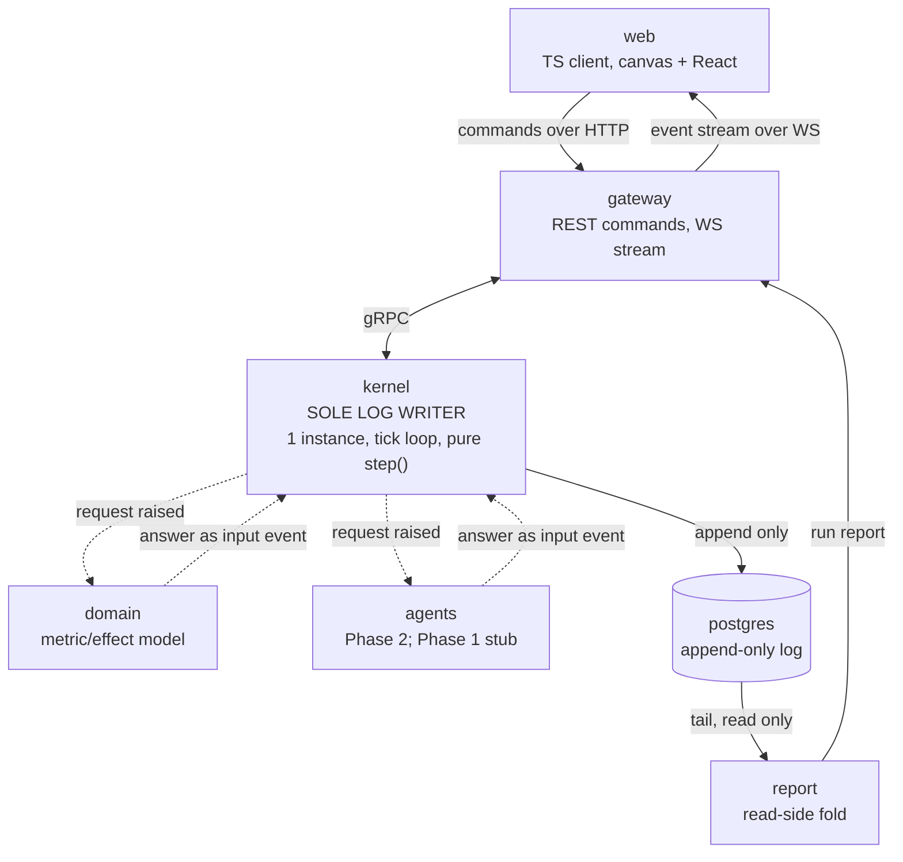
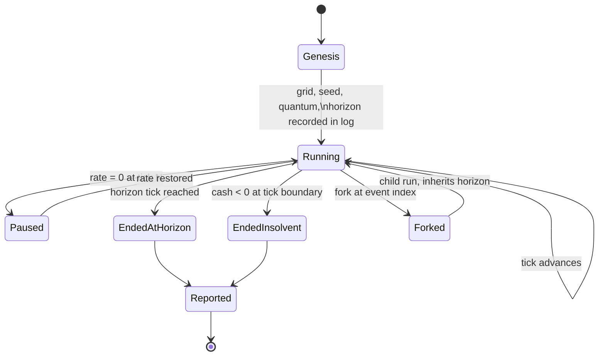

# feat: Company OS Phase 1 — event-sourced kernel and service split

## Summary

Rebuild `company-os.html` as seven services plus a separate TypeScript client, with the simulation reshaped into an event-sourced kernel. The kernel is the sole writer to an append-only log; every other service is read-side or reached through a pending-input contract that keeps network calls out of the deterministic step function. Behavioral parity against the ported assertion suite is proven before any new mechanic lands.

---

## Problem Frame

The origin document establishes what to build and why (see origin: `docs/brainstorms/2026-08-12-company-os-platform-requirements.md`). This plan resolves how.

Three findings from planning research change the approach rather than merely informing it.

**The interpreter on PATH cannot run the backend.** `python3` resolves to 3.9.12; FastAPI, Starlette and Uvicorn all floor at 3.10. Python 3.12 is pinned under `uv` as the first unit of work, before anything else can be installed.

**Microservices and bit-identical replay are in tension, and the tension is resolvable.** A network call inside `step()` destroys determinism: latency, retries and failures all become part of the run. Distributed writes to the log destroy ordering. The resolution is one authoritative write side and many read sides — the kernel alone writes, and services the kernel needs answers from are consulted through the pending-input contract the origin already specifies for agents. The answer returns as a logged input event tagged with the tick it applies at, and replay reads the logged answer rather than re-issuing the call.

**One origin requirement does not do what it says.** The origin's position guard validates a client-asserted position against a client-asserted position, so it catches nothing but a stale tick index. Logging the CEO's *input* rather than their position makes the guard real, collapses the log's dominant write source, and removes the last float-position exception. This plan amends the requirement rather than implementing a check that reads as a safeguard and is not one.

---

## Key Technical Decisions

### Determinism

**The kernel is the sole log writer, and it is not replicable.** `uvicorn --workers N` yields N tick loops and N writers against one store. The kernel service runs at exactly one instance, and this is recorded in compose and in the README as a correctness constraint rather than a performance setting.

**External services are reached through the pending-input contract, never inline in `step()`.** The kernel emits a request event and stalls the affected item — the same mechanic that already stalls work at a CEO decision point. The answer arrives as an input event carrying the tick it applies at. Replay reads it from the log. This is what makes the service split compatible with replay identity, and it is why the domain model and the agent layer can be separate services at all.

**Stateless counter-based RNG, not `random.Random`.** CPython guarantees only that `random()` and the compatible seeder are stable across versions; `shuffle`, `sample`, `choices` and `randrange` are explicitly subject to change. Each draw is derived as a pure function of `(run_seed, tick, purpose_tag, entity_id)` through a SplitMix64-class mixer. Three consequences matter: there is no RNG state to snapshot, adding a new stochastic consumer does not renumber existing draws so seeded fixtures survive feature work, and the algorithm is reimplementable in TypeScript if the client ever predicts a stochastic outcome. Draws are still logged per origin R3, which makes replay independent of even this code.

**Replay determinism and seed determinism are different properties, and the plan needs both.** Logging every non-recomputable input buys replay determinism, which is what the origin's replay test asserts. It does not buy seed determinism — two fresh runs from one seed producing the same run — which the capacity-loop success criterion requires when it compares two assignment orderings from one seed. Seed determinism needs the stable RNG above plus a fixed phase order within each tick.

**Integer state throughout, with one documented multiplier composition order.** Cash, effort, morale, load and position are integers; no float accumulates. Three separate requirements chain rate multipliers — over-ceiling degradation, morale degradation, and the director rate — so the composition order is itself part of the rules version and is pinned in one helper rather than emerging from call order.

**A state-hash checkpoint event at every sim-day boundary.** The hash covers canonically serialized kernel state, with sub-hashes per subsystem. Without it, a determinism regression in a long run is a hand bisect; with it, replay divergence localizes to a tick and a subtree. The hash is computed over decoded state, never over a store-returned JSON string — Postgres JSONB reorders keys where SQLite does not, so hashing serialized text would work locally and break the first time the schema targets Postgres.

**Rules version is separate from schema version, and replay hard-fails on a rules mismatch.** Schema version covers event shape; rules version covers tuning constants and multiplier order. The origin already treats runs as disposable across tuning changes; this makes that mechanical rather than aspirational.

**No tick event per quantum.** Under a fixed quantum a tick event carries no information. Current tick lives on the run row and on snapshots.

**Kernel-assigned dense sequence, not store autoincrement.** The kernel knows the sequence before insert, it is gapless, and it sidesteps the out-of-order-commit gap that a Postgres sequence introduces. A `BigInteger` primary key also silently loses autoincrement on SQLite, since affinity matching requires the literal type name.

**The CEO's input is logged, not their position.** The client submits the held-direction bitmask per tick — which the prototype already keeps — run-length encoded to one event per keypress rather than roughly 36 rows per second of walking. The kernel derives position with the same integer arithmetic it uses for staff. The CEO becomes client-*predicted* rather than client-*owned*: the client runs the identical movement function locally at zero latency, and because the kernel applies the identical input at the identical tick, the prediction is always right and reconciliation never fires in practice. This amends origin R43 and R44.

### Services and transport

**The log is the integration point for read-side consumers.** In event sourcing this is the designed use, not the shared-database anti-pattern. The report service tails the log; the gateway subscribes to the kernel's stream for live latency.

**gRPC between services, with the proto definitions as the contract.** This buys the Phase 2 and Phase 4 extraction path, not throughput — a single-user simulator has no throughput problem. Recorded plainly so the cost is visible.

**The domain model is consulted at period boundaries, not per tick.** Demand modeling is naturally periodic. Per-tick round-trips would both stall the loop and flood the log.

**The synchronous kernel is called off the event loop.** FastAPI's threadpool applies only to functions FastAPI itself calls — a synchronous kernel invoked from inside an `async` tick loop runs inline and stalls every request and every WebSocket send. Kernel invocation and long folds go through `anyio.to_thread.run_sync`. This keeps the loop responsive; it does not make ticks cheaper, since the GIL still serializes pure-Python work.

**The tick task holds a strong reference and cancels on shutdown.** The event loop keeps only weak references to tasks, so a dropped handle can be garbage collected mid-execution and the simulation silently stops. Bare `create_task` also swallows exceptions from a crashed loop.

**Starlette is pinned explicitly.** FastAPI declares an unbounded Starlette floor, and a fresh install resolves a Starlette major that postdates the FastAPI release and that FastAPI has never tested against.

### Client

**The renderer is ported with an explicit lifecycle.** The prototype starts its animation loop at module scope and contains no cancel path anywhere, which breaks under both React strict mode's double-invocation and Vite's HMR. The ported module exposes `start()` / `stop()` owning the frame handle, returns cleanup symmetrically, and disposes on hot update.

**Event stream lands in a store subscription, never in component state.** High-frequency updates go through a transient subscription that binds without re-rendering; the canvas reads from it directly.

**Frontend and backend are separate apps.** Independent toolchains, independent build, independent run. The backend can serve the built client as a deployment convenience; development uses the client dev server proxying to the gateway.

---

## Alternatives Considered

**Modular monolith with service-ready seams.** One backend process, strict internal module boundaries at the seams Phases 2 and 4 will need, each behind an explicit interface with an import-boundary test. Extraction later becomes a deploy change rather than a rewrite. Rejected in favour of the current shape on the operator's explicit direction. It remains the cheapest path to the same end state and the honest fallback if service overhead proves not to pay.

**Kernel plus gateway only.** Two backend services: a single-instance kernel owning the clock and the log, and a gateway handling HTTP and WebSocket. Makes the transport boundary physically enforced while leaving the domain model and agent layer in-process. Rejected on the same direction, though it captures most of the value — the transport split is the boundary that carries a real async-versus-sync asymmetry.

**Keeping the domain model in-process.** In Phase 1 the domain model is pure functions over integers with no state and no I/O; it ships the flat authored deltas the prototype already has. Putting it behind a network boundary converts a function call into a two-event log round-trip whose event kinds the fold must handle permanently, and it is the only reason the poisoned-answer path (R24) is reachable at all. Origin R15 asks for a replaceable interface, which an abstract base class in the kernel library satisfies — arguably more strongly, since Phase 4 could then implement the same interface out-of-process if its real demand model turns out to need one. Kept as a service on the operator's direction; R24's validation is the mitigation, and the residual cost is recorded in Risks. Reversing this is a one-unit change and drops the service count to six.

**A message bus between kernel and read-side consumers.** Rejected for Phase 1: the log already serves that role, and a bus earns its place when there are more consumers than the report service.

---

## High-Level Technical Design

### Service topology



Solid edges are synchronous. Dashed edges are the pending-input contract: the kernel never blocks on them inside `step()`.

### The pending-input contract

This is the mechanism that reconciles a service split with bit-identical replay. It is the same shape as the existing stall-at-checkpoint behavior, which is why the origin's architecture accommodates it without redesign.

```mermaid
sequenceDiagram
  participant K as kernel
  participant L as log
  participant S as external service
  Note over K,S: kernel-initiated bidirectional stream,<br/>opened by the kernel at startup
  K->>L: RequestRaised(tick, request_id)
  Note over K: item stalls; clock continues
  K->>S: request on the stream
  S->>K: answer(request_id) on the same stream
  K->>K: validate against versioned bounds
  K->>L: InputReceived, appended at the next tick boundary
  Note over K: resumes on the tick the input applies at
  Note over K,L: on replay, the kernel reads InputReceived<br/>and never opens the stream
```

**The answer transport is a kernel-initiated bidirectional stream, one per external service.** The kernel opens it; no service holds the kernel's address or initiates a connection to it. This is chosen over a unary call the kernel awaits (which would put the outstanding-request registry in process memory, lost on restart) and over an inbound delivery endpoint on the kernel (which would create a dependency cycle and an externally reachable write entrance to a permanent log). The stream's value is that a connection drop is a *failure signal* rather than a timeout: every request outstanding on that stream is known-unanswered, which is exactly what recovery needs.

The simulation never stalls waiting on the network. An unanswered request leaves its item stalled while the clock continues — the same behavior as an unresolved CEO decision.

### Failure semantics and recovery

The invariants are one writer, one clock, one truth. Every failure question reduces to whether a boundary can violate one of those, and whether the violation announces itself.

**Durability precedes observability.** No event reaches a subscriber before it is durable. A committed transaction can still roll back after power loss, so publishing before appending would leave the client's rendered world ahead of the authoritative log with nothing to detect the divergence. This forbids the publish-then-append shortcut that "the gateway subscribes for live latency" otherwise invites.

**One transaction per tick.** All events from one `step()` invocation append atomically. A partial tick folds to a state no pure step could produce, and the day-boundary hash would report it as an unexplainable determinism regression at the next boundary rather than at the fault.

**Only the tick loop appends.** Answers arriving on a stream are enqueued and appended by the loop at a tick boundary. This makes sole-writer true at the transaction level rather than merely at the process level, and it is what makes tick atomicity achievable — a concurrent append path would let a later sequence become visible before an earlier one, and a tailer treating the highest row as the head would skip an event permanently.

**Store unavailable: stall, never terminate.** Buffering unpublished events is a stall with extra memory; buffering published ones breaks durability-first. Terminating requires writing a terminal event to the store that is down, and would make an outage indistinguishable from insolvency in the report. Stalling is safe precisely because sim-time is not wall-clock — a stopped clock is already a modeled state. The stall is surfaced out of band on the stream, and on recovery the kernel appends a recovery event so the report can tell an outage from a CEO pause.

**Downtime is not simulated.** Elapsed real time decides how many quanta to run, which taken naively fast-forwards thousands of ticks after a laptop sleeps. Catch-up per wake is clamped, read from a monotonic clock, and when the clamp binds the clock falls behind rather than sprinting. Quanta are never skipped: falling behind means the clock runs slower than the requested rate and the lag is reported.

**Single instance is enforced at the store.** A compose replica cap is not a mechanism — and the documented single-process mode pointed at a compose store is a supported path to two kernels, two loops, and interleaved sequences that fold to a state neither process produced. A writer lease carrying owner identity, a heartbeat, and a monotonic fencing token gates every append. It survives crash (the lease expires), zombie resurrection (the token is fenced), and the single-process collision. It is needed on the SQLite path too, since WAL gives one writer at a time rather than one writer.

**Answers are validated, not trusted.** A malformed or out-of-domain answer becomes a permanent logged fact that every future fold reproduces, and the report presents it with a resolvable event behind it — which makes it more credible, not less. Bounds are part of the rules version and are asserted on read as well as before append. A violating answer is rejected and logged rather than clamped: clamping makes behavior depend on where the clamp sits and diverges live from replay if the two paths clamp differently. A rejected or absent answer escalates the item to the CEO through the existing tray rather than stalling it indefinitely.

**Recovery ladder, cheapest first.** Snapshots invalidated by a tuning change are dropped and re-folded, losing nothing. A rules-version mismatch makes a run unplayable under current rules while its report stays valid and self-describing. A store DDL mismatch refuses startup and names the remedy. A corrupt tail is localized by sequence density plus checkpoint hashes and truncated back to the last valid checkpoint, losing at most one sim-day. A full reset destroys all runs.

### Run lifecycle



Insolvency is evaluated at tick boundaries: the quantum in which cash crosses completes in full, and termination is the last event of that quantum. Otherwise two implementations produce different final cash and the report stops being reproducible.

---

## Output Structure

```
backend/
  pyproject.toml              # uv workspace, Python 3.12, Starlette pinned
  packages/
    simcore/                  # pure kernel library: step(), state, events, RNG, hash
    contracts/                # generated gRPC stubs, event envelope schema
  services/
    kernel/                   # tick loop, sole log writer, gRPC surface
    gateway/                  # REST commands, WebSocket stream
    domain/                   # metric/effect model behind the origin R15 seam
    agents/                   # Phase 2 layer; Phase 1 stub resolver
    report/                   # read-side log fold
  proto/                      # service and message definitions
  tests/                      # parity suite, replay suite, golden vectors
frontend/
  package.json                # Vite, React, TypeScript from template
  src/
    render/                   # ported canvas module, lifecycle-managed
    ui/                       # React shell, panels, HUD
    dag/                      # DAG view, chain strip
    net/                      # WS client, event stream, sequence resume
  tests/
docker-compose.yml            # 7 services; kernel pinned to 1 replica
```

The tree is a scope declaration, not a constraint. Per-unit file lists are authoritative.

---

## Requirements

The origin document carries R1–R63, A1–A5, F1–F5 and AE1–AE20; each implementation unit cites the origin IDs it advances rather than restating them. The requirements below are the ones this plan introduces, and two amendments the plan makes to the origin.

**ID convention.** Both documents number requirements from R1, so the two namespaces overlap. Origin requirements always carry the `origin` prefix — `origin R20` is the origin's, bare `R20` is this plan's. They are unrelated requirements and the prefix is the only thing distinguishing them; a unit's Requirements line mixing both is reading two namespaces.

**Architecture**

- R1. The kernel is the only component holding a write handle to the log, and runs at exactly one instance.
- R2. No network call occurs inside the kernel's step function. External answers enter as logged input events carrying the tick they apply at.
- R3. Replay reads logged external answers and never re-issues the originating call. Re-issue is permitted only when folding to the live head, never during historical replay, fork reconstruction, or a report fold, and a same-run re-issue reuses the original request id. A fork's re-issued request takes a child-scoped id derived from the child run and the raising event's sequence, so parent and child never hold the same in-flight id. Whether the fold is at the live head is a parameter of the fold, not an implicit property of the caller.
- R4. Every inter-service boundary is defined in a proto contract, and no service imports another service's internals.
- R5. The kernel library is importable and runnable headless without any service, transport, or store dependency.

**Determinism**

- R6. No float value accumulates in kernel state or crosses the log.
- R7. RNG draws derive from `(run_seed, tick, purpose_tag, entity_id)` through a project-owned mixer, not from a stateful generator.
- R8. Multiplier composition order is defined in one place and versioned with the rules.
- R9. A state-hash checkpoint event is emitted at every sim-day boundary, with per-subsystem sub-hashes, computed over decoded state.
- R10. Replay refuses to run and reports why when the log's rules version does not match the running rules version.
- R11. Two fresh runs from the same seed and item set produce identical logs, compared as a canonical projection over sequence, tick, kind, both versions and payload. Ingest time, correlation ids, producing host and store backend are excluded, and a new envelope field must be explicitly classified as hashed or metadata before it can be added.
- R17. External answers arrive on a kernel-initiated bidirectional stream. No service holds the kernel's address or opens a connection to it, and the kernel has no outbound dependency on any read-side service.
- R18. Tick-loop lifecycle follows the run's persisted rate, not subscriber count. Subscribing is read-only and has no effect on simulation state. Rate is run state, so disconnection does not change it; an idle run whose subscribers have all dropped has its rate set to zero after a documented interval, and the change is logged so nothing happens silently.
- R35. All appends inside the kernel process serialize through one store-writer queue. Per-run tick tasks enqueue a tick's event batch and the single writer commits one tick per transaction, so sole-writer holds when more than one run is active.
- R36. The rules version is derived, not hand-written: a canonical hash over the tuning-constant table and the multiplier composition order, computed at import. A human-readable label rides alongside as metadata. Every integrity guard keys on this value, so a forgotten manual bump would leave stale snapshots treated as current and make fold-from-snapshot diverge from fold-from-zero while the guard reported a match.
- R37. The log's primary key is run and sequence. The next sequence is read as the run's committed maximum plus one inside the same transaction that appends the tick, so an aborted tick cannot advance the cursor and leave a gap the corrupt-tail detector would misread.
- R19. Sim-time never advances for wall-clock elapsed while the kernel was not ticking. Catch-up per wake is clamped to a documented maximum, read from a monotonic clock, and quanta are never skipped.
- R20. No event is delivered to any subscriber before it is durable. On store unavailability the kernel stalls the clock and does not terminate the run.
- R21. All events produced by one step invocation append in one transaction, the day-boundary hash included.
- R22. Only the tick loop appends. Answers arriving on a stream are enqueued and appended at a tick boundary.
- R23. Outstanding requests are a projection of the log, never memory-only.
- R24. Every external answer is validated against versioned bounds before append, and the bounds are asserted again on read. A violating answer is rejected and logged, never clamped, and escalates its item to the CEO.
- R25. Answer idempotency is enforced structurally on run and request id. No event appends after a run's terminal event.
- R26. Single instance is enforced at the store by a writer lease carrying owner identity, a heartbeat and a fencing token that every append presents. A second kernel refuses to start, exits non-zero, and names the current holder.
- R27. Any fold of a log whose rules version differs from the running rules refuses and reports the mismatch. The guard lives in the fold, so no consumer can omit it.
- R28. The store's DDL version is recorded and checked at startup. A mismatch refuses to start and names both versions and the remedy.
- R29. Kernel readiness reflects tick-task liveness. A dead task for a run with a non-zero rate reports unhealthy and surfaces the exception.
- R30. Commands carry a client-supplied idempotency key, deduplicated structurally, with an outcome-by-key query so a reconnecting client can resolve an in-flight command.
- R31. Stream resume is keyed on run and sequence and is bounded. Beyond the window the gateway returns a resync carrying a state snapshot and its sequence, and the client hard-resets.
- R32. A run exports as a self-contained artifact carrying its log, genesis, and both versions, and imports to replay to the same state hash in a different process.

**Amendments to origin**

- R12. The client submits the CEO's held-direction input tagged with a tick a fixed delay ahead of the one it is rendering, run-length encoded; the kernel applies the identical input at the identical tick and derives position with the same arithmetic as staff. The delay absorbs jitter so both sides agree by construction and reconciliation never fires. Inputs tagged for far-future ticks are rejected and logged. Amends origin R43.
- R13. The position guard validates the client's claimed position against the kernel's independently derived position at the claimed tick, within a stated staleness window. Amends origin R44, which as written compares a client claim to a client claim.
- R33. The kernel periodically echoes its derived CEO position; the client compares, snaps on mismatch, and surfaces a divergence indicator. Golden vectors alone prove agreement only for cases someone thought to vector, and a mis-recorded in-person resolution is the failure this protects.

**Toolchain**

- R14. Python 3.12 is pinned, dependencies are managed with `uv`, and Starlette carries an explicit pin.
- R15. Frontend and backend build and run independently, with no shared package manager or lockfile.
- R16. `docker compose up` brings the full system up with no manual provisioning; a documented single-process mode runs the kernel without Docker, composing the same application objects rather than reimplementing them.
- R34. Services bind all interfaces inside their container; only the gateway and client publish ports, and only on the host's loopback interface. A literal loopback bind is correct in single-process mode only — inside a container it makes the service unreachable from siblings and from a published port.

---

## Success Criteria

The origin's criteria, and where this plan discharges each.

| Origin criterion | Discharged by |
|---|---|
| Behavioral parity with the ported assertion suite | U5, with the effort-burn-timed assertions deliberately rewritten in U7 |
| Visual parity at the same grid size and zoom | U12, judged on side-by-side screenshots at a fixed window size |
| A run survives restart and reload without losing sim-time, positions or decisions | U15, plus R12's input-derived CEO track |
| Re-folding a log under the same rules reproduces the run | U15, with R27's guard in the fold and R21's tick atomicity in U6 |
| A Phase 2 agent needs no change to the advancement contract | U11's stub resolver through R17's stream |
| The capacity loop measurably changes outcomes | U7's two-ordering divergence scenario |
| The DAG reflects transitions within one event and shares the office's load scale | U14 |
| The horizon is reachable and decision supply holds across the run | U8, bounded per the origin's decision-supply constraint |
| A contributor reaches a running simulation without provisioning external services | U1's default compose profile |

---

## Implementation Units

### Phase A — Foundation

#### U1. Toolchain, repo split, and compose skeleton

- **Goal:** A runnable empty system: separate frontend and backend trees, pinned toolchains, seven services that start and answer a health check.
- **Requirements:** R14, R15, R16; origin success criterion on clone-and-run.
- **Dependencies:** none.
- **Files:** `backend/pyproject.toml`, `backend/.python-version`, `backend/services/*/main.py`, `frontend/package.json`, `frontend/tsconfig.app.json`, `docker-compose.yml`, `README.md`
- **Approach:** `uv` workspace at `backend/`, Python 3.12 pinned via `.python-version`. Starlette pinned explicitly rather than resolved through FastAPI's unbounded floor. Frontend scaffolded from the current Vite React-TS template, taking the template's TypeScript version rather than npm `latest` — the newest major ships without a compiler API, which removes type-aware lint. One shared Python base image with per-service build targets, so dependency resolution happens once rather than seven times. Two compose profiles: a default demo profile serving the built client, and a dev profile omitting `web` so the client dev server runs on the host. The kernel gets a fixed container name, which is what actually makes compose refuse to scale it, and an on-failure restart policy with a low cap so a crash stays visible instead of loop-hiding. Only the gateway and client publish ports, on the host loopback interface; the store is reached on the compose network. One structured status endpoint per service returns service name, git sha, rules version, event-schema version, store DDL version, store backend and per-dependency reachability — the payload a contributor pastes into an issue.
- **Patterns to follow:** none in repo; this is the first backend code.
- **Test scenarios:** Each service answers its status endpoint under the default profile, with a per-service definition of healthy rather than one blanket claim. `uv run` resolves on Python 3.12 and fails loudly on 3.9. The dev profile starts without `web` and the host dev server proxies to the published gateway port. Compose refuses to scale the kernel. The kernel retries an unavailable store rather than exiting. The gateway starts and reports the kernel unreachable rather than failing its own health when the kernel is down. Bringing the stack up twice in a row does not collide on ports beyond the published block.
- **Verification:** The default profile reaches healthy from a cold clone within a recorded target time on the reference machine; the frontend loads an empty shell against a live gateway.

#### U2. Inter-service contracts and the event envelope

- **Goal:** Proto definitions and a versioned event envelope that every later unit codes against.
- **Requirements:** R4, R10; origin R2, R3, R37.
- **Dependencies:** U1.
- **Files:** `backend/proto/kernel.proto`, `backend/proto/domain.proto`, `backend/proto/agents.proto`, `backend/proto/events.proto`, `backend/packages/contracts/`
- **Approach:** The envelope carries kernel-assigned dense sequence, tick index, event type, per-type schema version, rules version, and payload. The kernel surface exposes submit-command, subscribe-to-events, fold, replay, and fork. The domain and agent surfaces are request/response with a request id that ties an answer back to the raised request. Generated stubs land in `contracts` so no service imports another's source.
- **Technical design** — directional, not a specification:

```
Event envelope
  --- hashed: participates in replay identity and the state hash ---
  seq          uint64   kernel-assigned, dense, gapless
  tick         uint64   quantum index this event belongs to
  kind         enum
  schema_ver   uint16   per event type
  rules_ver    string   tuning + multiplier order identity
  payload      bytes    canonical, integers only
  --- metadata: excluded from both, per R11 ---
  run_id       uuid
  command_id   uuid     gateway-minted; ties a command to its events
  request_id   uuid     answer events only; UUIDv5 over (run_id, seq_of_RequestRaised)
  ingested_at  ts       store-side only
```

The metadata group is the causation trace that makes one identifier greppable across every service stream, and U2 is the last cheap moment to add it — retrofitting means a schema version bump across every event type. It sits outside the hashed set so it cannot affect replay or the state hash. Request ids derive from the raising event's sequence, which makes them deterministic and run-scoped; a per-run counter would collide across a fork and let an answer intended for the parent be accepted by the child.

- **Patterns to follow:** none in repo.
- **Test scenarios:** An envelope round-trips with sequence, tick and both versions preserved. An unknown event kind is rejected rather than silently skipped. A payload containing a float is rejected. An event produced from a command carries that command's id. Changing a metadata field does not change the state hash. A new envelope field fails the test suite until it is classified as hashed or metadata. Generated stubs import cleanly from every service without pulling another service's module.
- **Verification:** Every service compiles against the generated contracts; an import-boundary test fails if any service imports another's internals, and the report service's state-reconstruction path resolves to the kernel library.

### Phase B — Kernel with parity

#### U3. Determinism primitives

- **Goal:** The substrate every kernel behavior is built on: integer state, fixed quanta, counter-based RNG, canonical hashing, multiplier ordering.
- **Requirements:** R6, R7, R8, R9, R11; origin R3, R35, R58.
- **Dependencies:** U2.
- **Files:** `backend/packages/simcore/time.py`, `backend/packages/simcore/rng.py`, `backend/packages/simcore/hashing.py`, `backend/packages/simcore/rates.py`, `backend/tests/test_determinism.py`
- **Approach:** Sim-time is an integer tick count with the quantum recorded at genesis; the clock, burned effort, positions and arrival ticks all derive from it. The mixer takes packed integers and returns a normalized draw, with `purpose_tag` giving each consumer its own coordinate space. Canonical serialization sorts keys and forbids floats, `NaN` and sets — a `set` in kernel state would make iteration order part of the run. One `apply_rates` helper composes the multiplier chain in a fixed documented order. The rules version is derived here as a hash over the tuning table and that composition order, so it cannot drift from the constants it identifies.

  Two things are declared complete at this unit even though their content arrives later: the full subsystem list the state hash covers, and the full ordered multiplier slot list. U7 introduces per-person morale, capacity and two of the three multipliers, and if they joined the hash then, every golden hash produced in U5 and U6 would change with nothing recording that the change was deliberate — a state-shape change that neither the event-schema version (event shape) nor the rules version (tuning and order) covers. U7's slots ship as identity factors and its subsystems ship empty, and the checkpoint event carries a state-shape version so a later addition is a recorded decision rather than a silent hash break.
- **Execution note:** Implement test-first. These are the properties every later unit depends on, and a determinism defect here surfaces as an unexplainable divergence twenty units later.
- **Test scenarios:** The same coordinates return the same draw across processes and interpreter restarts. Adding a new `purpose_tag` leaves every existing draw unchanged. Canonical serialization of two structurally equal states with different insertion order produces one hash. A float anywhere in state raises. Multiplier composition is order-stable across two call paths that apply the same three multipliers. Tick-derived position for a known path matches a hand-computed value at ×1 and ×3. Editing any tuning constant changes the derived rules version. Adding a subsystem to the hash without bumping the state-shape version fails the suite.
- **Verification:** The determinism suite passes twice in separate processes with identical hashes.

#### U4. Kernel port — world, people, work, assignment, simulation

- **Goal:** The prototype's simulation logic running headless in Python with no rendering or transport dependency.
- **Requirements:** origin R1, R4, R5, R6, R7, R8, R13, R14, R20, R26, R27, R28, R36, R37, R43, R58; A1–A4; F1, F2, F4; R12, R13 above.
- **Dependencies:** U3.
- **Files:** `backend/packages/simcore/world.py`, `backend/packages/simcore/people.py`, `backend/packages/simcore/items.py`, `backend/packages/simcore/step.py`, `backend/packages/simcore/effects.py`, `backend/tests/test_kernel_port.py`
- **Approach:** Ports script sections 1–7 of `company-os.html` (lines 956–1890), which carry only six DOM references between them and are the natural port boundary — wider than the origin's "roughly 600 lines" estimate. The grid, room rectangles, desk slots and spawn point are computed once at genesis and recorded, so the server owns geometry rather than re-deriving it from a viewport. Department membership follows the reporting line, giving four load-bearing departments. Pathfinding stays server-side; walk speed is expressed in tiles per sim-hour so arrival ticks are computable. CEO position derives from the logged input bitmask, identically to staff.
- **Patterns to follow:** `company-os.html:973` room plan, `:1170` roster, `:1279` work items, `:1622` assignment and handoff, `:1767` tick.
- **Test scenarios:** Work does not progress while a checkpoint is unresolved. A checkpoint resolved in person records tacit knowledge; the same checkpoint resolved from the tray does not. Deliverables carry work item, assignee and shaping decisions. An item gated on a prerequisite stays unavailable until it clears; an item gated on a visibility threshold likewise. Bypassing a director costs morale and records them as not knowing. Reassignment within a reporting line succeeds and retains burned effort; across reporting lines it is rejected and mutates nothing. Every desk is reachable from spawn. No two people share a chair. A CEO input bitmask replayed from the log reproduces the same position track.
- **Verification:** The kernel advances a full sim-day headless, with no import of any service, transport or store module.

#### U5. Parity suite and golden vectors

- **Goal:** Prove the port before any new mechanic changes it.
- **Requirements:** origin R32, R33; origin behavioral-parity success criterion.
- **Dependencies:** U4.
- **Files:** `backend/tests/test_parity.py`, `backend/tests/fixtures/golden/`, `frontend/tests/golden.test.ts`
- **Approach:** Port the 29 runtime assertions from `test/harness.js` as a pytest suite — the assertions, not the code. Note for the implementer: the harness contains 30 `check(` call sites of which 29 execute, one sitting in a branch not taken on the default path. The harness asserts visibility, morale and cash; it asserts nothing about manual hours, so no exemption is needed there. The assertions genuinely at risk are the effort-burn-timed ones, and they are expected to change in U7 when new mechanics alter the burn rate — porting them now makes that change deliberate rather than ambiguous. Anything implemented in both languages gets a Python-generated golden vector asserted on the TypeScript side.
- **Test scenarios:** All 29 ported assertions pass against the kernel. A golden vector generated in Python for the sprite palette derivation matches the TypeScript implementation. A golden vector for tick-derived position matches across both languages. The suite fails loudly rather than skipping when a fixture is missing.
- **Verification:** 29 of 29 assertions green; golden vectors match in both languages.

### Phase C — Durability

U6 and U15 were one unit until review found it carried four unrelated subsystems and tested request semantics a Phase E unit produces. They land in order; everything in Phases D and E sits behind U15.

#### U6. Log store, append-only enforcement, and the writer lease

- **Goal:** A store that accepts appends from exactly one writer, refuses mutation, and behaves the same on both dialects.
- **Requirements:** R1, R21, R25, R26, R28, R35, R37; origin R2.
- **Dependencies:** U5.
- **Files:** `backend/services/kernel/store.py`, `backend/services/kernel/lease.py`, `backend/services/kernel/schema.py`, `backend/tests/test_store.py`
- **Approach:** Append-only table keyed on run and sequence, with the next sequence read as the run's committed maximum plus one inside the append transaction so an aborted tick cannot advance the cursor. Append-only is enforced by per-dialect before-update and before-delete triggers on the log table only — SQLite has no roles, so the read-only credential described in System-Wide Impact is a Postgres-side addition rather than the mechanism. Snapshot, lease and version tables stay mutable. All appends serialize through one store-writer queue: per-run tick tasks enqueue a batch and the writer commits one tick per transaction, which is what keeps sole-writer true when more than one run is active. WAL on the SQLite path gives non-blocking readers with one writer, and the setting is persistent and database-wide. Portability handled up front: integer primary key typed for SQLite affinity, foreign keys enabled per connection, UTC stored explicitly since SQLite has no native datetime and does not enforce the timezone flag, transaction control set so SAVEPOINT and isolation match Postgres, and no dialect-scoped JSON type.
- **Test scenarios:** An attempted update or delete against the log table is rejected on both dialects; snapshot, lease and version tables remain mutable. Insert of a duplicate run-and-sequence pair is rejected and halts the kernel rather than advancing the cursor. An aborted tick leaves the committed maximum unchanged and the next append reuses the sequence. Injecting a failure between two events of one tick leaves all of that tick's events or none. Two active runs appending concurrently produce a contiguous per-run sequence and no interleaved partial ticks. A second kernel fails to acquire the lease, exits non-zero and names the holder. A kernel whose lease was taken over cannot append. A lease held by a killed process is reclaimable after its documented interval. A store DDL version mismatch refuses startup and names both versions and the remedy.
- **Verification:** The store suite passes against both SQLite and Postgres, including the append-only rejection on each.

#### U15. Fold, snapshot, replay, fork, and export

- **Goal:** State that survives restart, replays bit-identically, forks at an arbitrary event, and leaves the machine as an artifact.
- **Requirements:** R9, R10, R27, R32; origin R9, R12, R34; AE7, AE20; F5.
- **Dependencies:** U6.
- **Files:** `backend/packages/simcore/log.py`, `backend/packages/simcore/snapshot.py`, `backend/packages/simcore/verify.py`, `backend/packages/simcore/export.py`, `backend/tests/test_replay.py`
- **Approach:** Snapshots are a pure function of a log prefix, keyed by the derived rules version and invalidated when it changes. The rules-version guard lives in the fold itself rather than in any caller, so replay, the report, and a snapshot load cannot each forget it. Fork is an eager prefix copy, executed as a command enqueued to the parent's tick loop and committed at a tick boundary inside the lease-fenced transaction — that is the only path that satisfies both the lease and the sole-appender rule, and it is why fork is not a free-standing store operation. A prefix-size bound above which fork is refused with a reason keeps one long transaction from blocking the single writer and surfacing as a phantom outage in the lag metric. Verify walks sequence density plus checkpoint hashes to localize a corrupt tail to a sim-day.
- **Execution note:** Add characterization coverage for the fold before layering snapshots on it.
- **Test scenarios:** Re-folding a completed log reproduces state with an identical hash. Fold-from-zero and fold-from-snapshot produce the same hash. Any fold — replay, report, or snapshot load — of a log whose rules version differs refuses and names the mismatch. Editing a tuning constant invalidates existing snapshots rather than silently validating them. A fork at an arbitrary event index yields a child inheriting the parent's horizon, seed and quantum, with an atomic prefix copy. A fork above the size bound is refused with a reason rather than blocking the writer. A run resumes at the same sim-time after process restart with actors mid-path. A run resumes with the CEO at their last input-derived position rather than at spawn. Sequence density plus checkpoint hashes localize a corrupt tail to a sim-day. An exported run imports and replays to the same state hash in a different process.
- **Verification:** Replay of a multi-day run matches by hash on both dialects; an export handed to a second process reproduces it.

### Phase D — New mechanics

#### U7. Capacity, hiring, morale feedback, and the economy

- **Goal:** The mechanics that make a run produce outcomes nobody scripted.
- **Requirements:** origin R20, R21, R22, R23, R24, R25, R38, R41, R42, R47, R48, R49, R56, R57, R59, R60; AE3, AE5, AE9, AE11, AE13, AE17, AE18; F3.
- **Dependencies:** U15.
- **Files:** `backend/packages/simcore/capacity.py`, `backend/packages/simcore/hiring.py`, `backend/packages/simcore/morale.py`, `backend/tests/test_capacity.py`
- **Approach:** A department's daily draw is allocated across all reporting-line members including the director, as hours deducted from available hours before queue effort burns, so it enters the workload measure directly; unconsumed draw expires at day end. Including the director is load-bearing rather than cosmetic: Customer Support and People each hold exactly one non-director on the shipped roster, so a single attrition event would otherwise leave a department with no one to allocate draw across. Manual hours derive from the summed draw converted to the displayed unit, and the draw carries into daily fixed cost so automating work reduces burn — without that term the economy is one-directional and returning work to backlog strictly dominates hiring. Morale becomes per-person with the company metric as the roster aggregate. Degradation and attrition read the individual's value; the burn multiplier has a floor and hiring items are exempt, so the recovery lever cannot be throttled exactly when it is needed. The floor planner adds a desk row or tightens spacing for a hire, or refuses the hire with a reason.
- **Test scenarios:** A department with baseline load and no assigned projects consumes capacity as a day elapses, and manual hours reflect the draw with no decision taken. Load above the ceiling permits assignment, degrades throughput and drops morale. Over-ceiling load reduces the head item's burn rate rather than splitting effort across the queue. Unconsumed draw does not carry into the next day. A decision that automates work lowers the draw, manual hours, and daily fixed cost together. Returning an in-flight item to backlog retains burned effort, lowers load, and leaves cash unchanged. One overloaded specialist crossing the morale threshold degrades only their own burn rate; nobody outside their department is affected; a hiring item in flight burns undegraded. A hire arrives seated inside its own department, or is refused with a reason when the room cannot fit a desk. A hire costs cash on arrival and raises daily fixed cost. Two different assignment orderings from one seed produce materially different day-N lead time, morale and cash, with divergence traceable to load events. A department reduced to its director alone by attrition still allocates draw, still degrades, and is recoverable only through hiring.
- **Verification:** The capacity suite passes; the effort-burn-timed parity assertions from U5 are updated deliberately with the change recorded.

#### U8. Run lifecycle and the report service

- **Goal:** A run that ends, and an artifact that explains it.
- **Requirements:** origin R50, R51, R52, R53, R61; AE14, AE15, AE16.
- **Dependencies:** U7.
- **Files:** `backend/packages/simcore/lifecycle.py`, `backend/services/report/fold.py`, `backend/services/report/main.py`, `backend/tests/test_lifecycle.py`
- **Approach:** Horizon is chosen at genesis and recorded alongside quantum and grid, immutable and inherited by forks. Insolvency is evaluated at tick boundaries so the crossing quantum completes and termination is its last event. The report service tails the log read-only and never writes. Beyond trajectories and outcomes it records, per decision, the resolution path, the tacit line surfaced, and which directors were left uninformed — in Phase 1 every metric number is authored tuning, so that provenance trail is the report's most defensible content. Each claim carries the event sequence that produced it, and the report names its rules version.
- **Test scenarios:** A run reaches its horizon and terminates with a report. A day's fixed costs and salaries taking cash below zero terminates the run at that quantum's end, not mid-quantum. One decision resolved in person and one from the tray each record their path, with the tray one marked as carrying no tacit line. Following a metric movement in the report locates the event that caused it. A forked child inherits the parent's horizon. The report renders with every number marked as authored tuning. The report service holds no write handle to the log.
- **Verification:** A full run from genesis to horizon produces a report whose every claim resolves to an event; the same for a run driven into insolvency.

### Phase E — Services

#### U9. Kernel service: tick loop and gRPC surface

- **Goal:** The kernel running as a service that owns the clock.
- **Requirements:** R1, R2, R5, R18, R19, R29, R33, R35; origin R10, R14.
- **Dependencies:** U8.
- **Files:** `backend/services/kernel/main.py`, `backend/services/kernel/loop.py`, `backend/services/kernel/grpc_server.py`, `backend/tests/test_kernel_service.py`
- **Approach:** One asyncio task per active run, its lifecycle following the run's persisted rate rather than subscriber count — starting on subscribe would make clock ownership conditional on a gateway event and would race two loops into existence on near-simultaneous subscribes, which is the multiple-tick-loop failure arriving through the front door. A strong reference is held for the task's lifetime with explicit cancellation after the lifespan yield, because the loop keeps only weak references and a dropped handle can be collected mid-execution while the simulation silently stops. Kernel invocation and every long fold go through a worker thread, since FastAPI's threadpool applies only to functions FastAPI itself calls. The loop wakes on a fixed interval and runs the quanta the elapsed monotonic time permits in one excursion — batched large enough to amortize the thread hop at 36 to 108 ticks per second, small enough that one excursion does not hold the GIL past the point where stream jitter shows. Catch-up is clamped so a laptop sleep does not fast-forward a sim-week in one wake. Rate changes are echoed with the tick they took effect at, and the multiplier stays out of kernel state — storing it would make replay speed part of the run, and keeping it out means degrading it under lag is free. A diagnose call answers "why did the clock stop": rate and its effective tick, subscriber count, tick-task state with any exception, last wake, sim-time lag, unresolved checkpoints, and raised-but-unanswered requests with ages. The kernel also periodically echoes its derived CEO position on the stream, which is the server half of the divergence detector U12 consumes — golden vectors prove agreement only for cases someone vectored, and a mis-recorded in-person resolution is what this catches.
- **Test scenarios:** The loop advances sim-time while the service answers calls. Fifty concurrent subscribes to one run produce exactly one tick task. Cancelling on shutdown terminates without hanging the lifespan. A raised exception surfaces rather than being swallowed, and readiness turns unhealthy naming the failure. A long fold does not block a concurrent status call. A rate change of zero pauses at a specific tick and reports it. A synthetic twenty-minute elapsed-time jump advances at most the clamped quanta and the service stays responsive. Injected store latency degrades the effective multiplier and reports it without growing a tick backlog. Two subscribers receive the same event sequence. A run whose subscribers all drop keeps its rate until the idle interval elapses, then has rate set to zero with that change logged. Two runs active in one process append through one writer queue with contiguous per-run sequences. The kernel's position echo lets a perturbed client predictor be detected.
- **Verification:** The service advances a run for a sim-week while remaining responsive; no unretrieved task exception appears; the diagnose call explains a deliberately stopped clock without log reading.

#### U10. Gateway service: commands and event stream

- **Goal:** The client's only contact surface.
- **Requirements:** R4, R20, R30, R31, R34; origin R11, R39, R40.
- **Dependencies:** U9.
- **Files:** `backend/services/gateway/main.py`, `backend/services/gateway/commands.py`, `backend/services/gateway/stream.py`, `backend/tests/test_gateway.py`
- **Approach:** Commands arrive over REST carrying a client-supplied idempotency key, are enqueued for a tick boundary, and the response awaits the outcome — validating and applying in separate steps would leave a race where a command validates against a state the tick then changes. Retry is expected behavior for a call whose response the client may never see, so deduplication is structural and an outcome-by-key query lets a reconnecting client resolve an in-flight command rather than retrying blind. A paused run has no tick boundary, so paused-command semantics are stated explicitly rather than leaving the request to hang. Events stream over WebSocket with one sender task per connection, since the tick loop pushes unsolicited frames while the handler awaits receive; sending after close raises, so the send side carries its own guard. The per-connection outbound queue is bounded, and on overflow the socket closes and the client resumes from its sequence — the recovery path already exists, so buffering unboundedly buys nothing. Resume is keyed on run and sequence, since a fork shares sequence values with its parent and a bare sequence would be ambiguous; beyond the window the gateway returns a resync snapshot. Exposure follows R34: bind all interfaces inside the container, publish only on host loopback.
- **Test scenarios:** A command is applied at a tick boundary and its response reports the outcome. A retried command with the same idempotency key applies once. A command submitted while paused resolves per the stated rule rather than hanging. A command arriving at the tick a run terminates is rejected and mutates nothing. A command rejected for crossing a reporting line returns a reason and mutates nothing. A client reconnecting with a stale sequence receives the missed window in order. Resume beyond the window returns a snapshot rather than an event stream. Resume with a parent run's sequence against a forked child is rejected. A client that stops reading is disconnected rather than growing the gateway's memory, and resumes without a gap. A subscriber never receives an event whose sequence exceeds the durable head. Two clients on one run both receive every event. A command referencing an unknown run returns not-found rather than creating one.
- **Verification:** A client drives a run through assignment, decision and hire over REST while receiving a gap-free event stream.

#### U11. Domain and agent services

- **Goal:** The two extraction seams stood up and exercised.
- **Requirements:** R2, R3, R4, R17, R23, R24, R25; origin R15, R37.
- **Dependencies:** U9.
- **Files:** `backend/services/domain/main.py`, `backend/services/domain/model.py`, `backend/services/agents/main.py`, `backend/services/agents/stub.py`, `backend/tests/test_pending_input.py`
- **Approach:** The domain service answers metric-effect questions at period boundaries; Phase 1 ships the flat authored deltas the prototype already has, behind the interface Phase 4 will replace. The agent service ships a stub resolver that exercises the producer-agnostic pending-input contract without making any decision — in Phase 1 every decision point is human-resolved because no other resolver exists, so the stub's value is proving the boundary works before Phase 2 depends on it. Both are reached only through the kernel-initiated stream, with answers validated against versioned bounds before append. Abandonment deadlines are counted in sim-ticks and evaluated inside the step function; a wall-clock retry produces no events, because an event whose tick index depends on machine speed would break seed determinism while still replaying fine. Outstanding requests are capped per item and per run, enforced inside the step so the cap is deterministic.

Every raised request names an owning item, because the entire failure story rests on stalling that item while the clock continues. The period-boundary domain consult is company-scoped and owns no item, so it attaches to a synthetic period item: a late, rejected or absent answer defers only that period's metric application rather than either advancing the day without it or stalling the clock. A late answer applies at the tick it carries.
- **Test scenarios:** A raised request stalls only the affected item while the clock continues. An answer arrives as a logged input event carrying the tick it applies at. A request raised while a service is still starting is answered on arrival and the item resumes with no kernel restart. A service that never answers leaves the item stalled without stalling the simulation. An out-of-range answer is rejected, logged, and its item escalated to the CEO rather than stalled indefinitely. A duplicate answer for one request id applies once and the duplicate is logged as rejected. An answer arriving after the assignee was removed by attrition is rejected with a reason and logged. An answer arriving after termination is rejected. A stub agent resolver closes a checkpoint through the same contract a human uses, with no change to the advancement contract. A run raising more requests than the cap for one item fails deterministically rather than growing the log. A log whose last event for an item is a raised request folds to a state where that request is outstanding. A period-boundary answer that never arrives defers that period's metric application without stalling the clock. A duplicate answer for one request id is rejected structurally rather than by a racing check.
- **Verification:** A run completes with both services live; replaying the same log with both services **running and configured to answer differently** produces byte-identical output — a stopped service cannot prove the replay path never calls out.

### Phase F — Client

#### U12. Renderer port with explicit lifecycle

- **Goal:** The pixel renderer running inside a React app without losing what makes it good.
- **Requirements:** origin R16, R17, R18; the approved art direction.
- **Dependencies:** U2 (contracts only; can proceed in parallel with Phase C–E).
- **Files:** `frontend/src/render/index.ts`, `frontend/src/render/sprites.ts`, `frontend/src/render/floor.ts`, `frontend/src/render/interpolate.ts`, `frontend/tests/render.test.ts`
- **Approach:** Ports script sections 8–12 of `company-os.html` (lines 1890–3271) as an imperative module outside the framework's render cycle. The prototype starts its frame loop at module scope and has no cancel path anywhere in the file, so the port's first requirement is a `start()` / `stop()` pair owning the handle — without it the module double-starts under strict mode's development setup-cleanup-setup cycle and leaks a loop on every hot update. Cleanup is symmetric rather than guarded by a ref, and hot-update disposal tears down the loop, listeners and generated sprite sheets. Movement interpolates in tick space from path intents; the render clock slews toward authoritative sim-time rather than jumping, and pause clamps it to the pause tick exactly so actors do not snap backwards on resume.
- **Patterns to follow:** `company-os.html:1899` sprite generation, `:2352` canvas sizing, `:2593` sprite drawing, `docs/design/art-direction.html` for palette, glyphs and label face.
- **Test scenarios:** `start()` followed by `stop()` leaves no pending frame handle. A simulated strict-mode setup-cleanup-setup cycle results in exactly one running loop. Every sprite grid is rectangular and its palette clean, matching the retained sprite validation. Interpolated position at a mid-path tick matches the Python golden vector, including values above 2^53 where a naive numeric port would silently lose precision. A rate change to zero clamps the render clock to the pause tick. A rate change to ×3 advances the render clock three times faster without moving actors off their paths. A resync beyond the slew threshold sets the render clock directly rather than slewing, since slewing a thirty-day gap would render a provably wrong world for minutes. The render clock extrapolates at most one quantum past the last authoritative tick, then freezes with a stalled indicator rather than fabricating motion. A deliberately perturbed client predictor is detected and surfaced rather than silently tolerated.
- **Verification:** The renderer displays a live run at visual parity with the prototype at the same grid size and zoom, judged against side-by-side screenshots at a fixed window size.

#### U13. Client shell, panels, and HUD

- **Goal:** The surfaces the CEO steers by.
- **Requirements:** origin R19, R41, R54, R55, R62, R63; AE19.
- **Dependencies:** U10, U12.
- **Files:** `frontend/src/ui/Shell.tsx`, `frontend/src/ui/Hud.tsx`, `frontend/src/ui/Panels.tsx`, `frontend/src/net/stream.ts`, `frontend/src/net/store.ts`, `frontend/tests/hud.test.ts`
- **Approach:** The event stream lands in a transient store subscription that binds without re-rendering; the canvas reads from it directly and panels select narrowly. A selector returning a fresh reference causes an update loop in the current store major, so object and array selectors use the shallow-comparison hook. The HUD carries trajectories rather than bare values, plus runway, per-department capacity heat on the load ramp, and decision pressure. Each metric declares its favourable direction — falling is the win for manual hours and lead time — because a uniform rising-is-good rule would render the automation gain as a regression. Decision pressure renders in neutral chrome; it aggregates the fact the beam signals, so the intuitive colour is the one hue the design system reserves. Composition is configurable from a default arrangement, with runway and decision pressure non-removable, persisted client-side per user and never in the log.
- **Patterns to follow:** `company-os.html:2719` panels, `docs/design/art-direction.html` for the reserved beam rule and the load ramp.
- **Test scenarios:** A burst of events updates the canvas without re-rendering a subscribed panel. Manual hours falling over ten sim-days renders as favourable. Cash falling renders as unfavourable. A trajectory with one data point renders flat rather than empty. Decision pressure never renders in the reserved amber. Removing runway from the HUD is refused. HUD composition survives a reload and does not appear in the log. A department crossing its ceiling shows red on the same ramp the DAG uses.
- **Verification:** A live run drives the HUD through a capacity crossing, a hire and a decision without a dropped frame.

#### U14. DAG view and chain strip

- **Goal:** The second surface over the same state.
- **Requirements:** origin R29, R30, R31, R45, R46; AE8, AE12.
- **Dependencies:** U13.
- **Files:** `frontend/src/dag/Dag.tsx`, `frontend/src/dag/layout.ts`, `frontend/src/dag/nodes.ts`, `frontend/src/dag/ChainStrip.tsx`, `frontend/tests/dag.test.ts`
- **Approach:** Nodes and edges fold from the same state the office reads. Status is carried by border form plus a glyph, with hue secondary and reusing existing semantic slots — colour is already spent on the department stripe and the load bar, and blocked never uses the reserved amber. Edge appearance derives from the source node's status, so the graph itself shows where work can flow. Layout assigns layers by longest-path depth and orders within a layer by stable item id, so an unlock does not reshuffle the graph. The stage toggles between office and DAG; the chain strip persists in both, collapsing the graph to one pip per item under the same encoding, which is why the encoding had to survive shrinking.
- **Patterns to follow:** `docs/design/art-direction.html` sections 08–10 for the node encoding, edge states, layout idiom and chain strip.
- **Test scenarios:** An item moving through all five statuses updates its node within one event and animates each transition. The chain strip reflects the same transition while the stage still renders the office. A blocked node renders violet with a severed outgoing edge, never amber. The five states remain distinguishable with every status hue replaced by one value. Unlocking an item does not change the layer or order of any existing node. Toggling to the DAG and back leaves the office rendering unchanged. A node shows its owning department's load on the same ramp the office uses.
- **Verification:** A live run drives a blocked chain visible in both the strip and the full graph, matching the approved specimen.

---

## Scope Boundaries

### Deferred for later

Carried from origin: LLM agents, memory scopes and agent tools (Phase 2, with the scripted conversation content ported as-is rather than deferred); org-chart and company-data import (Phase 3); a real demand and elasticity model (Phase 4, behind the domain interface); the fork-from-day-N interface and side-by-side strategy comparison (Phase 4 — this plan only guarantees the log and kernel permit it); accounts, authentication, hosting and multi-tenancy; multiple simultaneous CEOs; org structures deeper than director to specialist.

### Outside this product's identity

Carried from origin: a management simulation game; a turn-based report generator with no office; a general-purpose agent framework.

### Deferred to follow-up work

- Extracting the persistence layer into its own application service. The kernel's write path shares its transaction, so an RPC inside it would break the single-writer guarantee.
- A message bus between kernel and read-side consumers. The log serves that role in Phase 1; a bus earns its place when there are more consumers than the report service.
- Independent scaling of the gateway. It is stateless and could scale, but there is only ever one kernel to serve.
- Migrating the dev path off SQLite once Postgres is the only target.

---

## Risks & Dependencies

- **The service split buys Phase 2 and 4 flexibility at real Phase 1 cost.** Seven services, proto contracts and compose orchestration are machinery a single-user simulator does not need for throughput. The mitigation is that the seams sit exactly where Phases 2 and 4 need them, and that a single-process kernel mode stays documented for contributors who only want to work on the simulation.
- **Contributor onboarding regresses.** The prototype opens as a file with no build step; after this it needs Docker or a pinned interpreter. The origin's clone-and-run criterion is met by `docker compose up` rather than by a double-click, and `company-os.html` stays runnable as the zero-install demo artifact until the ported renderer reaches visual parity.
- **The two economy parameters pull against each other.** Carrying the draw into fixed cost gives automation a payback, and bounding the horizon to the authored checkpoint supply may leave insolvency rarely reachable. Both need tuning together; if insolvency never fires in playtesting, the horizon or the burn is mis-sized rather than the termination rule being wrong.
- **Decision supply, not work supply, bounds a useful run.** Baseline load regenerates forever but the eight authored items carry nine checkpoints between them. A horizon longer than that supply is burn with nothing to decide.
- **Framework version churn.** FastAPI's unbounded Starlette floor currently resolves to an untested major, and the ORM's next minor is imminent with a change that moves async support into an extra. Both are pinned; both need a deliberate bump.
- **Golden vectors are the only build-time guard on duplicated logic, and R33 is the only runtime one.** Vectors prove agreement for cases someone thought to vector. A client reimplementation of integer movement that differs in clamp order at a wall, or a numeric port of the mixer that loses precision above 2^53, passes every vector that happens to stay in range.
- **The domain model behind a network boundary is the only reason the poisoned-answer path exists.** In Phase 1 it computes pure functions over integers; putting it out-of-process imports the whole failure surface — down, slow, restart, duplicate, orphan, malformed — for a function call, and its answers move the numbers the report's credibility rests on. R24's validation is the mitigation. Reversing the boundary is a one-unit change and is recorded under Alternatives Considered.
- **Answer validation looks like gold-plating for a stub and is not.** Phase 1's agent producer returns whatever it is told to. Phase 2's is an LLM, which will return malformed and out-of-range values as a matter of course. Building the bounds contract now is the difference between Phase 2 being additive and Phase 2 requiring a change to the log's contract.
- **The report is a second consumer of the fold.** A divergent reimplementation in the report service would make the audit artifact disagree with the kernel about what happened while passing its own tests, and the product's central claim — every report claim resolves to the event that produced it — would be false while appearing to hold.
- **Unobserved advancement is a semantic hazard, not an availability one.** A run whose observer crashed keeps burning fixed costs and consuming the authored checkpoint supply, and can reach insolvency or the horizon with zero decisions taken. Replay integrity is unharmed — the log is a faithful record — but the report would present a browser crash and a strategy in the same shape. R18 resolves it: rate is run state so a reload does not pause the clock, and an idle interval sets rate to zero with the change logged, so an abandoned run stops rather than burning unwatched.

---

## System-Wide Impact

The repository goes from one self-contained file to a two-tree monorepo with seven services, and the test story changes shape: the prototype's DOM-stub harness is replaced by a headless kernel suite plus golden vectors bridging two languages. Anyone who currently demos by opening a file needs a new path, which is why the prototype stays runnable through this phase. The `docs/design/art-direction.html` specimen becomes a load-bearing reference rather than a proposal — three client units cite it for palette, encoding and layout.

The topology carries eight boundaries, not the six the diagram draws: the gateway must read historical events to serve a resume, and the answer leg of the pending-input contract is its own directed edge. Both are specified above; the diagram shows the steady-state paths.

Two enforcement choices sit at the infrastructure layer rather than in code, because a credential outlives every future code path a test did not anticipate. The report service — and the gateway, if it reads the log directly for resume rather than through the kernel — connect with a read-only role that compose provisions. Schema creation is owned by a one-shot step or gated by the same lease as the kernel, since a kernel that creates schema on startup reintroduces the two-writer collision it is meant to prevent.

CI splits along the same seam as the dev mode: kernel, determinism, parity and replay suites run through the single-process path where they are fast and need no Docker, and one smoke job exercises compose end to end. Running everything through compose would make the suite slow enough that contributors skip it.

---

## Operational Notes

Calibrated to a contributor on a laptop and an operator running this for themselves. There is no deploy, no cluster, no on-call.

**Ordering.** Exactly one hard dependency edge: the kernel and the report service require a healthy store, because the kernel's first acts — the DDL check and lease acquisition — are startup failures rather than transients. The kernel's dependency on the domain and agent services is tolerated and retried, never declared, because a bidirectional `depends_on` is a cycle compose rejects and because the cold-start path is the same code path as a service that never answers. The gateway declares at most a started-condition dependency on the kernel and reports kernel reachability in its own status rather than failing its own health — it is the surface a contributor already has open, and it should be able to explain that the kernel is down.

**Logging and diagnosis.** One shared logging module in `backend/packages/`, not per service: single-line JSON to stdout with timestamp, level, service, run, tick, sequence, command id and message. `docker compose logs -f` is the aggregator, and naming that as the answer is deliberate. Kernel tick-level logging is off by default — 36 to 108 ticks per second at debug drowns the stream. The causation id from U2 is what makes grepping one identifier across seven streams work at all; without it a shared format buys formatting consistency and nothing else. The diagnose call is the highest-leverage addition here: it answers why the clock stopped without anyone reading a log.

**Tick budget.** Measured per wake, not per tick. At the prototype's clock constants a one-sim-minute quantum is 36 ticks per wall second at ×1 and 108 at ×3 — roughly 28 ms and 9 ms per tick, which is tight for pure-Python work and is the wrong number to optimize against. The batch is bounded below by amortizing the worker-thread hop and above by GIL hold time before stream jitter shows. The headline metric is sim-time lag and achieved multiplier against nominal, not tick duration: the user-visible failure is that ×3 does not deliver 3×. The day-boundary state hash is a per-tick spike on one tick in roughly 540, which is a second reason the budget is per-wake, and its measured cost is the input to the snapshot-cadence question.

**Single-process mode.** Composes the same application objects, store module and service implementations — a different process topology, not a second implementation. Anything it reimplements is where drift will start. It defaults to SQLite at a git-ignored path, with the compose store reachable by one environment variable, and exposes the same routes on the same port and path prefix so the client proxy configuration is byte-identical across both paths. Two things it cannot cover: the Postgres-only hazards (JSON key ordering behind the state hash, sequence and transaction-control differences) and gRPC serialization if it wires the kernel in-process. A green single-process run is not evidence for either, and those belong to the compose path and the contract tests.

**Not adopted, with the trigger that would change it.** Distributed tracing infrastructure — the causation id plus the diagnose call cover the need; trigger is a hop not visible from the log. A metrics stack — two numbers on a status endpoint suffice for one user; trigger is hosting. Log aggregation — compose logs is the aggregator; trigger is more than one machine. Alerting, SLOs, error budgets — no on-call, no availability commitment; trigger is hosting. Reversible migrations — runs are already disposable across rules changes, so a version check plus a documented wipe is the honest equivalent; trigger is a run that must survive a schema change, which arrives with Phase 3's real company data. Separate liveness and readiness probes — one status endpoint; trigger is an orchestrator requiring the distinction. Service mesh, mTLS, inter-service auth, gateway rate limiting — loopback, single user, no adversary; trigger is hosting. Horizontal scaling — the kernel cannot scale by construction. Load and chaos testing — the one resilience case that matters is already a test scenario. Backup rotation — run export is the calibrated substitute.

Two production-adjacent items that are **not** declinable: modest CPU and memory caps per service in compose, with a note that seven Python services on an 8 GB laptop is a real constraint on the clone-and-run criterion rather than a production concern; and a stated rough per-service memory expectation.

---

## Open Questions

### Deferred to implementation

- Numeric values for department draws, capacity ceilings, degradation curves, salary levels, hiring lag and the horizon. The plan pins representation and composition order; the values need a tuning pass against a running system.
- Snapshot cadence. The mechanism is in scope; the interval is a measurement question once run lengths are real.
- Whether the gateway serves the built client in production or a separate static host does. Both work; the choice depends on deployment, which is out of Phase 1 scope.
- The staleness window for the position guard, the input-delay constant, the catch-up clamp, the outstanding-request caps, the fork prefix-size bound, the idle-run interval, and the resume window. Each is a single number with a stated behavior outside it; none is knowable before measurement.
- Whether the append-only guard admits an offline truncation path. It is the only real recovery for a corrupt tail; declining it means the honest answer is "delete the run," which should be written down rather than discovered.

### Carried from origin, still open

- Whether the run report is a standalone export with an embedded replay view or an in-app screen tied to a live server. This plan builds the report as data plus a resolvable event reference, which serves either.
- What the report may contain about real named employees once Phase 3 supplies them.
- Whether Phase 1 should have been split into a port milestone and a new-mechanics milestone. This plan sequences both as one build with parity proven at U5, which preserves the split as a later decision rather than foreclosing it.

---

## Sources / Research

- `docs/brainstorms/2026-08-12-company-os-platform-requirements.md` — origin; R1–R63, A1–A5, F1–F5, AE1–AE20.
- `docs/design/art-direction.html` — approved specimen; node encoding, palette, reserved beam, load ramp, chain strip, label face.
- `company-os.html` — the prototype. Sections 1–7 (lines 956–1890) carry six DOM references total and are the port boundary; sections 8–12 (1890–3271) carry 121 and stay client-side. Frame loop self-starts at `:3269` with no cancel path in the file.
- `test/harness.js` — 30 `check(` call sites, 29 executing; asserts visibility, morale and cash, and nothing about manual hours.
- Determinism: replay determinism and seed determinism are separate properties; CPython guarantees stability only for `random()` and the compatible seeder, not `shuffle`, `sample`, `choices` or `randrange`. Counter-based RNG removes snapshot-state and draw-renumbering traps.
- Deterministic lockstep practice — send inputs, not state; run-length encode; state checksums per turn to localize divergence.
- FastAPI: lifespan is canonical for background tasks; the threadpool applies only to functions the framework calls; the event loop holds weak task references; unbounded Starlette floor.
- SQLAlchemy and SQLite: legacy transaction control breaks SAVEPOINT and isolation in ways Postgres will not reproduce; integer affinity requires the literal type name for autoincrement; foreign keys off by default; no native datetime; WAL is persistent and database-wide with a single writer.
- Vite and React: strict mode runs an extra setup-cleanup-setup cycle in development; non-component modules get no automatic hot-update handling and need explicit disposal; the current template pins a TypeScript major below npm `latest` because the newest ships without a compiler API.
