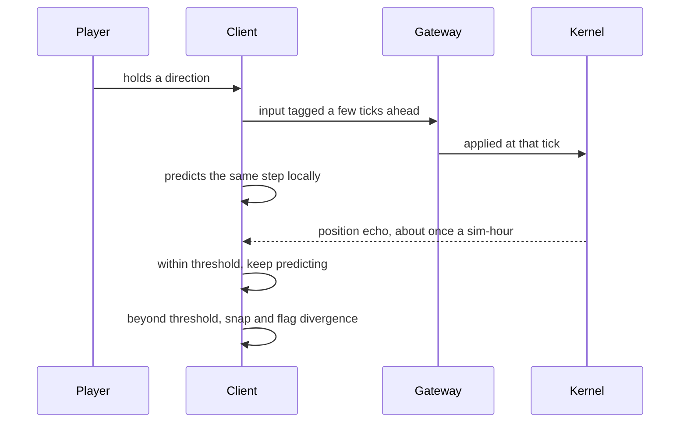
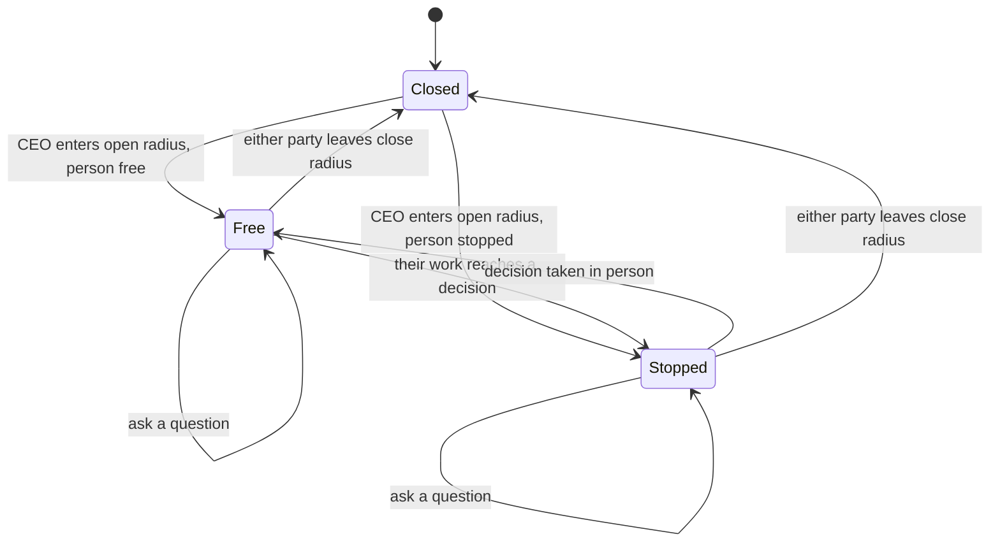
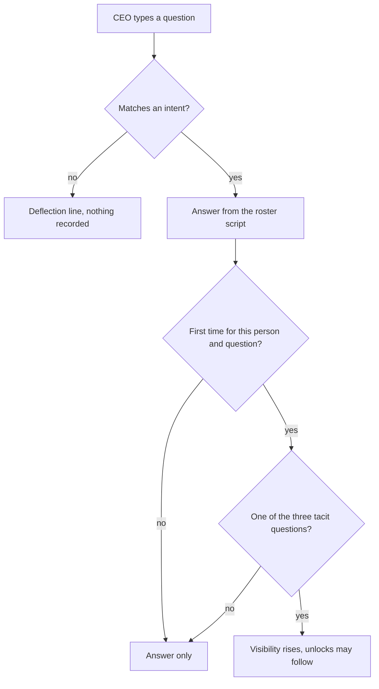

# feat: Company OS Phase 2 - the playable loop

## Summary

Wire the playable loop into the React client on the kernel Phase 1 already built: draw and drive
the CEO, open a conversation by standing next to someone, assign and decide from inside it, and add
the one kernel command the ask mechanic needs. Eight units, one of them backend-only.

Every command the loop needs already exists and is tested, except asking. The work is mostly
connection, not construction.

---

## Problem Frame

Phase 1 shipped a correct, durable, tested kernel and no way to play it. The CEO is not an actor
on the floor: keystrokes reach the kernel and move `state.ceo`, but the resulting position never
returns to the client, and the client-side predictor sits written and golden-tested with no callers
outside tests. There is no conversation surface, so the in-person route — the mechanic every metric
in this product rewards — is unreachable, and the tray's cheaper route is the only decision path
that exists.

Three of Phase 1's requirements caused this by being written and never assigned to an
implementation unit. This plan carries a coverage table for that reason: every requirement in the
origin document names the unit that discharges it, so an unowned requirement is visible rather than
silent.

---

## Requirements

This plan adopts the origin document's requirement numbering rather than introducing a second one,
so the table below reads against either document. Every origin requirement names its unit.

| ID | Requirement | Unit |
|---|---|---|
| R1 | CEO renders as an actor, accent-coloured, depth-sorted | U1 |
| R2 | WASD and arrows drive continuous movement while held | U2 |
| R3 | Client predicts position and reconciles against the kernel's echo | U1, U2 |
| R4 | Walking costs sim-time at the current clock rate | U2 |
| R5 | Standing within 1.9 tiles opens a conversation; leaving closes it | U3 |
| R6 | The conversation names person, title, department and state | U3 |
| R7 | A stopped person's conversation shows prompt, options and the in-person line | U4 |
| R8 | The in-person line never appears in the tray or work panel | U4 |
| R9 | Conversation resolution records in person; tray resolution records not | U4 |
| R10 | Each route states its cost before the choice | U4 |
| R11 | The clock keeps running while a conversation is open | U3 |
| R12 | A free person's conversation offers work they or their reports can take | U5 |
| R13 | Direct assignment bypasses and records the director; routed does not | U5 |
| R14 | The work panel keeps its assignment buttons | U5 |
| R15 | Free-text question matched to four intents | U6, U7 |
| R16 | An unmatched question returns that person's own deflection line | U6, U7 |
| R17 | First tacit answer per person raises Visibility; repeats pay nothing | U6, U7 |
| R18 | Answers persist on the person across conversations | U7 |
| R19 | Answered questions are run state and survive reload | U6, U7 |
| R20 | A person reaching a decision stops and the floor shows it | U4 |
| R21 | The tray lists everyone waiting | U4 |
| R22 | Work does not progress while a decision is unresolved | U4 |
| R23 | Pause stops the world and the CEO, and says so | U2 |
| R24 | An open conversation stays readable while paused | U3 |
| R25 | The client can start a run and attach to it | U8 |
| R26 | A finished run can be followed by another from the same screen | U8 |

The origin's four flows land the same way: assigning in person in U5, being summoned to a decision
in U4, asking what the tray never shows in U7, and settling from the tray instead in U4.

---

## Success Criteria

Carried from the origin document. These are the phase's bar, and no single unit discharges them —
they hold once the units are together.

- A run can be played start to finish entirely from the floor, with every assignment and every
  decision taken inside a conversation, never opening the tray or the work panel.
- The same run can be played entirely from the panels, so the two routes can be compared directly.
- The two routes produce measurably different Visibility and morale over a run, so the in-person
  mechanic's value is observable rather than asserted.
- The loop sustains itself: after assigning work there is always someone worth walking to, and the
  run reaches its horizon without the player running out of things to do.
- Walking feels worth doing on a floor of ten people, at x1 and x3.

---

## Key Technical Decisions

**Adopt the origin's requirement numbering.** One numbering across both documents. A second
plan-local set would make the coverage table ambiguous, which is the failure this table exists to
prevent.

**The client predicts; the kernel audits.** The position echo arrives about once per sim-hour, so
rendering from it is impossible. Prediction with a snap past a threshold is the only shape that
gives responsive movement and a detectable divergence (see origin: Key Decisions).

**The answered-question state serializes as a sorted list.** A set anywhere in hashed state raises
`NotCanonical`, and that failure surfaces at a day-boundary hash rather than at the call site.

**The ask event carries the answer text.** The codebase's habit is to re-derive scripted content
rather than store it — the report re-derives checkpoint tacit lines from state. A generated answer
cannot be re-derived, so storing it now keeps the log's shape stable when a hearing API replaces
the script.

**The Visibility gain per tacit answer goes in the tuning table.** This product treats every metric
number as authored tuning. It also means the derived rules version moves; see System-Wide Impact.

**Proximity uses hysteresis.** A single radius makes two adjacent desks trade the panel back and
forth. The open radius, the close radius and the switch margin are three different numbers.

**The conversation is an overlay with a pure model.** An overlay keeps the HUD and tray visible
while it is open. The model owns range and eligibility so both are testable without a canvas,
following the split the HUD and panels already use.

**Paused rejections surface instead of being swallowed.** Movement commands currently discard their
errors on purpose, since a dropped input is a missed step. A paused run rejects every command, so
that same silence is what would make pause read as a broken build.

**No new golden fixtures.** The CEO step vectors already pin the predictor, both suites read them,
and this plan changes no stepping constant.

---

## High-Level Technical Design

**Input and position, round trip.** The client is the only thing that feels responsive; the kernel
is the only thing that is authoritative.

**The conversation's states.** Which card the panel shows follows the person, not the CEO.

**What an ask pays.** The once-only rule is the part that is easy to get wrong.

---

## Implementation Units

U6 is backend-only and depends on nothing, so it can land in parallel with U1 through U5.

### U1. Draw the CEO on the floor

- **Goal:** The CEO appears in the office as a distinguishable actor, positioned from run state.
- **Requirements:** R1, and R3's seeding half.
- **Dependencies:** none.
- **Files:** `frontend/src/render/palettes.ts`, `frontend/src/render/sprites.ts`,
  `frontend/src/net/store.ts`, `frontend/src/ui/stage.ts`, `frontend/tests/render.test.ts`,
  `frontend/tests/store.test.ts`
- **Approach:** The kernel's snapshot already carries the CEO's position and facing, so the client
  seeds from run state rather than a hardcoded spawn — which is also what makes a reload land the
  CEO where they were. The actor projection currently maps staff only; the CEO joins the same list
  so one depth sort covers everyone. The sheet comes from the generator that already builds staff
  sheets, with a new accent palette entry rather than new pixel rows.
- **Patterns to follow:** sheet generation and the palette map in `frontend/src/render/sprites.ts`;
  the depth-sorted draw loop in `frontend/src/render/index.ts`; the actor shape in
  `frontend/src/render/actors.ts`.
- **Test scenarios:**
  - Covers R1. The actor projection includes the CEO when run state has one, and the CEO's palette
    differs from every staff palette.
  - A CEO standing below a desk draws in front of it; standing above, behind it.
  - The generated CEO sheet is rectangular with a clean palette, matching the existing sprite
    validation.
  - Attaching to a run in progress seeds the CEO at the position run state reports, not at an
    origin default.
- **Verification:** Opening a run shows a distinguishable CEO figure where the kernel says they
  are, sorted correctly against desks and staff.

### U2. Predict and reconcile CEO movement

- **Goal:** WASD moves the CEO responsively, the echo keeps prediction honest, and a paused run
  says why nothing happens.
- **Requirements:** R2, R3, R4, R23.
- **Dependencies:** U1.
- **Files:** `frontend/src/net/store.ts`, `frontend/src/ui/stage.ts`, `frontend/src/ui/Shell.tsx`,
  `frontend/src/render/index.ts`, `frontend/tests/render.test.ts`, `frontend/tests/golden.test.ts`
- **Approach:** The predictor exists and is vector-tested; this unit calls it. Each frame advances
  the predicted position by the held mask, in tick space. The position echo is compared against the
  prediction and snaps past a threshold, raising the divergence flag the banner already reads.
  Movement's deliberate error-swallowing gets one exception: a paused rejection surfaces. On resume
  the currently held mask is re-sent, because a key held across a pause fires no fresh keydown and
  the CEO would otherwise stay frozen until the player let go.
- **Execution note:** Pin the paused-resume behaviour with a failing test first — the bug is silent
  by construction, so it is easy to believe it is fixed when it is not.
- **Patterns to follow:** `ceoStep` and the milli-tile arithmetic in
  `frontend/src/render/interpolate.ts`; the slew-versus-snap threshold in
  `frontend/src/render/clock.ts`; the rejection banner in `frontend/src/ui/Shell.tsx`.
- **Test scenarios:**
  - Covers R2. A held direction advances the predicted position every tick; releasing stops it.
  - Covers AE8. An echo within threshold leaves the prediction alone; an echo beyond it snaps and
    raises divergence rather than tolerating it.
  - Covers R23, AE10. At rate zero a movement key produces no motion and the paused reason reaches
    the banner instead of being discarded.
  - A direction held across a pause moves the CEO on resume without the player releasing the key.
  - Covers R4. At x3 the CEO covers three times the distance per wall-second, and stops dead at
    rate zero.
  - Diagonal input uses the diagonal step, matching the existing golden vectors.
  - The CEO's walk cycle animates while a direction is held and rests when released. Staff derive
    this from their walking state; the CEO has no such field and must take it from held input.
- **Verification:** WASD walks the CEO around the floor at x1 and x3 with no divergence banner
  during normal play, and pausing states why nothing moves.

### U3. Proximity and the conversation shell

- **Goal:** Standing next to someone opens a conversation naming them; walking away closes it.
- **Requirements:** R5, R6, R11, R24.
- **Dependencies:** U1.
- **Files:** `frontend/src/ui/Conversation.tsx`, `frontend/src/ui/conversation-model.ts`,
  `frontend/src/ui/shell.css`, `frontend/src/ui/Shell.tsx`,
  `frontend/tests/conversation.test.ts`
- **Approach:** A pure model owns who is in range, so the rule is testable without a canvas:
  nearest person inside the open radius, held until they pass the close radius, and only replaced
  when another is nearer by the switch margin. Range is recomputed from both parties' positions,
  since staff walk to desks and meetings and can leave a conversation the CEO is standing still in.
  The panel is an overlay beside the stage rather than a rail entry, so it never displaces the HUD
  or the tray. Nothing about opening a conversation touches the rate.
- **Patterns to follow:** narrow store selection with the shallow-comparison hook as in
  `frontend/src/ui/Panels.tsx`; the model-and-component split in `frontend/src/ui/hud-model.ts` and
  `frontend/src/ui/panels-model.ts`.
- **Test scenarios:**
  - Covers R5, AE1. Crossing into the open radius selects that person; leaving the close radius
    clears the selection.
  - Two people standing together do not swap the selection until the second is nearer by the switch
    margin.
  - Covers R6. The panel shows name, title, department and current state for the selected person.
  - A person who walks away while the conversation is open closes it, driven by their movement.
  - Covers R11, R24, AE10. Opening a conversation leaves the rate alone, and an open conversation
    stays rendered at rate zero.
  - A selected person becoming stopped re-renders the panel into the stopped shape without
    reopening.
- **Verification:** Walking the floor opens and closes conversations cleanly, with no flicker
  between adjacent desks.

### U4. Decide in person

- **Goal:** A stopped person's decision is taken inside the conversation, with the line they say
  only in person, while the tray keeps its cheaper route.
- **Requirements:** R7, R8, R9, R10, R20, R21, R22.
- **Dependencies:** U3.
- **Files:** `frontend/src/ui/Conversation.tsx`, `frontend/src/ui/conversation-model.ts`,
  `frontend/src/ui/Panels.tsx`, `frontend/tests/conversation.test.ts`,
  `frontend/tests/panels.test.ts`
- **Approach:** The kernel already prices both routes and already records which was taken, so this
  unit adds the in-person path and the guarantee that the tacit line is unreachable from anywhere
  else. The conversation reads the raised checkpoint from run state, badges the tacit line, and
  sends the resolve with the in-person flag set. The tray keeps its options, its cost sentence and
  its flag unchanged. The payoff is already visible without the report: the deliverables panel
  renders the tacit lines a run surfaced.
- **Patterns to follow:** the tray card and its resolve payload in `frontend/src/ui/Panels.tsx`;
  the raised-checkpoint and deliverable slices of `frontend/src/net/store.ts`.
- **Test scenarios:**
  - Covers AE2. Resolving from the conversation sends the in-person flag, and the decision records
    the tacit line.
  - Covers R8, AE3. The tray renders prompt and options but never the tacit line, in any state.
  - Covers R10. Both routes state their cost before the choice is made.
  - Covers R20, R21. A person reaching a checkpoint appears in the tray and shows the waiting beam
    on the floor with no panel open.
  - Covers R22, AE9. Time passing with an open, unresolved decision leaves that person's progress
    unchanged.
  - A resolve the kernel rejects — already resolved, run ended — surfaces the reason rather than
    failing quietly.
- **Verification:** A run can be driven through several decisions entirely from the floor, and the
  deliverables panel shows the tacit lines those decisions surfaced.

### U5. Assign from the conversation

- **Goal:** A free person can be handed available work from inside the conversation, by either
  route.
- **Requirements:** R12, R13, R14.
- **Dependencies:** U3.
- **Files:** `frontend/src/ui/Conversation.tsx`, `frontend/src/ui/conversation-model.ts`,
  `frontend/tests/conversation.test.ts`
- **Approach:** The model computes what this person can take — unlocked backlog items wanting them,
  or wanting one of their reports — and the route follows from that: an item wanting them goes
  direct, an item wanting a report routes through them. Availability comes off the wire rather than
  being recomputed from authored gates, matching the rule the work panel already follows. The list
  refreshes when a Visibility gain unlocks something while the conversation is open.
- **Patterns to follow:** the assign payloads and the availability-off-the-wire rule in
  `frontend/src/ui/Panels.tsx`; the reporting-line grouping in the same file's org panel.
- **Test scenarios:**
  - Covers R12. A free person's conversation lists the unlocked backlog items they or their reports
    could take, and no locked or already-assigned ones.
  - Covers R13, AE6. Handing an item straight to a specialist records their director as
    uninformed; routing through the director does not.
  - A director's conversation offers work wanting any of their reports.
  - An item unlocking while the conversation is open appears without reopening it.
  - Covers R14. The work panel's own assign buttons keep working unchanged.
  - Assigning to someone who became busy in the same tick surfaces the rejection.
- **Verification:** A run's whole backlog can be assigned without opening the work panel.

### U6. The ask command in the kernel

- **Goal:** The kernel records what the CEO asked whom, pays Visibility once per person per
  question, and answers from the roster's script.
- **Requirements:** R15, R16, R17, R19.
- **Dependencies:** none.
- **Files:** `backend/proto/kernel.proto`, `backend/proto/events.proto`,
  `backend/packages/contracts/envelope.py`, `backend/packages/simcore/step.py`,
  `backend/packages/simcore/people.py`, `backend/packages/simcore/rates.py`,
  `backend/packages/simcore/snapshot.py`, `backend/services/kernel/loop.py`,
  `backend/single_process.py`, `backend/tests/test_kernel_port.py`,
  `backend/tests/test_contracts_generated.py`, `backend/tests/test_replay.py`
- **Approach:** A new command kind and a new event kind, built the way every Phase 1 command was.
  Person state gains the questions already answered, serialized as a sorted list because a set in
  hashed state raises. The three tacit questions pay Visibility on first answer only; the
  bottleneck question pays nothing, matching the prototype. The event carries the answer text. Ten
  deflection lines join the roster, one per person, for a question matching no intent. The
  Visibility gain lands in the tuning table, which moves the derived rules version. Regenerate
  stubs with the existing script rather than editing generated files.
- **Execution note:** Characterization first. Add the state-hash and replay assertions before
  touching person state, because a set or float reaching hashed state fails at a day boundary
  rather than at the call site.
- **Patterns to follow:** the command-function shape and `CommandRejected` usage in
  `backend/packages/simcore/step.py`; the enum-mirroring test in
  `backend/tests/test_contracts_generated.py`; the write-and-read state pair in
  `backend/packages/simcore/snapshot.py`; stub regeneration via
  `backend/scripts/generate_protos.py`.
- **Test scenarios:**
  - Covers R17, AE4. The first tacit question answered for a person raises Visibility; the same
    question again returns the answer and moves nothing.
  - The bottleneck question returns its answer and never moves Visibility.
  - Covers R16, AE5. A question matching no intent returns that person's deflection line and
    records no answer.
  - Covers R19, AE7. Snapshot and reload round-trip the answered-question state, and a reloaded
    person pays nothing on a repeat ask.
  - Hashed state stays canonical with the new field: no set, no float, and two structurally equal
    states hash the same.
  - Replaying a log containing asks reproduces the same Visibility trajectory.
  - The new event kind decodes through the envelope, and the proto and Python enums stay in sync.
  - Asking a person who is not on the roster is rejected and mutates nothing.
  - Every roster person has all four scripted answers and a deflection line.
- **Verification:** The backend suite passes with the new command exercised end to end in
  single-process mode, and a run's Visibility rises only through asking and in-person decisions.

### U7. The ask box in the conversation

- **Goal:** The CEO types a question, the person answers, and what they have already said persists.
- **Requirements:** R15, R16, R17, R18, R19.
- **Dependencies:** U3, U6.
- **Files:** `frontend/src/ui/Conversation.tsx`, `frontend/src/ui/conversation-model.ts`,
  `frontend/src/net/store.ts`, `frontend/tests/conversation.test.ts`
- **Approach:** The intent matcher lives in the pure model, mirroring the prototype's keyword sets,
  so matching is unit-testable without rendering. Answers fold out of the new event into per-person
  run state, so returning to someone shows what they already said and a reload does not lose it.
  Typing in the box must not drive the CEO; the stage's key handling already ignores form controls,
  and a test pins that it stays that way.
- **Patterns to follow:** the keyword intent sets at `company-os.html:3049`; the event-folding
  shape in `frontend/src/net/store.ts`; the pure-model split in `frontend/src/ui/hud-model.ts`.
- **Test scenarios:**
  - Covers R15. Each of the four intents matches its keywords, case-insensitively.
  - Covers R16. A phrase matching no intent renders that person's deflection line.
  - Covers R18. Answers accumulate on the person and are still shown after closing and reopening
    the conversation.
  - Typing letters that are also movement keys into the box does not move the CEO.
  - A first tacit answer shows Visibility rising in the HUD.
  - Covers R19. A reload replays the asks and restores the answers.
- **Verification:** Standing next to each person and asking the four questions surfaces their
  script and raises Visibility exactly once per question.

### U8. Start a run from the client

- **Goal:** A session begins by opening the page, and a finished run can be followed by another.
- **Requirements:** R25, R26.
- **Dependencies:** none.
- **Files:** `frontend/src/net/gateway.ts`, `frontend/src/net/runid.ts`, `frontend/src/App.tsx`,
  `frontend/src/ui/Shell.tsx`, `frontend/tests/gateway.test.ts`
- **Approach:** The client calls the gateway's existing creation route and attaches to what it
  made. Creation stays its own route, so the rule that no command brings a run into being is
  untouched. With no run named in the URL the page offers to start one instead of reporting gateway
  status. A terminated run offers another rather than leaving a dead screen. The created id reaches
  the URL so a reload re-attaches instead of starting a second run.
- **Patterns to follow:** the fetch-and-classify shape in `frontend/src/net/gateway.ts`; the
  terminal-state banner in `frontend/src/ui/Shell.tsx`.
- **Test scenarios:**
  - Covers R25, AE11. Starting a run posts creation once, attaches to the returned id, and renders
    the office without a reload.
  - Creating a run that already exists attaches to it rather than erroring, matching the route's
    idempotency.
  - A creation failure reports why and leaves the page usable.
  - Covers R26. A terminated run offers a new one, and starting it replaces the stream cleanly.
  - The created run id reaches the URL, so a reload re-attaches to the same run.
- **Verification:** From a cold browser with no terminal, a run can be started, played, and
  replaced.

---

## System-Wide Impact

**The derived rules version moves.** It is a digest over the tuning table and the multiplier
composition order, and the ask mechanic's Visibility gain belongs in that table. Logs written
before this work therefore report as un-replayable under the new rules rather than diverging
silently — the guard for that already exists and names the version in its error. Any demo run kept
from Phase 1 stops being replayable, which is correct and worth knowing before someone treats it
as a regression.

**Person state joins the state hash.** No test pins a literal hash, and determinism is asserted by
self-consistency, so no fixture regeneration follows. The risk is shape, not value: a set or float
reaching hashed state raises at a day boundary, far from the code that put it there.

**The event kind set is closed on decode.** An event written with a kind the envelope does not know
fails to decode rather than being skipped, so the proto and the Python enum must land together. The
report's fold is a chain of conditionals with no fallback branch, so it needs no change and will
ignore the new kind.

**The golden fixtures are shared.** Both suites read the same vectors, so a change to the CEO's
stepping constants would break the kernel and the client together. This plan changes none of them.

---

## Risks & Dependencies

- **The verdict may be about the script, not the mechanic.** Each person has four answers and then
  runs dry. Name this when forming the verdict, or the ask box gets blamed for the writing.
- **Nothing here is exercised under compose.** The gRPC client leg is still absent, so the demo
  path stays unproven and every claim in this plan is a claim about single-process mode.
- **The in-person claim stays unverified.** Proximity is derived client-side and the kernel trusts
  the flag, so the mechanic's integrity depends on one honest client (see origin: Known holes).
- **Free text against fixed answers will miss often.** The deflection lines are the mitigation and
  they carry more weight than their size suggests.
- **U6 is the only unit with a schema surface.** Regenerated stubs are committed, so a partial
  regeneration is the likeliest source of a confusing failure in this plan.
- **A full run is twenty sim-days, about five minutes at x1 and under two at x3.** Manual
  verification of the whole loop costs a sitting, not an afternoon, so the success criteria above
  can be checked by hand rather than only inferred from tests.
- **The roster is ten people, four directors and six staff, and every one has all four scripted
  answers.** No person is unaskable, so the ask box needs no empty-state beyond the deflection line.

---

## Scope Boundaries

### Deferred for later

Carried from origin: encourage and its once-a-day morale; click-to-walk and the org panel's
walk-over buttons; the conversation's working-state card and the stop-this-work action; surfacing
the run report; the gRPC client leg and a working compose demo path; the hearing API; retiring
`company-os.html`; screenshot-based visual parity verification.

### Known holes we are accepting

Carried from origin: in person is a claim rather than a check, so the tray could assert the
in-person route and collect its rewards — acceptable while one honest client plays solo, and it
must close before any client we do not control can drive a run. And four answers per person is the
whole script, so the mechanic is judged at that depth on purpose.

---

## Open Questions

Deferred to implementation:

- The exact open, close and switch thresholds for proximity. The shape is decided; the numbers want
  a floor to walk around before they are fixed.
- Whether the conversation overlay anchors to the stage or floats over it at narrow widths.
- Whether answers render newest-first as the prototype does, or in the order asked.

---

## Sources / Research

| Location | What it holds |
|---|---|
| `company-os.html:1872` | Talk range and the proximity rule that opens and closes the conversation |
| `company-os.html:2974` | The conversation panel and its stopped / working / free states |
| `company-os.html:3049` | The four ask intents, which three are tacit, and the miss path |
| `company-os.html:2648` | The prototype's distinct CEO sprite key |
| `backend/packages/simcore/people.py:179` | Four scripted replies per person, ported and unread |
| `backend/packages/simcore/step.py:1258` | Kernel CEO movement from a held-direction bitmask |
| `backend/packages/simcore/step.py:1683` | The price of each decision route, in person versus tray |
| `backend/packages/simcore/step.py:1297` | The unlock gate that Visibility feeds |
| `backend/packages/simcore/rates.py:166` | What the rules version digests, and so what moves it |
| `backend/tests/test_determinism.py` | That a set in hashed state raises, and that no literal hash is pinned |
| `backend/scripts/generate_protos.py` | Stub regeneration, including the import rewrite |
| `frontend/src/render/interpolate.ts:125` | The movement predictor, golden-tested and called only by tests |
| `frontend/src/net/store.ts:355` | Where the position echo arrives and is discarded |
| `frontend/src/ui/stage.ts:55` | The actor projection, staff only |
| `frontend/src/ui/Panels.tsx:292` | The tray's resolve, reporting the in-person route as not taken |
| `backend/services/gateway/commands.py` | Why every command is rejected while the rate is zero |
