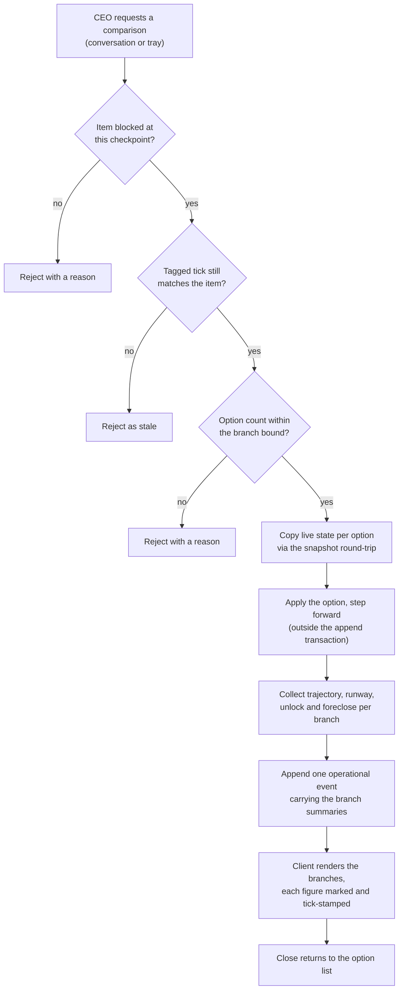
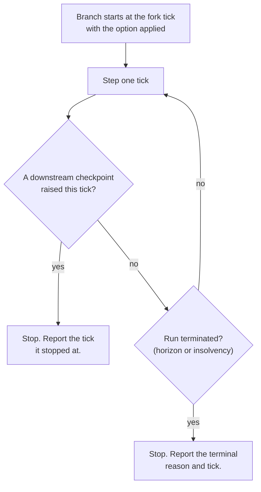

# feat: Company OS - option consequence and branch comparison

## Summary

Put each checkpoint option's authored consequence on the screen, mark every number the client renders as authored tuning, and let the CEO run one branch per option to see where that option travels before committing. Six units, none of which needs a model key, a new dependency, or the kernel-to-agents transport leg. The bench, the citation contract and the objection round follow in a second plan.

---

## Problem Frame

The origin document splits cleanly at the model boundary, and the half below it is buildable today.

`Option` in `backend/packages/simcore/items.py` carries `label`, `detail`, `effect` and `note`. `catalog_to_state()` ships two of the four, withholding `effect` on purpose — its docstring says the CEO should not be able to optimise against the arithmetic. So the decision surface shows three labels and three authored sentences and nothing about consequence, which is the gap the origin's Problem Frame names.

The second half of that gap is shape over time. A single delta says where a metric steps; it cannot say what the option opens or forecloses, or how far the runway moves by the next decision. The origin answers that with a per-option branch, and research found the fork path is a poor fit: `fork_run` copies the parent's prefix eagerly under a 5,000-event bound, the child shares sequence values with its parent, `KernelRuntime.fork` derives the child id from parent and sequence alone so two branches at one tick collide, the child arrives paused with nothing to fold or advance it, and the append-only log refuses the deletion a discard would need. Meanwhile the kernel is a pure function that runs headless by design, and a full 20-day horizon measures about 10,800 ticks at roughly 0.12 seconds of stepping.

And the marking the origin makes load-bearing does not exist. The coverage audit found "authored tuning" in two code comments and on no rendered surface, while the HUD renders five metric values, five deltas, five sparklines, a runway estimate, capacity heat and decision pressure.

---

## Requirements

Requirement numbering is the origin document's, unchanged — one numbering across both documents, following the precedent set in `docs/plans/2026-08-14-001-feat-company-os-playable-loop-plan.md`. Only the origin requirements this plan discharges are listed; the rest belong to the second plan.

**Option consequence**

- R35. Each option at a checkpoint shows its authored effect and note, marked per R27, by carrying through the fields the server-side option already holds.

**Marking**

- R27. Every trajectory, delta, runway figure and derived value the client renders is marked as authored tuning. This plan reads "renders" as covering the surfaces that already exist, not only the ones it adds — the audit found the marking on none of them, and a founder reading a projection where none exists cannot tell a new tile from an old one.
- R28. No surface presents a number without that number's marking travelling with it. The marking is a property of the figure, so the second plan's agent prose inherits it rather than re-implementing it.
- R36. The marking is a dedicated token — a persistent glyph and label — and never a hue, so it cannot be satisfied with the amber reserved for a person waiting on the CEO.

**Branch comparison**

- R21. At an open checkpoint the CEO may run one branch per option, forked at that tick and advanced to the first downstream checkpoint it raises, or to the run's horizon if it raises none. The comparison is reachable from a conversation and from the tray, with or without a model key.
- R22. A branch reports each metric's trajectory, runway, and which work the option unlocked or foreclosed, every figure naming the tick it was measured at. A branch takes no action at any checkpoint or unassigned item it reaches, and is presented as this option with no further decisions taken.
- R24. A branch never mutates the parent run and is discarded when the comparison closes. Satisfied structurally: a branch is never written to the store, so collision and leakage are not states the system can reach.
- R25. A comparison neither advances nor rewinds the parent run's clock. Its result carries its fork tick and is refused as stale once the parent has moved that checkpoint's item.
- R26. The branch count per comparison is bounded. The bound is a submission guard rather than a tuning constant — see the Key Technical Decisions.
- R34. Closing a comparison returns the CEO to that checkpoint's own option list, in whichever surface it was opened from, to commit. A comparison informs a choice and never commits one.

**Determinism and the keyless path**

- R8. The branch comparison stays available with no model key configured, because its arithmetic needs no model. The rest of R8 is already true — no bench exists yet.
- R23. Resolved as unnecessary and dropped. Branches reproduce the parent's stochastic draws by construction; see the Key Technical Decisions.
- R29. Re-folding a log containing comparison records reproduces the run exactly.
- R30. A run with the bench absent passes every assertion that passed before this phase.

**Already discharged by existing code**

- R4 and its accounting case need no work. `items.director_for(item)` is already `roster.reporting_line_of(item.want)`, and both items authored against the accounting room name Priya, whose reporting line is the Administration director.

**Origin acceptance examples in scope**

AE9, AE10, AE11, AE13, AE15, AE19, AE20, AE21, AE23, and the comparison-from-the-tray clause of AE14. The remainder cover the bench, the citation contract and the objection round.

**Origin flows in scope**

F2, compare the options, in full. The option-consequence and comparison clauses of F4, play without a key. F1 and F3 belong to the second plan, and the actors they need — the department expert, and the specialist as an objection respondent — arrive with it. Only the CEO and the kernel act in this plan.

---

## Key Technical Decisions

**Branches run in memory; the store never sees them.** A comparison is a function call against a copy of live state, not a forked run. This avoids the eager prefix copy and its 5,000-event refusal, the child that shares sequence values with its parent, the paused child that nothing folds or advances, the `resume_all` fold cost on every restart, and the append-only rows a discard cannot remove. It satisfies R24 by making persistence impossible rather than by managing it, and it leaves the fork interface untouched for the strategy-comparison phase that owns it.

**Branches run outside the append transaction.** The single writer holds one transaction per tick. Three branches at roughly 0.12 seconds each inside that transaction would stall every other run's ticks and read as a store outage that is not happening — the same failure `fork_run`'s own refusal message exists to avoid. The comparison computes first, then appends one event.

**State is copied through the snapshot round-trip.** `snapshot.to_wire` then `from_wire` yields an independent state, and `restore` already re-hashes what it rebuilt and refuses a mismatch, so the copy is provably both separate and equal. A shallow copy would share the mutable per-person and per-item objects the step function writes through, and the parent would drift.

**A comparison is an operational event.** It mutates no state, so the fold must neither apply it nor regenerate it — regenerating would make every replay re-run N branches for no gain in what replay proves. It joins `DAY_CHECKPOINT` and `RUN_FORKED` in `OPERATIONAL_KINDS`. Two consequences follow: this phase adds no hashed state and needs no state-shape version bump, and the figures the CEO saw are still on the record for the second plan's citation contract to point at.

**The branch bound is a guard, not tuning.** This departs from R26's literal wording, and the repo's own rule is why: a bound on what may be submitted stays out of the tuning table, while a number that changes what a recorded run means goes in. A comparison changes no state, so its bound cannot change what a run means. Keeping it a guard also leaves `RULES_VERSION` where it is, which matters — moving it invalidates every existing snapshot and makes current logs unfoldable.

**The shared-draw rule is dropped.** R23 required an agent input drawn once and shared across a comparison's branches. `rng.draw` is a pure function of run seed, tick, purpose and entity with no generator state, so every branch already reproduces the parent's draws tick for tick; and an unattended branch invokes no agent, because no CEO is inside it and R17 forbids the expert from choosing. The rule protects nothing. AE10's identical rerun holds by construction.

**Branch trajectories are a separate shape from the live trajectory store.** `state.trajectories` is the parent run's actual history, bounded at 240 points and written only from what the store read off an event. A branch's points are a projection carrying a measured tick and an authored basis. They live in their own slice, keyed by the comparison, and are dropped with it.

**The marking follows the tacit-line precedent.** A semantic text token plus a badge, not a hue — `PAL.tacit` with its "Only in person" badge is the working example of a non-hue semantic slot. Export the token separately, the way `RESERVED_BEAM` is exported, so "the marking is never the beam" is a property a test states directly rather than a convention someone remembers.

**Option deltas reverse a deliberate withholding, and the docstring says so.** `catalog_to_state`'s docstring withholds `effect` because the CEO should not optimise against the arithmetic. The marking is what makes showing it defensible: the figure is visible and labelled as invented rather than hidden and imagined. Rewrite the docstring to record the reversal and its reason instead of deleting the paragraph.

**A comparison is the first command allowed while the run is paused.** The established rule is that a paused run has no tick boundary to apply a command at, so player input does not land. A comparison mutates no state and needs no tick boundary, and pausing to weigh two options is exactly when it is wanted. The append still works — pause stops the clock, not the writer.

**The comparison command tags the render clock's tick.** The client's authority for tagging is the render clock, not the last tick the store heard out loud; a command tagged from the store's tick lands in the kernel's past and is rejected. This was a real defect fixed in `d454a10`, and an end-to-end check that passes the server's own tick to the request would not catch a regression.

**Every unit's verification names its production caller and its rendered surface.** The repo's documented failure mode is golden-tested code with no call path — the coverage audit found three such capabilities, and the commit history shows at least five instances. A unit that passes its tests and reaches no surface is not done.

---

## High-Level Technical Design

**A comparison request, end to end.** The branches are computed before anything is appended, and the parent's clock is never touched.

**Where a branch stops.** The stop condition is what keeps a branch honest: nothing inside it can settle a decision, so it runs only as far as the next one.

---

## Implementation Units

### U1. Carry each option's authored consequence to the client

- **Goal:** `effect` and `note` reach the client for every checkpoint option, so the decision surface can show what an option costs.
- **Requirements:** R35; AE20, AE23
- **Dependencies:** none
- **Files:**
  - `backend/packages/simcore/items.py` — `catalog_to_state`, and its docstring
  - `backend/packages/contracts/envelope.py` — `KIND_SCHEMA_VERSIONS`, genesis payload version
  - `backend/proto/events.proto` — genesis payload version comment, if it carries one
  - `backend/tests/fixtures/golden/genesis.json` — regenerated
  - `backend/tests/test_kernel_port.py` — catalog wire-shape assertions
  - `frontend/src/net/store.ts` — `CheckpointDef`, `CatalogEntry`
  - `frontend/src/ui/conversation-model.ts` — `DecisionOption`
  - `frontend/tests/conversation.test.ts`
  - `frontend/tests/helpers/frames.ts` — `catalogFixture` if its shape moves
- **Approach:** Add `effect` and `note` to the option projection and bump the genesis payload version, the way the catalog and the roster names landed at versions 2 and 3. The recurring-draw pseudo-key is not a metric and must be separated from the metric deltas before display, using the existing draw-splitting helper rather than a second implementation. The tacit line stays withheld — the structural guarantee that the tray cannot reach it is unchanged and must remain asserted.
- **Patterns to follow:** the two prior genesis payload bumps for the shape of the change; `items.split_draw` for separating the draw key; the existing structural test that the tray carries no tacit line.
- **Test scenarios:**
  - Covers AE20. A checkpoint's three options each arrive with their authored effect map and note; the note is the sentence the deliverable's provenance records.
  - An option whose effect map is empty renders no figures rather than a row of zeros — the approval checkpoint on the closing-cycle item carries this case.
  - An effect carrying the recurring-draw pseudo-key surfaces as a draw change in the department's own unit, not as a metric delta.
  - The tacit line is absent from the catalog projection, and the existing tray-cannot-reach-it assertion still passes.
  - The regenerated golden fixture parses in the frontend suite, and the suite fails with its regeneration instruction if the fixture is stale.
  - Covers AE23. With no model key configured, the option consequence still renders.
- **Verification:** The conversation's decision card and the tray card both display each option's authored consequence in a running single-process session. Production caller: the genesis frame the client already reads at run start.

### U2. The authored-tuning marking, and the sweep that keeps it complete

- **Goal:** every number and derived value the client renders says it is authored tuning, in a form that cannot be satisfied with a colour.
- **Requirements:** R27, R28, R36; AE11
- **Dependencies:** none
- **Files:**
  - `frontend/src/design/tokens.ts` — the marking token, exported separately
  - `frontend/src/ui/Hud.tsx` — metric tiles, runway, pressure, capacity
  - `frontend/src/ui/Conversation.tsx` — the option consequence from U1
  - `frontend/src/ui/Panels.tsx` — the tray card's option consequence
  - `frontend/src/dag/nodes.ts` and `frontend/src/dag/draw.ts` — the owning-department load signal
  - `frontend/src/ui/shell.css`
  - `frontend/tests/hud.test.ts`
  - `frontend/tests/dag.test.ts`
- **Approach:** One token, a glyph and a short label, exported on its own line so a test can assert the token is never the beam — the shape `RESERVED_BEAM` established for exactly this reason. The completeness guarantee is a sweep test over the HUD's default composition rather than one assertion per tile, because the failure mode is a tile added later without the marking. Read R27 as covering existing surfaces, not only new ones; the Open Questions record the narrower reading if a reviewer wants it.
- **Patterns to follow:** `PAL.tacit` plus its badge as the precedent for a non-hue semantic slot; the existing never-the-beam assertions in the HUD and DAG suites; the counting-panel harness if a tile's subscription changes.
- **Test scenarios:**
  - Covers AE11. Every tile in the default HUD composition renders the marking; a tile added to the composition without it fails the sweep.
  - The marking token is not the reserved beam, and no surface introduced here draws the beam.
  - The marking is present in greyscale — asserted by checking the glyph and label rather than a colour value.
  - A metric with fewer than two trajectory points still carries the marking on its flat neutral state.
  - The runway figure carries the marking when it is null before the first day's costs, and when it is zero at insolvency.
  - The DAG's owning-department load signal carries the marking on the same scale the office shows.
- **Verification:** Every tile visible in a running session carries the marking, including the ones present before this plan. Production caller: the HUD's tile dispatch and the DAG's node renderer.

### U3. The branch runner

- **Goal:** a pure function that takes a state, a checkpoint and an option index and returns that option's branch summary, without touching the store or the parent.
- **Requirements:** R21, R22, R23, R24
- **Dependencies:** none
- **Files:**
  - `backend/packages/simcore/compare.py` — new
  - `backend/tests/test_compare.py` — new
- **Approach:** Copy the state through the snapshot round-trip, apply the option through the existing checkpoint-resolution path so the branch prices the decision the way the run would, then step until the first downstream checkpoint raises or the run terminates. Collect per-metric points, the runway at the stopping tick, and the unlock and foreclose sets derived from the existing gate predicates. The module is pure `simcore` — the import-boundary tests forbid transport or store imports here, and that constraint is the reason the runner is a library rather than a service call.
- **Execution note:** Write the parent-is-unchanged assertion first. It is the property the whole decision rests on, and a hash comparison makes it cheap to state before the runner exists.
- **Patterns to follow:** the `Recorder` harness shape used by the pending-input and replay suites; the existing gate predicates for unlock reasoning; `snapshot.restore`'s round-trip-your-own-hash guard as the copy's correctness argument.
- **Test scenarios:**
  - Covers AE15. A branch forked at an early checkpoint stops at the next downstream checkpoint, and the summary names the tick it stopped at.
  - A branch whose option raises no downstream checkpoint runs to the horizon and reports the terminal reason.
  - A branch whose costs cross zero terminates on insolvency and reports that, rather than continuing.
  - Covers AE9. The parent state's hash is byte-identical before and after a branch runs.
  - Covers AE10. The same branch computed twice from the same state returns identical summaries.
  - Two options that gate differently produce different unlock sets — the accounts-payable pair is the available case.
  - Every figure in a summary carries the tick it was measured at.
  - No checkpoint downstream of the fork is resolved inside a branch; each is reported as reached and unsettled.
- **Verification:** The runner is called from U4's command handler, not only from tests. Production caller: the comparison command.

### U4. The comparison command and its record

- **Goal:** the CEO can request a comparison; the kernel guards it, runs the branches outside the append transaction, and appends one operational event carrying what was shown.
- **Requirements:** R21, R25, R26, R29
- **Dependencies:** U3
- **Files:**
  - `backend/proto/kernel.proto` — the command enum
  - `backend/proto/events.proto` — the new event kind
  - `backend/packages/contracts/envelope.py` — `EventKind`, `KIND_SCHEMA_VERSIONS`
  - `backend/packages/simcore/log.py` — `OPERATIONAL_KINDS`
  - `backend/packages/simcore/step.py` — the command handler and its guards
  - `backend/services/kernel/loop.py` — the dispatch table
  - `backend/single_process.py` — `COMMAND_KINDS`
  - `backend/tests/test_compare.py`
  - `backend/tests/test_contracts_generated.py`
  - `backend/tests/test_replay.py`
- **Approach:** Register the command in all four places the parity test checks. Guard order is resolve-everything-that-can-fail before anything is recorded, and the new command joins the existing sweep test that asserts this across every command that can reject. The event is operational, so the fold neither applies nor regenerates it; the payload carries the branch summaries under a length guard, following the bound-what-is-unbounded convention rather than adding a tuning constant. Comparisons are permitted while the run is paused.
- **Patterns to follow:** `ask_person` for the resolve-before-mutate ordering and its stated reason; the submission guards for the bound's shape and its exclusion from the tuning table; `DAY_CHECKPOINT`'s operational classification.
- **Test scenarios:**
  - The four-place registration parity test passes, and removing any one of the four fails it.
  - A comparison on an item that is not blocked at a checkpoint is rejected with a surfaced reason, and nothing is appended.
  - Covers AE19. A comparison whose tagged tick no longer matches the item — resolved, completed, reassigned, or its assignee removed — is rejected as stale.
  - A request above the branch bound is rejected with a reason; the bound does not appear in the tuning table and the rules version is unchanged.
  - Covers AE9. A comparison advances no tick and leaves the parent's clock, state and hash unchanged.
  - A comparison submitted while the run is paused succeeds, unlike every other player command.
  - Covers R29. Re-folding a log containing comparison records reproduces state exactly, and the fold neither applies nor regenerates them.
  - The branch summaries in the payload are bounded; an over-long payload is refused at the entry point rather than written.
  - The resolve-before-mutate sweep test includes the new command.
- **Verification:** A comparison requested from the client produces one event in the log and no state change, observed in a running single-process session. Production caller: the gateway command route.

### U5. The comparison surface in the conversation and the tray

- **Goal:** run a comparison from either route, read the branches side by side with every figure marked and tick-stamped, and return to the option list to commit.
- **Requirements:** R21, R22, R27, R34; AE14 (tray clause)
- **Dependencies:** U1, U2, U4
- **Files:**
  - `frontend/src/ui/comparison-model.ts` — new, the pure rules
  - `frontend/src/net/store.ts` — the event branch and the comparison slice
  - `frontend/src/ui/Conversation.tsx` — the comparison section
  - `frontend/src/ui/Panels.tsx` — the tray card's comparison affordance
  - `frontend/src/ui/shell.css`
  - `frontend/tests/conversation.test.ts`
- **Approach:** Rules in a model module beside the component, matching the lint rule that keeps components export-only and the repo's testing strategy. The comparison slice is separate from the live trajectory store, and it is invalidated by the generic item branch that already drops tray entries when an item leaves blocked — derived from an authority rather than a flag nothing clears. Closing returns to the checkpoint's option list without committing. The tray route and the conversation route read the same model, so the two surfaces cannot disagree.
- **Patterns to follow:** the tacit-line slice held apart from tray entries, as the shape for state the surface must not leak; `personActivity` for deriving display state from an event-backed authority; `sparklinePoints` for rendering a bounded point series; the `X.tsx` plus `x-model.ts` split.
- **Test scenarios:**
  - Covers AE15, R22. A checkpoint with three options renders three branch columns, each figure showing the tick it was measured at.
  - Covers AE11. Every figure in a branch column carries the authored-tuning marking.
  - The parent's live trajectory store is unchanged after a comparison renders — asserted by comparing the slice before and after.
  - Covers R34. Closing the comparison returns to the option list with no decision committed and no command sent.
  - A displayed result is dropped when the item's status leaves blocked on the wire, without any client-side timer.
  - Covers AE14. The comparison is reachable from the tray card and produces the same model as the conversation route.
  - Covers AE23. With no model key configured the comparison renders identically, and no expert section appears.
  - A branch that terminated on insolvency renders its terminal reason rather than an empty trajectory.
- **Verification:** A comparison runs and renders from both the conversation and the tray in a running session, and closing it returns to the options. Production caller: the conversation's decision card and the tray card.

### U6. The keyless path, end to end

- **Goal:** prove the whole plan is reachable and complete with no model key, no bench and no transport leg — so the criterion is observed rather than assumed.
- **Requirements:** R8, R30; AE13, AE23
- **Dependencies:** U1, U2, U3, U4, U5
- **Files:**
  - `backend/tests/test_gateway.py` — the comparison route driven through the composed stack
  - `backend/tests/test_lifecycle.py` — a keyless run to its horizon
  - `frontend/tests/conversation.test.ts`
  - `README.md` — the "What is real, and what is not" section
- **Approach:** Drive the comparison through the composed single-process stack rather than the kernel directly, so the command path, the guard, the event and the client's read are all exercised together. The README's reality list gains the option consequence and the comparison, and states that the numbers are authored tuning — the same claim the marking makes on screen.
- **Patterns to follow:** the composed-stack test shape that calls the launcher's `compose()` directly; the README's existing real-versus-not-real split.
- **Test scenarios:**
  - Covers AE13. A run with no model key configured plays to its horizon and every assertion that passed before this plan still passes.
  - Covers AE23. A comparison requested through the composed stack with no key returns branch summaries.
  - The comparison route's rejection reasons reach the client as a surfaced reason rather than an error status.
  - A run resumed after a restart can still request a comparison at an open checkpoint.
- **Verification:** `cd backend && uv run pytest` and `cd frontend && npm test && npm run lint && npm run build` all pass, and a keyless session demonstrates option consequence and a comparison from both surfaces.

---

## System-Wide Impact

**The genesis payload version moves.** Adding option effect and note is the fourth genesis payload change, and the shared golden fixture the client parses against must be regenerated in the same change. The frontend suite is built to fail with a regeneration instruction rather than skip, so a stale fixture is loud.

**The rules version does not move.** This is deliberate. The branch bound is a submission guard rather than a tuning constant, and no behavioural number is added, so existing snapshots stay valid and existing logs stay foldable. If a later change puts the bound in the tuning table, every kept run stops replaying — correct, but worth knowing before someone reads it as a regression.

**The state hash and shape version are untouched.** A comparison mutates no state, so nothing new enters the hashed snapshot or the snapshot wire form. This plan adds no subsystem and needs no shape-version bump.

**A new event kind joins a closed enum.** It must land in the proto and the Python enum in the same change or the parity test fails, and it must be classified in the fold's kind partition — operational here — or the fold refuses it rather than skipping it.

**The command surface grows by one.** Four registrations, asserted by a test that checks all four agree. The command is also the first that is accepted while the run is paused, which is a departure from the established pause rule and is stated on screen wherever pause is explained.

**Every claim in this plan is a claim about single-process mode.** The gateway-to-kernel gRPC leg is still absent, so nothing here is exercised under compose and the documented demo path stays unproven.

---

## Risks & Dependencies

**Flow and edge-case analysis did not run.** The systematic sweep failed on an API quota limit, so the edge cases in the test scenarios above are derived from the origin document and repo research rather than from an exhaustive pass. Four transitions are named but unanalysed: a comparison closed while its branches are still being computed, a second comparison opened at the same checkpoint before the first is closed, the run terminating between the request and the render, and a comparison requested against an item whose assignee is removed by attrition in the same tick. The Open Questions carry the two that need a decision.

**External research did not run,** for the same reason. This plan needs none — no new dependency, no model, no unfamiliar framework surface — but the second plan's model integration has no prior art in this repo and none was gathered, so it should not inherit the assumption that this plan was externally grounded.

**Branch cost is bounded but not free.** Nine authored checkpoints, three options each, and up to about 10,800 ticks per branch at roughly 0.12 seconds. Worst case is a few tenths of a second per comparison, which is acceptable only because it runs outside the append transaction. If the branch runner is ever moved inside one, the single writer stalls and every other run's ticks stall with it.

**The prior phase's verdict is still unrecorded.** The origin document makes it a precondition for committing this phase's scope, and no end-to-end run has been played. A run costs about five wall-clock minutes. This plan is written; whether to execute it before that verdict exists is a decision this plan does not make.

**Two inherited holes carry forward unchanged,** rather than falling off the register: the in-person claim is asserted by the client and trusted by the kernel with no position validation, and staff do not move on the client. Neither is touched here.

---

## Scope Boundaries

### Deferred to Follow-Up Work

The model-bearing half of the origin document, in one follow-on plan: the kernel-to-agents transport leg, the four director-seated experts, the citation contract and its rejection path, the objection round, and the scripted fallback for every way a model answer fails to arrive usable. Nothing in this plan forecloses any of it — the comparison record exists so those figures are citable, and the marking is a property of a figure so agent prose inherits it.

### Deferred for later

Carried from the origin document unchanged: the mirror intake and everything following from real employee data; the self-serve company composer; external-lookup sourcing; AI spend as a third company resource; the three-tier memory scopes; specialists as agents; per-tick agent invocation; the report's client surface and replay-to-position; the gateway-to-kernel gRPC leg; staff movement and position validation.

Dropped rather than deferred: making forked runs reachable and advanceable. The comparison no longer forks, so the gateway route, the child registration and the fork event are not needed, and the fork interface stays as it is for the phase that owns it.

### Outside this product's identity

Carried from the origin document unchanged: an agent that decides for the CEO; an AI advisory chat reachable without crossing the floor; a general-purpose agent framework.

---

## Open Questions

### Deferred to implementation

- Whether a branch summary is cached for a re-read within one open comparison or recomputed on each read. The runner is cheap enough that either works; the choice is visible once the client's slice shape is real.
- Whether a second comparison at the same checkpoint replaces the first or is refused. Replacing is simpler and matches how the decision card is keyed today; refusing is safer if the first is still computing.
- Whether the comparison's rejection reasons need their own copy or can reuse the existing rejection sentences.

### For a reviewer to narrow if they disagree

- This plan reads R27's marking as covering the surfaces that already render numbers, not only the ones it adds. That is the larger reading and it makes U2 touch the HUD, the conversation, the tray and the DAG. The narrower reading — mark only what this phase introduces — would shrink U2 to the option consequence and the branch columns, and leave the audit's finding open.

---

## Sources / Research

| Location | What it holds |
|---|---|
| `backend/packages/simcore/items.py` | `Option` and `Checkpoint`; `catalog_to_state` and the docstring stating why `effect` is withheld; `split_draw` and `director_for`; nine checkpoints across eight items |
| `backend/packages/simcore/snapshot.py` | `to_wire` / `from_wire`, and `restore`'s round-trip-your-own-hash guard — the copy's correctness argument |
| `backend/packages/simcore/hashing.py` | `SHAPE_HISTORY` and the state-shape version, and why an undeclared subsystem fails loudly. Untouched by this plan |
| `backend/packages/simcore/rates.py` | `TUNING` and the derived rules version — why the branch bound stays out of it |
| `backend/packages/simcore/step.py` | The submission-guard convention and its stated distinction from tuning; `ask_person` as the resolve-before-mutate model; the fixed phase order within a tick |
| `backend/packages/simcore/log.py` | The input, output and operational kind partitions, and the refuse-rather-than-skip rule for an unclassified kind |
| `backend/packages/simcore/rng.py` | Draws as a pure function of seed, tick, purpose and entity — why the shared-draw rule protects nothing |
| `backend/services/kernel/store.py` | `fork_run`, its eager prefix copy, its event bound and its single-writer refusal message — the costs this plan avoids |
| `backend/services/kernel/loop.py` | The dispatch table, and `fork` deriving a child id from parent and sequence alone |
| `backend/single_process.py` | `COMMAND_KINDS`, and the launcher's `compose()` that service-level tests drive |
| `backend/packages/contracts/envelope.py` | The closed event enum with its reserved bands, and the per-kind schema version table |
| `backend/tests/test_import_boundaries.py` | Why the branch runner is pure `simcore` and the model client can never be |
| `backend/tests/test_contracts_generated.py` | The four-place command parity test |
| `backend/scripts/generate_golden.py` | The genesis fixture, and why the frontend suite fails rather than skips when it is stale |
| `frontend/src/design/tokens.ts` | `RESERVED_BEAM` exported so the rule is testable; `PAL.tacit` as the non-hue semantic precedent |
| `frontend/src/ui/hud-model.ts` | `TrajectoryPoint`, the 240-point cap, `sparklinePoints`, and the absence of any projected-trajectory notion |
| `frontend/src/ui/conversation-model.ts` | `DecisionOption`'s two fields; the proximity rule with hysteresis; the tacit slice held apart from tray entries |
| `frontend/src/net/store.ts` | The single-patch event fold, the generic item branch that drops tray entries, and the rule that the store is not a second fold |
| `docs/2026-08-14-phase-1-coverage-audit.md` | The marking on no rendered surface; the three written-but-unwired capabilities; the measured event cadence |
| `docs/plans/2026-08-14-001-feat-company-os-playable-loop-plan.md` | The shared-numbering precedent, the rules-version impact note, and the known-holes register this plan inherits |
| `docs/brainstorms/2026-08-14-agent-team-requirements.md` | Origin requirements, flows and acceptance examples |
