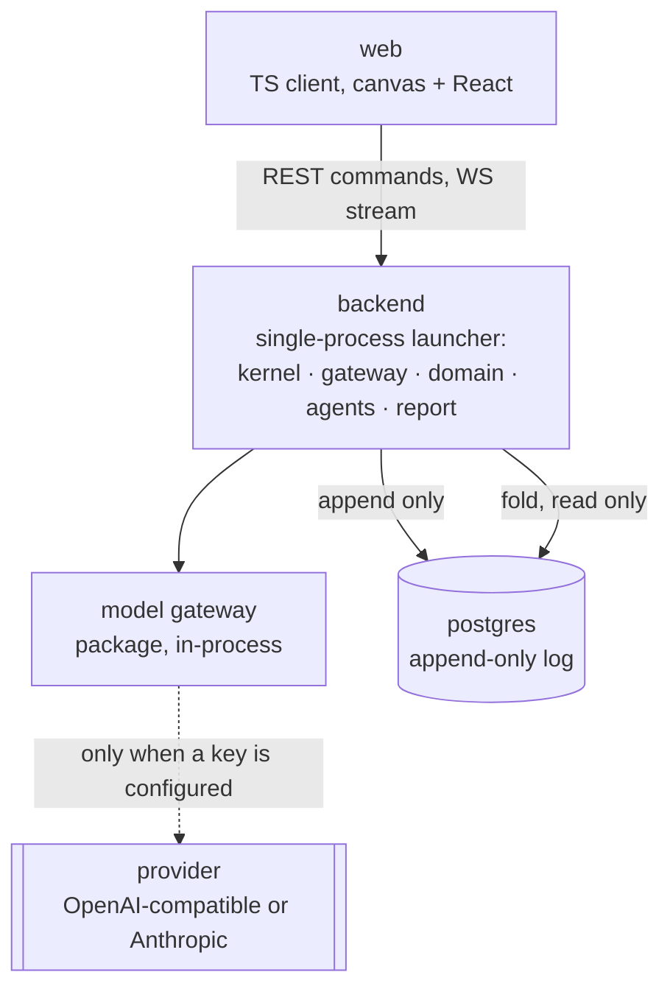
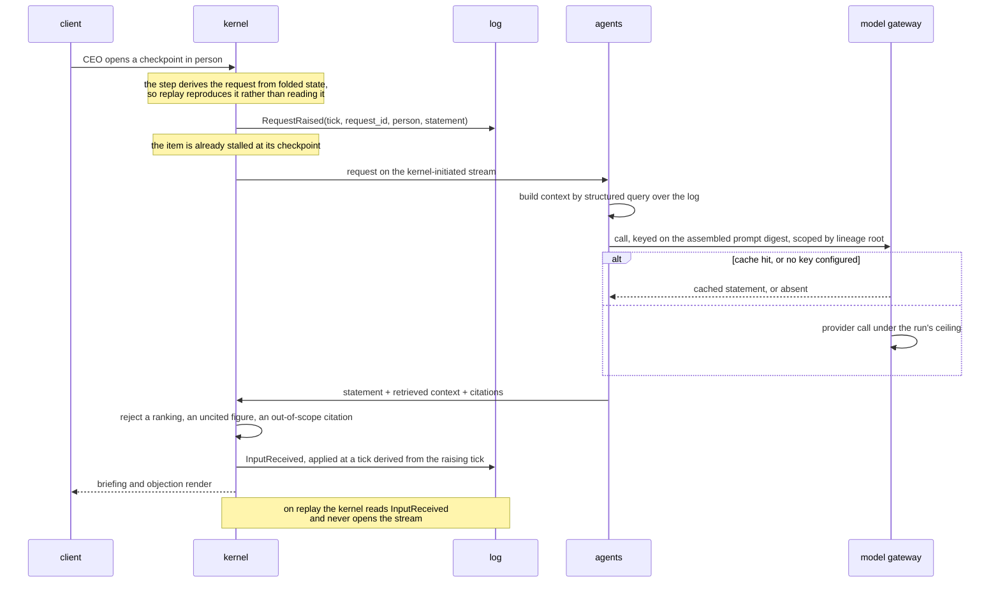
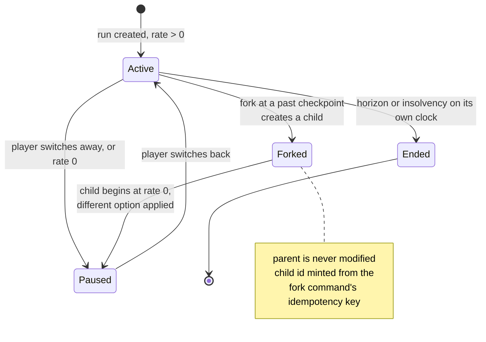

# feat: Company OS MVP — the bench, persistent timelines, and a repository that runs

## Summary

Build the half of Company OS that does not exist. Four directors become model-backed experts who
brief a decision and object to it without ever ranking the options; each carries a memory scoped to
their reporting line and must ask the CEO's Authorization to read another's. Any past checkpoint
forks into a persistent timeline that plays forward, and the whole Universe of timelines folds into
one standalone HTML report that says where the company was overloaded and what is worth automating.
Underneath it, the seven-service compose stack collapses to three containers — its five backend
services becoming one — so `docker compose up` becomes true.

Twenty-five units in six phases. The simulation is an input, not work.

---

## Problem Frame

The origin document establishes what to build and why (see origin:
`docs/prd/2026-08-16-company-os-mvp-prd.md`). `docs/2026-08-16-progress-checklist.md` establishes
what already exists. This plan resolves how to close the distance.

Three findings from planning research change the approach rather than merely informing it.

**The agent seam that exists is the wrong seam for the bench, and the transport behind it was never
built.** `backend/services/agents/stub.py` answers the question "which option", and
`simcore.pending.validate_agent_answer` enforces that the answer names a permitted option. That is a
resolver — precisely the behaviour M18 forbids a director to have. Worse, `_apply_queued_answers`
routes every non-domain answer into `_apply_agent_answer`, so a statement arriving on that leg would
either resolve a checkpoint or escalate one. And underneath both, `raise_request` and
`receive_answer` have no production caller at all: the agents service is nineteen lines of health
check, `agents.proto`'s stream has no servicer, and `diagnose()` returns an empty
outstanding-requests list. What exists is a tested state machine with no delivery leg. The bench is
a second request kind, a third dispatch branch, and the transport itself.

**The store's fork is nearly free; three defects above it are not.** `runs` already carries
`parent_run_id` and `forked_at_seq` (`backend/packages/logschema/tables.py:131`), so the Universe
tree is a query over rows the store already writes, and `LogStore.fork_run` copies a prefix
atomically inside the lease-fenced transaction. Above it: the child id is a uuid5 over
`(parent_run_id, at_seq)` and therefore collides (`backend/services/kernel/loop.py:745`); the child
row takes the parent's *present* `current_tick` while its head sits at the fork sequence
(`backend/services/kernel/store.py:452`), so resuming it folds the copied prefix forward by however
many ticks the parent has since run; and `KernelRuntime.fork` never registers the child, so the next
command against it raises. `CommandKind.FORK_RUN` exists in the proto with no dispatch entry, and the
only caller of `runtime.fork` is the gRPC servicer U1 deletes. Forking is three fixes and a command
path, not one line.

**Scenarios introduce a second thing a fold can disagree about.** Moving people and work items out
of code and into files means a run's meaning now depends on a file that is not in the log. The rules
version already guards tuning drift; nothing guards scenario drift, and a run folded against an
edited scenario would reproduce a different company while every existing guard reported a match.
The scenario's content hash has to travel with the run.

---

## Key Technical Decisions

### The bench

**A director is a statement producer, never a resolver.** The bench answers with prose and
citations; the CEO answers with a choice. These are different request kinds on the same
pending-input transport, and the existing resolver leg keeps its stub and its never-answers default.
A statement moves no metric (M22), so validation is about shape and citation rather than bounds.

**The statement request is derived inside the step, not issued from the command path.**
`REQUEST_RAISED` sits in the fold's output set and is compared byte-for-byte against what `step()`
reproduces, so a request emitted from a command handler fails strict replay. The request is raised
inside `step()` from state the fold already reproduces — the CEO adjacent to a director, an open
checkpoint on that director's item, no statement already asked for it. The answer rides
`INPUT_RECEIVED` with a payload discriminator rather than a new kind, which keeps it inside the
partial unique index that already enforces one answer per request per run.

**A statement applies at a tick derived from the tick that raised it.** `receive_answer` currently
computes the landing tick from the live tick, so how long the provider took becomes hashed state and
two fresh runs from one seed diverge. A fixed sim-tick offset from the raising tick makes latency
invisible to the run, the same call `pending.py` already made for deadlines.

**Statement requests carry their own deadline.** The shared deadline is one sim-day, which is fifteen
wall-seconds at ×1 and five at ×3 — sized for a service on a compose network, not a provider API.
Left shared, the bench's dominant path at speed is abandonment, and whether a briefing appears at all
becomes a function of the player's clock rate.

**The retrieved context is logged with the statement, not just the statement.** A re-ranked or
re-queried retrieval at replay time would hand the director a different world while the log claimed
fidelity. The context travels in the same input event.

**The cache is content-addressed on the prompt, and it is authoritative for nothing.** The key is a
digest of the assembled prompt bytes, plus the authorization scope the context was drawn under and a
purpose namespace; the lineage root is a scoping column, not part of correctness. Keying on tick
would be either redundant before a divergence — the prefix copy already makes those statements
byte-identical — or wrong after one, where the same situation at two ticks misses and calls the
provider. M34 is discharged by the log and the prefix copy; the cache is a cost optimisation, and a
lost cache write costs a provider call rather than a property.

**The ceiling stays per run, as M27 says.** A lineage-wide budget would leave a child at its parent's
exhaustion point, so the bench goes quiet at a different moment in each timeline and the diff
presents budget as consequence — the exact failure M34 forbids. The HUD aggregates spend across the
lineage for the player; the enforcement point is the run.

**A rejected statement is a fallback, never a retry loop.** M18's ranking guard, M19's citation
guard, a timeout, an error and a rate limit all land in one place and produce that director's
scripted reply for that turn. The condition is logged as a closed enum, never as a provider-supplied
message — a provider's wording in the log reaches the exported report and breaks seed determinism at
the same time.

### Scenarios

**A scenario's identity is recorded at genesis and checked at three sites.** The genesis payload
carries scenario id, content hash and hash version — the id because a fold has to know which file to
load before it can compare, the hash version so a change to the canonicalization is distinguishable
from a change to the file. Recording it on the event rather than on `runs` keeps the DDL change
additive and avoids a nullable column that would mean "no guard" for exactly the runs that predate
it. The guard runs in the from-zero fold, in a snapshot restore, and in the resume-from path, which
skips genesis entirely and would otherwise forgo the check.

**The scenario's canonical form keeps ordered things ordered.** Roster order decides who wins a
contested seat, and `canonical.encode` sorts keys unconditionally — so representing people as a map
keyed by id would erase the ordering from the hash while seating still moved. People are a list. The
hash covers the fully-defaulted, validated structure, which means a defaulted field is a scenario
field with a shipped value rather than a loader constant.

**Scenario files are TOML parsed with `tomllib`.** In the standard library on Python 3.12, so M26's
no-new-framework rule generalizes to data formats; comment-friendly and diff-friendly for the pull
request that is the authoring flow.

**A scenario is refused whole or loaded whole.** M12's partial-load prohibition is a validation pass
before any state is constructed, not a try-per-record loop.

### Timelines

**Only the active timeline ticks, and the reason is the company, not the writer.** The single writer
is already singular across every run — one thread, one queue — and `resume_all` already starts a task
per run with a non-zero rate. What an unwatched timeline costs is fiction: it burns cash and consumes
the authored checkpoint supply with nobody watching, which is the same reasoning that already sets an
idle run's rate to zero. Switching pauses the outgoing run before resuming the incoming one, so a
crash between the two appends fails closed, and `resume_all` refuses to start a second clock in one
lineage.

**Child run ids are minted from the fork command's idempotency key.** Retried forks stay idempotent,
simultaneous forks stay distinct, and neither property depends on the tick. The child row records the
tick at the fork sequence, not the parent's present tick, and `runs` gains a `lineage_root_id` set at
creation and copied at fork — which makes the tree query, the cache scope and the spend aggregate
single-column reads instead of a recursive walk that a deleted mid-lineage row would silently
corrupt.

**Forks and rate changes go through the single store writer.** `fork_run` and `set_rate` open their
own transactions today, which was harmless while forking was an unexercised RPC. Once forking is a
routine gesture and every timeline switch is two rate writes, they contend with the writer thread for
SQLite's write lock, and the loser surfaces as a killed tick loop rather than a retry.

**The comparison branch stays what it is.** M51 and M35 are already true — `simcore/compare.py` runs
in memory and is discarded. The only change it needs is the worker pool it runs on.

### Client surfaces

**The stage gains a third state, and the rail gains two panels.** The shell is a two-state stage —
office and DAG, bound to Tab — plus a panel rail. Universe becomes the third stage and hosts both the
timeline tree and the diff, which opens full-bleed inside it; Tab cycles the three in order. Memory
and past decisions are panels in the existing rail. Deciding this once matters because the four new
surfaces land in three different phases, and without one answer each implementer invents a different
one and the last reworks the others.

**New surfaces stay in the established idiom.** The tree is drawn on canvas in the DAG's idiom, and
the diff extends the comparison surface's existing column layout, direction glyphs and marking.
Neither introduces a second visual language, and neither uses colour as signal — the art direction
already spends colour on the department stripe and the load bar, and reserves amber.

### Deploy and the report

**The compose collapse deletes service definitions, not service modules.** The import-boundary test
keeps the seams honest and does not relax inside one process, so the launcher — which sits outside
`services/` by design — mounts the report and domain surfaces rather than the gateway importing
them. Any fold two services need lives in `packages/`, which is where the report already reads the
store from. Rebuilding the kernel–gateway split is a compose file and a channel; the agents leg is a
different matter, because `agents.proto` describes the resolver seam this plan replaces.

**The report renders and exports from the backend, and escapes everything.** A client-side serializer
would re-implement the fold, which is the divergent-second-consumer risk Phase 1 named. But the
export is also the one artifact that leaves the machine, and its content includes scenario text that
arrived by pull request and prose that came from a model — so every interpolated value is escaped by
construction, the document declares a restrictive CSP and contains no script, and a manifest test
fails when a new field reaches the export without being declared.

**Secrets are kept out by a mechanism, not a prohibition.** The key is held in a type whose
representations are masked, and `servicekit` gains a redacting log filter, because the guarantee has
to hold at call sites the model-gateway unit never sees. Two leaks exist today on the path U1
promotes: the launcher logs the full store DSN including its password, and the status probe returns
a raw URL for an unrecognised scheme into the payload its own docstring invites people to paste into
an issue.

**No prescription originates in a model.** Proposals come from an authored catalog, each cites the
events that motivate it, and the model writes prose over figures that already exist. This is the one
requirement most likely to be implemented as "ask the model what to automate", and it is the one
that would make the artifact indefensible.

**Retrieval is a structured query; pgvector stays out of the image.** The compose store is Alpine
Postgres with no vector support, and swapping the base image changes the one command M1 promises for
a capability a forty-five-event run does not need.

---

## High-Level Technical Design

### Topology after the collapse



Three containers where there were seven. The dashed edge is the only one that can be absent: with no
key configured the bench is absent and every other feature works unchanged.

### A briefing, end to end



A rejection at the guard, an error, a timeout or an exhausted ceiling all take the same exit: that
director's scripted reply, logged as such.

### Timeline lifecycle



---

## Output Structure

```
backend/
  scenarios/
    default.toml               # the shipped company: people, items, seeded assignment,
                               # automation-proposal catalog
    schema.md                  # what a scenario may declare
  packages/
    modelgw/                   # provider normalization, ceiling, cache
    simcore/scenario.py        # load, validate, hash, apply at genesis
    logschema/lineage.py       # the tree query, shared by the report and the gateway
  services/
    agents/bench/              # director personas, context assembly, memory, guards
frontend/
  src/
    universe/                  # timeline tree, switcher, diff
    ui/Memory.tsx              # the CEO's reading surface
    ui/Decisions.tsx           # past decisions, and forking one
.github/workflows/             # keyless path, mock adapter, first-command smoke
LICENSE                        # Apache-2.0
```

The tree is a scope declaration. Per-unit file lists are authoritative.

---

## Requirements

The origin carries M1–M67; each unit cites the M-IDs it advances rather than restating them. The
requirements below are the ones this plan introduces, and three amendments.

**ID convention.** `M<n>` is always the PRD's. A bare `R<n>` is always this plan's. Phase 1's plan
and the three brainstorms also number from R1; those are cited with their document.

**The bench**

- R1. A statement request is a distinct request kind from a resolution request, discriminated in the
  fold's answer dispatch. No bench answer can reach the resolver handler, and the resolver leg's
  bounds are unchanged.
- R2. A statement enters the log carrying the prose, the citations, the retrieved context, and the
  producer identity. Advances M31, M32.
- R3. A model response is cached under a digest of the assembled prompt, the authorization scope the
  context was drawn under, and a purpose namespace. The lineage root scopes the entry; it is not part
  of correctness. Advances M33.
- R4. The call and token ceiling is enforced per run, as M27 states. Spend is displayed aggregated
  across the lineage, and a ceiling reached in a parent does not silence a child's bench.
- R5. Guard rejection, provider error, timeout and exhausted ceiling converge on one fallback path
  that produces the scripted reply and logs which condition fired, as a closed enum carrying no
  provider-supplied text. Advances M21.
- R6. No provider key, auth header or raw request/response envelope reaches the event log, an event
  payload, the response cache, stdout, a status payload, the exported report, or a scenario file.
  Enforced by a masked key type and a redacting log filter, not by convention. Advances M29.
- R17. The statement request is raised inside the step function from state the fold reproduces, and
  the answer applies at a tick derived from the raising tick rather than from the live tick.
- R18. Statement requests carry a deadline sized against the fastest clock rate the client offers.

**Scenarios**

- R7. Scenario id, canonical content hash and hash version are recorded on the genesis event and
  inherited by forks. The from-zero fold, a snapshot restore and a resume-from-snapshot fold each
  check it, and a mismatch refuses and names both sides.
- R8. Scenario parsing and validation use the standard library only. No runtime dependency is added.
- R9. Validation completes before any state is constructed, so a refused scenario leaves nothing
  half-loaded. Unknown keys are refused, string fields that reach a prompt are length-capped and
  reject control characters, and a scenario is selected by name resolved inside the scenarios
  directory, never by a caller-supplied path. Advances M12.
- R19. Scenario-authored text enters a prompt as delimited data, never as system instruction, and the
  output guards apply regardless of what the text asked for.

**Timelines**

- R10. A child run id is minted from the fork command's idempotency key. A retried fork returns the
  same child; two distinct forks at one tick produce two runs. Advances M47.
- R11. At most one timeline in a lineage holds a tick task. Switching pauses the outgoing run before
  resuming the incoming one, both changes are logged, and a restart refuses to start a second clock
  in one lineage.
- R12. Every fold that crosses timelines — the diff, the report — reads through the same fold the
  kernel uses. No second reconstruction of state exists.
- R20. A child run's recorded tick is the tick at its fork sequence, and the child is registered with
  the runtime by the fork itself.
- R21. `runs` carries a `lineage_root_id`, set to the run's own id at creation and copied from the
  parent at fork.
- R22. Appends, forks and rate changes serialize through the one store writer. A multi-run operation
  takes per-run locks in run-id order.

**Closing the holes**

- R13. Command application and tick advancement hold one per-run lock, acquired per quantum inside
  the advance rather than across a batch. No provider call happens while it is held. Advances M63.
- R14. Branch execution draws from a capacity limiter distinct from the one the tick loop and the
  lease heartbeat draw from, and kernel readiness reports tick progress rather than task liveness.
  Advances M64.
- R15. A person's movement is transmitted as an event carrying the person, the resolved path and the
  start tick; the client interpolates it and a resync snapshot carries in-flight paths. Advances
  M62; discharges Phase 1 origin R13 and R17.

**Boundaries and surfaces**

- R23. Cross-line reads are default-deny at the query layer, with no reachable unscoped variant from
  bench code, and every cited sequence is re-checked against the producing director's authorized
  scope before the statement is appended.
- R24. An in-progress item whose Authorization is outstanding or refused is blocked or degraded. This
  behaviour is built here: raising a request does not stall an item today. Advances M41.
- R25. Every value interpolated into the exported report is escaped by construction, the document
  declares a restrictive content-security policy and contains no script, and a manifest test fails
  when a field reaches the export without being declared.
- R26. The event stream and any run-enumeration route validate the request origin against the
  client's own, and the application declares an explicit cross-origin policy.
- R27. A change to any `to_state()` shape moves the state-shape version and records a history entry,
  and verification compares the shape version before comparing hashes so a deliberate change reports
  as a version move rather than as corruption.

**Amendments to origin**

- R16. M6's seeded checkpoint changes day-zero state, which the 42-assertion parity suite asserts
  against. Those assertions are inline literals in `backend/tests/test_parity.py`; the vectors under
  `backend/tests/fixtures/golden/` are produced by `backend/scripts/generate_golden.py`. Both change
  in the unit that introduces the seeded assignment, and the change is recorded — the way Phase 1's
  U7 handled its effort-burn assertions.
- R28. M2 lists the report among the surfaces in one process. It is mounted by the launcher rather
  than reached through the gateway, because the import-boundary rule holds inside one process.
- R29. M33 keys the cache on tick, person and request. R3 replaces that with a digest of the
  assembled prompt: keying on tick is redundant before a divergence, because the prefix copy already
  makes those statements byte-identical, and wrong after one, because the same situation reached at
  two ticks would miss.

---

## Requirement coverage

Every origin requirement, and where this plan discharges it.

| Origin | Discharged by |
|---|---|
| M1, M3, M8 | U1 |
| M2 | U1's container, U24's composition |
| M4 | U11's keyless scenario, proven by U13 |
| M5 | already met — the client creates its run and the id is in the address bar |
| M6, M7 | U2 |
| M9, M10, M11, M12 | U6 |
| M13 | U7 |
| M14 | U11 |
| M15, M16 | U6 authors them, U7 surfaces them |
| M17, M22, M31, M32 | U10 |
| M18, M19, M20, M21 | U11 |
| M23, M24, M25, M26, M29 | U8 |
| M27, M28 | U9 |
| M30 | U13 |
| M33 | U12 |
| M34 | discharged by the log and the prefix copy; guarded by U19 |
| M35 | already met — the branch runs in memory; U19 guards it |
| M36, M37, M38 | U14 |
| M39, M40, M41, M42 | U15 |
| M43 | U15 |
| M45, M46, M47, M48 | U16 |
| M44 | U16's fork, U25's surface |
| M49 | U17 |
| M50, M52 | U18 |
| M51 | already met — the branch stays an in-memory preview; U5 moves only the pool it runs on |
| M53, M55, M56, M59 | U20 |
| M54, M60, M61 | U22 |
| M57, M58 | U21 |
| M62 | U3 |
| M63 | U4 |
| M64 | U5 |
| M65 | U19 |
| M66 | U23 |
| M67 | U1's first command, U13's CI proof |

---

## Implementation Units

### Phase A — The repository runs

#### U1. Collapse the backend to one container

- Goal: `docker compose up`, from a cold clone with no profile, reaches a playable client.
- Requirements: M1, M2, M3, M8, M67's first-command half; the PRD's gRPC non-goal.
- Dependencies: none.
- Files: `docker-compose.yml`, `backend/Dockerfile`, `backend/services/kernel/grpc_server.py`,
  `frontend/nginx.conf`, `backend/tests/test_compose.py`, `infra/postgres/init/`, `LICENSE`,
  `README.md`
- Approach: one new Dockerfile target running the launcher, replacing the five per-service targets;
  the gRPC servicer goes with them, since it is the last consumer of the split and nothing else
  references it. Compose becomes `postgres`, `backend`, `web`, with `web` losing its `demo` profile
  — the profile is why a bare `up` today starts no client at all. `frontend/nginx.conf` proxies
  `/api/` and `/ws` to `gateway:8800`, a name this unit removes, so both upstreams move or the
  client loads and every call 502s. `backend/tests/test_compose.py` inverts wholesale:
  its `test_seven_services`, `test_demo_profile_includes_the_client` and
  `test_dev_profile_omits_the_client` all assert the shape this unit removes. The report keeps its
  read-only credential behind its own store URL, because a SQLAlchemy engine is per-DSN rather than
  per-process — keeping it costs one environment variable and is the only guard that survives U20
  through U22 being written into the process that also writes.
- Patterns to follow: the exposure and ordering rules in the current `docker-compose.yml` header.
- Test scenarios:
  - Covers M1. A cold `docker compose up` with no profile reaches a client that creates a run and
    receives events, with no manual step.
  - Covers M3. First boot against an empty volume provisions the schema and passes the DDL check;
    second boot reuses it.
  - The writer lease acquires inside the one container, and a second backend container refuses to
    start and names the holder.
  - Bringing the stack up twice does not collide beyond the published ports.
  - `uv run python single_process.py` still works unchanged for contributors without Docker.
  - Covers M8. The repository carries an Apache-2.0 `LICENSE` and the README states it.
  - Covers M67. The README's first command is `docker compose up`, `company-os.html` is demoted from
    demo artifact to prototype, and no dead link remains in the README or the docs tree.
  - The contributor path — the single-process launcher — stays documented and working.
- Verification: a stranger's path — clone, one command, a run on screen — completes on the reference
  machine within a recorded time.

#### U24. Compose the remaining surfaces in one process

- Goal: the launcher runs what the container promises.
- Requirements: M2; R6, R26, R28.
- Dependencies: U1.
- Files: `backend/single_process.py`, `backend/packages/servicekit/logging.py`,
  `backend/packages/servicekit/probes.py`, `backend/services/gateway/main.py`,
  `backend/services/report/main.py`, `backend/tests/test_status.py`,
  `backend/tests/test_import_boundaries.py`
- Approach: `compose()` builds the store, the kernel runtime and the gateway client and nothing else
  today; the domain, agents and report surfaces join it, with the report's app mounted by the
  launcher rather than imported by the gateway — the launcher sits outside `services/` by design and
  is the only component allowed to see both. Three fixes ride along, because this unit owns the
  process that now fronts everything: the DDL check moves ahead of table creation and releases the
  lease when it refuses, so a version mismatch stops being an unhandled traceback with a stranded
  lease; the launcher stops logging the store DSN and its password at startup, and the status probe
  stops returning a raw URL for an unrecognised scheme; and the event stream validates request origin,
  since loopback is not a boundary against a browser and this port now fronts the report, the
  diagnose call and the domain surface. The report keeps its read-only credential: `store_url()`
  reads one environment variable today, so it gains an optional name and the report resolves its own
  while the kernel keeps the writer's.
- Patterns to follow: `backend/single_process.py:218` `compose()`; the mount-and-serve shape in its
  `main()`.
- Test scenarios:
  - Covers M2. Each of the five surfaces answers its status endpoint inside the one container.
  - Covers R28. The import-boundary test still passes; no service imports another service's
    internals.
  - Covers R6. No status payload and no startup log line contains a password, a userinfo segment or
    a query string, asserted by a sweep over emitted output.
  - A kernel started against a store at the wrong DDL version leaves the lease unheld and the schema
    untouched, and prints the remedy rather than a traceback.
  - Covers R26. A stream connection carrying a foreign origin is refused; one from the client's own
    origin is accepted.
  - The report's connection cannot append, asserted against the store rather than by scanning source.
  - The diagnose call and the domain surface are not reachable on the published path without their
    stated prefix.
- Verification: the one container answers every surface, and a version mismatch produces a sentence
  rather than a stack trace.

#### U2. Open on a person who is waiting

- Goal: the first thing on screen is a director holding an unsettled decision, and two hints that
  say how to reach them.
- Requirements: M6, M7; R16.
- Dependencies: U1.
- Files: `backend/packages/simcore/step.py`, `backend/packages/simcore/items.py`,
  `backend/tests/test_parity.py`, `backend/tests/fixtures/golden/`, `frontend/src/ui/Shell.tsx`,
  `frontend/src/ui/hints.ts`, `frontend/tests/hints.test.ts`
- Approach: genesis applies one authored assignment so a director reaches a checkpoint within the
  first sim-minutes rather than the floor sitting idle. The seeded assignment is authored data, so
  U6 moves it into the scenario file without changing behaviour. Hints are client-side state, shown
  once and persisted in local storage next to the HUD composition — never in the log.
- Execution note: regenerate the parity fixtures deliberately and record what moved. A silent
  fixture refresh here would hide a real day-zero regression later.
- Test scenarios:
  - Covers M6. A newly created run reaches an unresolved checkpoint held by a director without any
    command being sent.
  - The waiting beam lights on that person from the first frame.
  - Covers M7. Each hint renders once on a first run and never again after dismissal; a reload does
    not resurrect it.
  - Hint state does not appear in the log or in any event payload.
  - Covers R16. The parity suite passes against regenerated fixtures, and the diff of what changed
    is limited to day-zero assignment state.
- Verification: a fresh run shows a person waiting and two hints; the parity and replay suites are
  green.

#### U3. Staff movement on the wire

- Goal: a director walking to a specialist's desk is visible.
- Requirements: M62; R15; Phase 1 origin R13, R17.
- Dependencies: U1.
- Files: `backend/packages/simcore/step.py`, `backend/proto/events.proto`,
  `backend/packages/contracts/`, `backend/tests/test_kernel_port.py`,
  `backend/tests/test_replay.py`, `frontend/src/net/store.ts`, `frontend/src/render/index.ts`,
  `frontend/tests/render.test.ts`, `frontend/tests/store.test.ts`
- Approach: `_walk_to` emits an event carrying person, resolved path and start tick; `_advance_walker`
  stays silent, because the path plus the start tick is enough for the client to interpolate every
  intermediate position. The client half already exists and is golden-tested —
  `milliTilesProgressed` and `walkDurationTicks` in `frontend/src/render/interpolate.ts` are called
  only by tests today. A resync snapshot carries in-flight paths so a reconnect does not teleport
  everyone to their desks. The org chart's progress row, marked but unreachable because
  `PersonView.itemId` is set by no event, resolves once movement carries the item. The path and its
  start tick already live on `PersonRuntime`, so no subsystem joins the state hash and the state-shape
  version does not move; what changes is the golden *logs*, which gain an output event per walk, and
  the strict-replay comparison that counts produced outputs against logged ones.
- Patterns to follow: the CEO's predicted-and-echoed movement in `frontend/src/ui/stage.ts`; the
  event fold in `frontend/src/net/store.ts`.
- Test scenarios:
  - Covers M62. Assigning work across the floor emits one movement event carrying person, path and
    start tick, and no event per tick.
  - The client renders the person at the interpolated position for a mid-path tick, matching the
    Python golden vector.
  - Replaying the log reproduces the same position track.
  - A client attaching mid-walk receives the in-flight path in its resync snapshot and joins the
    walk rather than snapping to the desk.
  - A walk interrupted by reassignment emits a new path and the old one stops being rendered.
  - The org chart's progress row resolves for a person carrying an item.
- Verification: a live run shows delegation as a walk, at the same visual quality as the prototype.

#### U4. One lock across the command path and the tick

- Goal: a command and a tick can no longer touch run state at the same time.
- Requirements: M63; R13.
- Dependencies: U1.
- Files: `backend/services/kernel/loop.py`, `backend/tests/test_kernel_service.py`
- Approach: a per-run lock held across `apply_command` and across `_advance`'s state mutation, taken
  per quantum rather than across the batch — a partially advanced *batch* is a consistent state, and
  holding across up to 120 ticks would make a command wait that many append round-trips. The command
  route runs on a Starlette worker thread and `_advance` on an anyio worker thread, and nothing in
  `backend/` outside tests holds a lock today. Comparison made the window wide enough to hit by
  walking the whole state twice; the mitigation in place is a retry on a torn read, which is
  detection rather than prevention. No provider call and no store round-trip happens while the lock
  is held, which is the same discipline `compare_options` already follows for its branches.
- Execution note: pin it with a failing test first — a torn read is silent by construction, so it is
  easy to believe it is fixed when it is not.
- Test scenarios:
  - Covers M63. A command issued repeatedly against a ticking run never observes a partially
    advanced state, across a run long enough to have failed before.
  - A snapshot capture concurrent with a tick returns a self-consistent state on every attempt, with
    no retry fired.
  - Under a stated command rate, the achieved clock multiplier stays above a stated permille floor
    and sim-time lag stays under a stated tick count. Both numbers are chosen from a measurement
    before the change and recorded in the unit, so the test can fail.
  - A command rejected while the lock is held mutates nothing and releases.
  - A statement request in flight does not stall the tick loop.
- Verification: the concurrency test that fails before the change passes after it, and the tick lag
  metric is unchanged under command load.

#### U5. Comparison off the tick worker pool

- Goal: a comparison cannot slow the clock every run depends on.
- Requirements: M64; R14.
- Dependencies: U4.
- Files: `backend/packages/simcore/compare.py`, `backend/services/kernel/loop.py`,
  `backend/tests/test_compare.py`, `backend/tests/test_kernel_service.py`
- Approach: branch execution moves to its own capacity limiter, sized so the tick loop and the lease
  heartbeat always have a slot. Measured cost today is about 0.27s per branch at `MAX_BRANCH_DAYS`
  and roughly 1.6s for six options, all of it pure Python holding the GIL on a thread drawn from the
  same 40-slot default limiter `_advance` uses. Kernel readiness changes from asking whether the
  tick task is `done()` to asking whether it is progressing, because a starved clock currently
  reports ready.
- Test scenarios:
  - Covers M64. Six-option comparisons running back to back leave sim-time lag under the same tick
    count U4 states, measured against the same baseline.
  - A run whose tick task is alive but not progressing reports unhealthy and names the reason.
  - The branch limiter saturating queues comparisons rather than borrowing the tick loop's slots.
  - A comparison result is unchanged by the move — same branches, same figures, same bound.
- Verification: a six-option comparison against a live ticker leaves the achieved clock multiplier
  above the permille floor U4 records.

### Phase B — Scenarios

#### U6. The scenario format, the loader, and the company that moves into it

- Goal: a company is a file, a run knows which file it came from, and the genesis payload changes
  exactly once.
- Requirements: M9, M10, M11, M12, M15, M16; R7, R8, R9.
- Dependencies: U1, U2.
- Files: `backend/packages/simcore/scenario.py`, `backend/scenarios/default.toml`,
  `backend/scenarios/schema.md`, `backend/packages/simcore/people.py`,
  `backend/packages/simcore/items.py`, `backend/packages/simcore/step.py`,
  `backend/packages/simcore/capacity.py`, `backend/packages/simcore/morale.py`,
  `backend/packages/simcore/hiring.py`, `backend/packages/simcore/snapshot.py`,
  `backend/packages/simcore/log.py`, `backend/Dockerfile`,
  `backend/scripts/generate_golden.py`, `backend/tests/test_scenario.py`,
  `backend/tests/test_parity.py`, `backend/tests/test_replay.py`,
  `backend/tests/fixtures/golden/`, `frontend/tests/golden.test.ts`
- Approach: TOML through `tomllib`. `PEOPLE` and the authored catalog move into `default.toml`
  verbatim — including U2's seeded assignment and the deliberate Priya mismatch, Accounting seat
  against an Administration reporting line, which is the reason seating and reporting are two
  questions — and every person gains a responsibility and the tools, MCP servers and skills they are
  described as having. The data move and the schema extension land together because each changes the
  genesis payload, and splitting them would mean regenerating golden fixtures twice for one logical
  change. The loader validates in one pass and constructs nothing until every check passes:
  departments against the fixed four lines, people against known departments, prerequisites against
  declared items, seats against floor capacity, and every key against a closed set — an unknown key
  is refused, which is what keeps a future `base_url` or `api_key` from ever appearing in a scenario
  file. The canonical form keeps people as an ordered list, because roster order decides contested
  seats and a keyed map would sort that ordering out of the hash. Scenario id, hash and hash version
  ride the genesis payload; the guard runs in the from-zero fold, in a snapshot restore, and in the
  resume-from path. Where the hashes differ, the regenerated roster and catalog are compared
  structurally so the refusal can say which person moved rather than only that two digests differ.

  Three mechanical consequences the file list reflects. The roster and catalog are module constants
  today, read at fold and step time by `step.py`, `capacity.py`, `morale.py`, `hiring.py` and
  `snapshot.py` — and one process ticks many runs at once, so a scenario loaded into a global is
  shared across runs of different scenarios. The loaded scenario is carried on `State` and those
  lookups become state-parameterised — as an immutable fold-time input excluded from the state hash,
  because the genesis-recorded scenario hash already identifies it and hashing it twice would move
  the state-shape version for a value that cannot change within a run. `backend/Dockerfile` copies `packages/` and `services/` and
  nothing else, so `scenarios/` joins them or every run created inside the container fails at genesis
  while the host suite passes. And `backend/scripts/generate_golden.py` — the only mechanical path to
  the fixtures — builds its vectors from the module constants, so it resolves through the loader or
  it silently regenerates the roster this unit just removed.
- Patterns to follow: the rules-version guard in `backend/packages/simcore/log.py`; the floor
  comparison in `_apply_genesis`; `PersonSpec` at `backend/packages/simcore/people.py:32`;
  `catalog_to_state` at `backend/packages/simcore/items.py:585`.
- Test scenarios:
  - Covers M10. A run from `default.toml` is byte-identical to a run from the compiled roster at the
    same seed, once U2's recorded fixture change is accounted for.
  - Covers M12. A scenario naming an unknown department, an unknown manager, an unresolvable
    prerequisite, or an unknown key is refused with a reason naming the offending line, and no
    partial state exists.
  - Covers R7. Editing a scenario and re-folding an existing run refuses and names both sides;
    reordering two people changes the hash and changes seating; reformatting the file changes
    neither.
  - The guard fires on all three paths: a from-zero fold, a snapshot restore, and a fold resumed from
    a snapshot.
  - A fork inherits its parent's scenario id and hash.
  - Covers M11. A scenario declaring a fifth department or a new room is refused.
  - Covers M15. Every person carries department, title, responsibility and a tools list, and the
    genesis payload carries them to the client.
  - Covers M16. Nothing in the system invokes a tool named in a scenario.
  - Covers R9. A string field that reaches a prompt is length-capped and rejects control characters.
  - Covers R8. The dependency lockfile is unchanged by this unit.
  - A run created inside the container resolves the default scenario.
  - Two runs on different scenarios tick concurrently in one process without cross-contamination.
- Verification: the parity and replay suites pass against the default scenario, and the golden
  fixture diff is limited to the recorded genesis-payload change.

#### U7. Choosing a scenario, and seeing what it says

- Goal: a second company is reachable, and a person's schema is visible in the game.
- Requirements: M9, M13, M14's data half, M15, M16; R9's path rule.
- Dependencies: U6.
- Files: `backend/services/gateway/main.py`, `backend/packages/simcore/step.py`,
  `backend/single_process.py`, `backend/scenarios/`, `frontend/src/ui/Panels.tsx`,
  `frontend/src/ui/Conversation.tsx`, `frontend/src/net/gateway.ts`,
  `backend/tests/test_gateway.py`, `frontend/tests/store.test.ts`
- Approach: a scenario name threads through run creation — the gateway body, the kernel's create
  path and `new_run` — resolved against the scenarios directory by name, never by a caller-supplied
  path. Without this, M13's "a second scenario loads with no code change" is discharged by a loader
  nothing can reach. The client shows each person's responsibility and tools on their conversation
  surface, marked as description rather than capability.
- Patterns to follow: the run-creation route in `backend/services/gateway/main.py:84`; the marking
  component in `frontend/src/ui/Marking.tsx`.
- Test scenarios:
  - Covers M13. A second scenario file in the directory is selectable at run creation and produces a
    different company, with no code change.
  - An unknown scenario name is refused with a reason; a name containing a path separator is refused
    before any filesystem access.
  - A run created without naming a scenario uses the default.
  - Covers M15, M16. A specialist's tools render on their conversation surface, marked as
    description, and clicking one does nothing.
- Verification: two scenarios are playable from the client, chosen at run creation.

### Phase C — The bench

#### U8. The model gateway

- Goal: one package that talks to any configured provider, and to none.
- Requirements: M23, M24, M25, M26, M29.
- Dependencies: U1.
- Files: `backend/packages/modelgw/__init__.py`, `backend/packages/modelgw/openai_compatible.py`,
  `backend/packages/modelgw/anthropic_native.py`, `backend/packages/modelgw/config.py`,
  `backend/tests/test_modelgw.py`, `README.md`
- Approach: two code paths — an OpenAI-compatible base URL and Anthropic native — behind one call
  shape, because that pair covers OpenAI, Azure, OpenRouter, Ollama, LM Studio, vLLM and SGLang
  through configuration alone. Provider, model and base URL come from environment. No general-purpose
  LLM framework enters the tree: two HTTP shapes do not justify the dependency surface, and a
  bring-your-own-key user would meet its configuration surface as a support burden. Redaction is
  structural rather than stated: the key lives in a type whose string and repr forms are masked, and
  the redacting filter U24 added to `servicekit` catches the call sites this package never sees — the
  established idiom in this repo is `extra={"error": str(exc)}`, and a provider's 401 body can echo
  the auth header straight into it.
- Test scenarios:
  - Covers M23, M24. A mock server exercises both code paths and each documented provider's
    configuration shape resolves to one of them.
  - Covers M25. Changing provider, model or base URL requires no code change.
  - Covers M29, R6. A key rendered through str, repr, an f-string, a traceback and a log `extra`
    is masked in every one.
  - A provider error body containing the auth header does not reach the typed failure's message.
  - A provider returning malformed JSON, a 429, a 500, a timeout, a connection refused at a
    configured local base URL, and a 200 with empty content each surface as a typed failure rather
    than an exception escaping the package.
  - Covers M26. The lockfile gains no LLM framework.
  - With no key configured, the gateway reports itself absent rather than raising.
- Verification: the mock adapter drives both paths green, and the package imports with no provider
  configured.

#### U9. The ceiling and its counter

- Goal: a run can never spend without bound, and the player can see what it has spent.
- Requirements: M27, M28; R4.
- Dependencies: U8.
- Files: `backend/packages/modelgw/ceiling.py`, `backend/packages/logschema/tables.py`,
  `backend/services/agents/main.py`, `frontend/src/ui/Hud.tsx`, `frontend/tests/hud.test.ts`,
  `backend/tests/test_modelgw.py`
- Approach: calls and tokens count against the run, which is what M27 says and what keeps a parent's
  exhaustion from silencing a child's bench. The HUD aggregates spend across the lineage so the
  player sees one number for what the session cost. Reaching either ceiling stops model calls and
  falls back to scripted replies; it never stops the run, because a run that stops when a budget runs
  out is a run that cannot be demoed. The shipped default is a finite number — an absent
  configuration means the default, and an explicitly unlimited setting is logged loudly at startup,
  because on a bring-your-own-key tool the failure mode of a deferred number is `None` meaning
  unbounded. The spend tile is the one HUD figure that is measured rather than authored, so it is
  exempt from the authored-tuning sweep and carries the opposite label, built the same
  glyph-and-label way so it reads without hue.
- Test scenarios:
  - Covers M27. A run at its call ceiling continues advancing, and its next briefing is the scripted
    reply, logged as ceiling-limited.
  - Covers R4. A fork of a ceiling-exhausted parent has its own budget, and the parent's exhaustion
    does not appear in the child's timeline.
  - Covers M28. The HUD shows this run's calls and tokens against this run's ceiling, with the
    lineage total beside it, and updates during a run.
  - The spend tile is exempt from the authored-tuning sweep and carries a measured label instead —
    calls and tokens are the one figure in the product that is not invented.
  - A single call whose estimated input exceeds the remaining token budget is refused to the fallback
    path before the provider is contacted.
  - A cache hit does not count against the call ceiling, and the counter says so.
  - The counter survives a restart.
  - With no key configured the counter renders zero and the bench is marked absent, not failed.
- Verification: a run driven past its ceiling completes and its report shows where the bench went
  quiet.

#### U10. The statement contract

- Goal: a briefing and an objection that replay exactly — and the transport that carries them.
- Requirements: M17, M22, M31, M32; R1, R2, R17, R18, R23's query half.
- Dependencies: U4.
- Files: `backend/proto/agents.proto`, `backend/proto/events.proto`,
  `backend/packages/contracts/envelope.py`, `backend/packages/simcore/pending.py`,
  `backend/packages/simcore/step.py`, `backend/packages/simcore/log.py`,
  `backend/services/kernel/loop.py`, `backend/services/agents/main.py`,
  `backend/services/agents/bench/context.py`, `backend/tests/test_pending_input.py`,
  `backend/tests/test_replay.py`
- Approach: this unit builds the delivery leg, not a second kind on a working one. `raise_request`
  and `receive_answer` have no production caller today, the agents service holds no store handle and
  no servicer, and `diagnose()` reports an empty outstanding-request list — so the kernel side of the
  stream, the agents side of it, and the outstanding-request projection are all new. The request
  itself is derived inside `step()` from folded state, so `REQUEST_RAISED` stays regenerable under
  strict replay; the answer rides `INPUT_RECEIVED` with a discriminator, which keeps it inside the
  partial unique index that already enforces one answer per request. `_apply_queued_answers` gains a
  third branch, because today every non-domain answer falls into the resolver and a statement would
  resolve or escalate a checkpoint. Context assembly is a structured query — the events touching this
  reporting line since a bounded point, the department's draw, the note on the deliverable that
  unlocked this item — line-scoped by construction, with no reachable unscoped variant, because U15's
  Authorization guard has to constrain a signature that already exists. The agents service reads the
  store through `logschema` with its own engine, following the report's pattern rather than importing
  the kernel's.
- Patterns to follow: `PendingRequest` and the versioned bounds in
  `backend/packages/simcore/pending.py`; the input/output classification in
  `backend/packages/simcore/log.py`; `_read_log` in `backend/services/report/main.py:44` for a
  service reading the store without importing another service.
- Test scenarios:
  - Covers M17. Opening a checkpoint in person raises exactly one statement request; a tick with no
    conversation raises none; opening the same checkpoint twice reuses the outstanding request.
  - Covers M31, R17. **Strict** replay of a log carrying statements passes — the request is
    reproduced by the step, not read from the log.
  - Covers R17. Two fresh runs from one seed produce the same landing tick for a statement, with the
    provider made to answer at two different speeds.
  - Covers M32. The retrieved context is present in the log and identical on replay.
  - Covers M22. No metric moves between the request and the statement.
  - Covers R1. A statement answer never reaches the resolver handler and produces no rejection or
    escalation; the resolver leg's stub is unchanged and still declines by default.
  - Covers R18. At the fastest clock rate a statement request survives long enough for a provider to
    answer, and its deadline is independent of the shared one-sim-day deadline.
  - An answer minted for a parent run is refused by a fork.
  - Opening a checkpoint past the per-item outstanding cap is refused with a reason, not a 500 — the
    cap raises an exception that only the period consult catches today.
  - A statement request outstanding when the CEO walks away, and one outstanding across a
    reconnection, both resolve or expire without stalling the clock.
  - Covers R23. Context assembly for one director returns no event from another reporting line.
- Verification: a run with a scripted producer and a replay of that run produce byte-identical logs
  under the strict comparison.

#### U11. Four directors who brief, object, and never rank

- Goal: the bench itself.
- Requirements: M4, M14, M18, M19, M20, M21; R5, R19, R23's record half.
- Dependencies: U8, U10, U6.
- Files: `backend/services/agents/bench/personas.py`, `backend/services/agents/bench/guards.py`,
  `backend/services/agents/bench/prompts.py`, `backend/services/agents/stub.py`,
  `backend/tests/test_bench.py`, `frontend/src/ui/Conversation.tsx`,
  `frontend/tests/conversation.test.ts`
- Approach: each director's persona is assembled from their scenario entry — department, title,
  responsibility, tools — so lighting up a specialist later is configuration. Two guards run before
  the CEO sees anything: a ranking guard, which rejects a statement that names a preferred option or
  asserts one is better, and a citation guard, which rejects a figure that does not resolve to an
  event, a branch result, or authored content — and, in the same pass, rejects a cited sequence
  outside the producing director's authorized scope, which is what makes the query-layer rule
  independently verifiable from the log. Scenario-authored text enters as delimited data in the user
  turn, never as system instruction, and the guards run over the output regardless of what the text
  asked for. Rejection, error, timeout and exhausted ceiling all take one exit into that director's
  scripted reply, logged as a closed enum — and rendered with the reason that enum names, built with
  the marking component's glyph-and-label construction, so canned prose is never mistaken for a
  briefing. The objection is required rather than optional, because a bench that only agrees adds
  nothing to a decision the CEO was going to take anyway.

  On the surface, the decision card renders a pending block for that director from the tick the
  request is raised. The settle action stays enabled throughout — the player is never blocked on a
  provider — and the block resolves in place into the briefing and objection, or into the labelled
  fallback. Without it a fast player settles before the briefing lands and the bench is decorative,
  while a slow provider reads as a broken panel.
- Patterns to follow: the scripted dialogue table ported in `backend/packages/simcore/people.py`;
  the conversation surface in `frontend/src/ui/Conversation.tsx`.
- Test scenarios:
  - Covers M14. Opening a checkpoint with a director produces a briefing and an objection; opening
    one with a specialist produces the scripted reply.
  - Covers M18. A statement naming a preferred option, ranking the options, or asserting one is
    better is rejected before the CEO sees it, and the fallback fires.
  - Covers M19. A statement carrying a figure that resolves to nothing is rejected; a figure that
    resolves to an event renders with its source reachable.
  - Covers M21. A provider error, a timeout and a 429 each produce the scripted reply for that turn
    and log which condition fired.
  - Covers M20. With no key configured, the conversation is the Phase 2 conversation exactly, and
    comparison, forking and the report are unaffected.
  - Covers R19. A scenario field containing an instruction to rank the options does not produce a
    ranked statement; the guard fires and the fallback is logged.
  - A briefing and its objection arrive as separate fields on the statement event, and the surface
    renders them as separate blocks.
  - The pending block appears when the request is raised and resolves in place; the settle action is
    never disabled by it.
  - A fallback reply renders with its reason stated, and is distinguishable from a briefing with
    every hue removed.
  - A fixture prompt carrying a ranking and one carrying an uncited figure each fail the guard suite,
    which is what makes the CI assertion in U13 mean something.
- Verification: a full run with the bench live never surfaces a ranked option, and the same run
  keyless plays identically minus the bench.

#### U12. Caching on the situation

- Goal: the same situation returns the same advice, cheaply, without becoming load-bearing.
- Requirements: M33; R3.
- Dependencies: U9, U10, U11.
- Files: `backend/packages/modelgw/cache.py`, `backend/packages/logschema/tables.py`,
  `backend/tests/test_modelgw.py`, `backend/tests/test_store.py`
- Approach: a store-backed cache content-addressed on the digest of the assembled prompt, plus the
  authorization scope the context was drawn under and a purpose namespace so a CEO summary cannot be
  served where a director statement was asked for. The lineage root — a column this plan adds rather
  than a chain walked at call time — scopes the entry. What the cache is *not* is the mechanism
  behind M34: pre-divergence statements are byte-identical because the fork copies the parent's event
  rows, and replay reads the log rather than calling out, so the log is authoritative and the cache
  is authoritative for nothing. A failed cache write costs a provider call. Entries are scoped to a
  lineage and removed with it, and a startup sweep evicts entries written under a rules version no
  longer running.
- Test scenarios:
  - Covers M33. The same assembled prompt in a fork hits the parent's entry with no provider call; a
    changed prompt misses.
  - Two siblings forked at one tick with different options do not share an entry, because their
    assembled prompts differ.
  - A statement produced under a granted Authorization is not served into a timeline that never
    granted one.
  - A CEO summary and a director statement at the same tick and person do not collide.
  - The cache survives a restart; a rules-version change evicts rather than serving.
  - The cache table is registered as mutable, so the append-only coverage test does not silently skip
    it.
  - A cache write that fails leaves the run correct and the log unchanged.
- Verification: emptying the cache table between a fork and a re-fold changes nothing about the
  resulting states — which is the test that proves the property lives in the log.

#### U13. Continuous integration for the keyless path

- Goal: the path most users take is the path CI proves.
- Requirements: M4, M30, M67's proof half.
- Dependencies: U11.
- Files: `.github/workflows/ci.yml`, `backend/tests/test_bench.py`, `README.md`
- Approach: two jobs — the full suite with no provider configured, and the bench suite against the
  mock adapter. The documented provider list stays a configuration table rather than a test matrix,
  because a matrix over seven providers tests their availability rather than this code. No provider
  secret is ever configured in the repository's Actions secrets, and the reason is written down:
  scenario files arrive by pull request, so a key present for "testing the real path" would make a
  fork's pull request an exfiltration primitive.
- Test scenarios:
  - Covers M30. The keyless job passes with no model environment set at all.
  - The mock-adapter job exercises both gateway code paths.
  - CI runs the single-process path for the fast suites and one compose smoke job.
  - Covers M67. CI runs the README's first command from a clean checkout and reaches a client that
    creates a run.
  - The workflow references no provider secret, asserted by reading the workflow file.
- Verification: CI is green on a branch with no secrets configured.

### Phase D — Memory and Authorization

#### U14. Director memory and the CEO's reading surface

- Goal: each director remembers their line, and the CEO can read it without reading raw events.
- Requirements: M36, M37, M38; R23 via U10's scoped query.
- Dependencies: U10, U6.
- Files: `backend/services/agents/bench/memory.py`, `frontend/src/ui/Memory.tsx`,
  `frontend/src/ui/memory-model.ts`, `frontend/src/ui/Panels.tsx`,
  `backend/tests/test_bench.py`, `frontend/tests/memory.test.ts`
- Approach: memory is a scoped slice of the log, not a second store — the events touching that
  director's reporting line, read through the same scoped query U10 built, whose signature is
  default-deny with no unscoped variant reachable from bench code. The CEO's surface is a rolling
  summary plus the events that mattered, and the selection of what mattered is derived from the log
  so the panel is readable with no model configured; only the prose over the selection comes from a
  model. That also keeps the summary auditable: you can always ask which events a sentence was
  written over. The panel opens per director from the org panel row and the conversation header,
  renders the derived selection immediately with the prose filling in behind a stated pending line,
  and carries an as-of-day stamp whichever regeneration cadence is chosen.
- Test scenarios:
  - Covers M36. A director's memory contains events from their line and none from another's.
  - Covers M37. The CEO's surface shows a summary and the events behind it; raw memory is not
    reachable from the client.
  - Covers M38. With no model configured the surface renders the derived selection with no prose,
    and nothing is empty or broken.
  - Every sentence of a generated summary resolves to at least one event in the selection.
  - A staff member hired mid-run appears in their director's memory from their arrival tick and not
    before; a departed staff member's events stay in it. Directors are never hired and never leave,
    so their own arrival is not a case.
  - The panel opens per director and carries an as-of-day stamp; the derived selection renders before
    the prose does, with a pending line rather than an empty block.
- Verification: opening each director's memory shows a distinct, line-scoped view that resolves to
  events.

#### U15. Authorization as the co-work mechanic

- Goal: a director who needs another line's knowledge has to ask, and the CEO's answer has
  consequences.
- Requirements: M39, M40, M41, M42, M43; R23, R24, R27.
- Dependencies: U14.
- Files: `backend/proto/events.proto`, `backend/packages/simcore/pending.py`,
  `backend/packages/simcore/step.py`, `backend/packages/simcore/hashing.py`,
  `backend/packages/simcore/verify.py`, `backend/services/agents/bench/context.py`,
  `backend/services/agents/bench/memory.py`, `frontend/src/ui/Conversation.tsx`,
  `frontend/src/ui/Panels.tsx`, `backend/tests/test_authorization.py`,
  `backend/tests/test_replay.py`, `backend/tests/fixtures/golden/`,
  `frontend/tests/conversation.test.ts`
- Approach: an Authorization request is raised against the item that needs the knowledge, and **this
  unit builds the stall that gives a refusal consequence**. Raising a request does not stall anything
  today: nothing in `_advance_work` or the burn path reads `state.pending`, and the docstring's claim
  that a request stalls its owning item is true only by accident of its two existing callers — the
  domain consult owns a synthetic item that does no work, and the resolver's item is already blocked
  by its checkpoint. An Authorization's item is in progress, so without new behaviour the work
  completes on schedule whether the CEO grants, refuses, or never looks. That behaviour is a
  blocked-on-request status or a burn multiplier, which is a state-shape change: the shape version
  moves, golden fixtures regenerate, and both belong to this unit. So does the diagnosis fix that
  makes the move legible — `verify` compares the day-boundary hash without first comparing the shape
  version the checkpoint payload already carries, so without it this unit makes every historical run
  report as corruption. An abandoned request is treated as
  a refusal rather than as a third state, because the tray already escalates it and a run should not
  hold two meanings for silence. An Authorization applies to the request that asked for it: no
  standing permission, no settings surface, because a standing grant would quietly delete the human
  from the loop the product is built on.

  It needs an ambient signal, not only a tray card. An outstanding Authorization lights the reserved
  waiting beam on the asking director in the office and the org panel, and renders as its own tray
  card kind with grant and refuse actions — counted separately from the authored decision supply, so
  it does not corrupt the decision-pressure denominator. Without the beam a player who does not scan
  the rail watches an item degrade for a reason they were never shown, which is the failure M41
  exists to prevent.
- Patterns to follow: `_block` and the tray escalation in `backend/packages/simcore/step.py`; the
  subsystem declaration and `SHAPE_HISTORY` in `backend/packages/simcore/hashing.py`; the reserved
  beam rule in `docs/design/art-direction.html`.
- Test scenarios:
  - Covers M39. A director's context assembly cannot read another line's events without a granted
    Authorization, asserted at the query layer and again at the point of record by U11's scope check.
  - Covers M40. A request appears to the CEO naming who asks, what for, and which item depends on it,
    and it is visible from the tray rather than only from the conversation — the CEO may be across
    the floor from the asking director.
  - Covers M41, R24. An item with a refused Authorization is blocked or degraded with a stated
    reason, measurably slower or stopped against a control run, and never silently completes.
  - An abandoned Authorization behaves as a refusal, and the report says which of the two it was.
  - Covers M43. A granted and a refused Authorization each appear in the report with their
    consequence.
  - Covers M42. A second request for the same knowledge asks again; a granted Authorization does not
    carry.
  - An Authorization request refused by the per-item outstanding cap degrades visibly rather than
    disappearing.
  - An outstanding Authorization lights the beam on the asking director and does not change the
    decision-pressure count.
  - An Authorization granted after the item completed is rejected and logged.
  - Covers R27. The shape version moves with the new state, and verification reports a version move
    rather than a divergence.
  - Both the grant and the refusal replay from the log with no model reachable.
- Verification: a run in which one Authorization is granted and one refused shows two measurably
  different outcomes for the same kind of work.

### Phase E — Forks, Timelines, and the Universe

#### U16. Persistent forks

- Goal: a fork is a run.
- Requirements: M44, M45, M46, M47, M48; R10, R20, R21, R22.
- Dependencies: U4, U6.
- Files: `backend/proto/kernel.proto`, `backend/services/kernel/loop.py`,
  `backend/services/kernel/store.py`, `backend/services/gateway/main.py`,
  `backend/services/gateway/commands.py`, `backend/single_process.py`,
  `backend/packages/logschema/tables.py`, `backend/tests/test_store.py`,
  `backend/tests/test_kernel_service.py`, `backend/tests/test_contracts_generated.py`
- Approach: fork has no command path today — `CommandKind.FORK_RUN` is in the proto with no dispatch
  entry, `ForkRequest` carries no idempotency key, and the only caller of `runtime.fork` is the gRPC
  servicer U1 removes. So this unit adds the proto field, the dispatch entry, the gateway route and
  the launcher's command mapping, and fixes three defects underneath. The child id is minted from the
  fork command's idempotency key rather than derived from `(parent_run_id, at_seq)`, which is M47;
  because the deduplicating ledger is in-memory, a retry after a restart reaches the store, so a
  duplicate child id returns the existing child instead of raising. The child row records the tick at
  its fork sequence rather than the parent's present tick — today it inherits `current_tick`, so
  resuming a child forked at day four while the parent is at day twelve folds the copied prefix eight
  days forward with no inputs, which is a plausible-looking child that is not the fork point. And the
  fork registers the child with the runtime, which it does not do today, so the next command against
  it does not raise. The fork point is the sequence *before* the parent's resolution event: `fork_run`
  copies every event at or below `at_seq`, so forking at the resolution would copy the original
  decision and then apply a second one to a closed checkpoint. The different option is applied inside
  the fork itself rather than as a follow-up command, because the paused-run guard rejects every
  command except rate and comparison. The copy moves through the one store writer as a second job
  type and becomes one set-based insert rather than five thousand round-trips — as an out-of-band
  transaction it contends with the writer for SQLite's write lock, and the loser surfaces as a killed
  tick loop.
- Patterns to follow: `LogStore.fork_run` at `backend/services/kernel/store.py:387`; the writer queue
  at `backend/services/kernel/store.py:532`; the command dispatch at
  `backend/services/kernel/loop.py:646`.
- Test scenarios:
  - Covers M47. Two forks taken at the same tick with different idempotency keys produce two runs
    with distinct ids and non-overlapping sequences.
  - A retried fork with the same idempotency key returns the same child, including after a restart
    that emptied the command ledger.
  - Covers R20. A child forked at day four while the parent is at day twelve resumes at day four.
  - Covers M45. A child survives a restart and resumes at its own tick with its own state.
  - Covers M46. A fork of a fork of a fork folds correctly and reports its full lineage.
  - Covers M48. The parent's log is byte-identical before and after the fork.
  - Covers M44. The child's state at its first tick reflects the different option, and its log holds
    exactly one resolution for that checkpoint.
  - Covers R22. A fork concurrent with a ticking parent completes without killing either clock, on
    both dialects.
  - Four refusals each carry a reason and mutate nothing: forking a still-open checkpoint, forking
    above the prefix bound, forking at a sequence with an outstanding request, and forking a child
    past its inherited horizon.
  - Forking a terminated run succeeds — the demo's last beat is going back from an ended timeline.
- Verification: a three-deep lineage plays forward, survives a restart, and each timeline reports its
  own metrics.

#### U25. Forking from the client

- Goal: the player can reach a past decision and choose differently.
- Requirements: M44.
- Dependencies: U16.
- Files: `frontend/src/ui/Decisions.tsx`, `frontend/src/ui/panels-model.ts`,
  `frontend/src/net/store.ts`, `frontend/src/net/gateway.ts`, `frontend/tests/decisions.test.ts`
- Approach: nothing in the client surfaces a resolved decision — the tray holds open checkpoints, the
  DAG holds items, and the store handles a resolution by incrementing a count and discarding the
  option, the tick and the sequence. So the store gains a decisions projection keyed on item and
  checkpoint index, carrying the chosen option, the tick and the resolution sequence — which U16's
  fork point needs, since it forks at the sequence before the resolution. The panel lists past
  decisions with the option taken marked and a fork affordance per alternative. A successful fork
  switches the player into the child at rate zero with the Universe stage opened on the new node, and
  the parent renders as paused at its day: without that transition the player presses the button and
  sees the same office at the same tick, which is the product's central beat with no visible outcome.
- Patterns to follow: the tray in `frontend/src/ui/Panels.tsx`; the option surface in
  `frontend/src/ui/Comparison.tsx`.
- Test scenarios:
  - Covers M44. A resolved decision appears in the list with the option taken marked, and forking on
    an alternative creates a timeline whose first state reflects that alternative.
  - A successful fork lands the player in the child, on the Universe stage, with the new node
    selected.
  - The list survives a resync rather than silently coming back short.
  - The list is empty and says so before the first decision.
  - Forking from a terminated timeline is offered, not hidden.
  - A fork request that the backend refuses shows the reason rather than failing silently.
- Verification: a player forks a past decision without leaving the game surface.

#### U17. The Universe tree

- Goal: the player can see every timeline and move between them.
- Requirements: M49; R11.
- Dependencies: U16.
- Files: `backend/packages/logschema/lineage.py`, `backend/services/gateway/main.py`,
  `backend/services/kernel/loop.py`, `frontend/src/universe/Tree.tsx`,
  `frontend/src/universe/model.ts`, `frontend/src/ui/stage.ts`, `frontend/src/net/runid.ts`,
  `frontend/src/net/stream.ts`, `frontend/src/net/store.ts`, `frontend/src/App.tsx`,
  `frontend/tests/universe.test.ts`, `backend/tests/test_gateway.py`
- Approach: the tree is a query over `runs.lineage_root_id`, `parent_run_id` and `forked_at_seq` —
  no new table. It lives in `logschema`, which owns the tables and may import SQLAlchemy; `simcore`
  may not, and the import-boundary test enforces that both statically and by an import sweep. Each
  node carries its divergence point and the decision that separated it, and renders in one of three
  states — active with its current sim-day, paused at day N, ended with its reason — with the active
  node marked as where the player is standing. A single-node lineage renders from the first run, so
  the surface is not introduced to the player by their first fork. Switching is one command that
  pauses the outgoing run before resuming the incoming one, so a crash between the two appends
  leaves nothing ticking rather than two things ticking; per-run locks are taken in run-id order so
  two players' opposite switches cannot deadlock; and `resume_all` refuses to start a second clock in
  one lineage after a restart, logging which run it left paused. On the client the run id lives in
  the URL and the stream is per run, so switching resets the store and re-subscribes — and holds the
  outgoing timeline's last frame dimmed, naming the timeline being entered, until the incoming
  genesis and first snapshot land, driven by the connection status the client already carries. The
  stage toggle gains a third state, Universe, which hosts the tree; it is drawn on canvas in the
  DAG's idiom rather than as a DOM widget.
- Patterns to follow: the DAG layout's stable ordering in `frontend/src/dag/layout.ts` and its canvas
  painting; `docs/design/art-direction.html` for node encoding and the reserved beam; `resume_all` at
  `backend/services/kernel/loop.py:235`.
- Test scenarios:
  - Covers M49. A lineage with a fork of a fork renders as a tree with correct parentage and
    divergence points.
  - Covers R11. Switching moves the clock, leaves the previous timeline recoverable at its tick, and
    logs both rate changes.
  - A restart interrupted mid-switch leaves at most one timeline ticking, and says which.
  - A reload re-attaches to the timeline the player was on, not the lineage root, and the client's
    store holds no state from the previous timeline.
  - Switching away from a run with an outstanding statement request, or with a command in flight,
    loses neither.
  - Adding a fork does not reorder existing nodes.
  - A terminated timeline renders as ended, cannot be switched into as active, and can still be
    forked.
  - A lineage with no forks renders as a single active node rather than as an empty surface.
  - During a switch the outgoing frame is held and named; the HUD never renders zeros for a world
    that does not exist.
- Verification: a player forks twice and moves between three timelines without losing any of them.

#### U18. The timeline diff

- Goal: two futures side by side, with the decision that separated them named.
- Requirements: M50, M52; R12.
- Dependencies: U17.
- Files: `frontend/src/universe/Diff.tsx`, `frontend/src/universe/diff-model.ts`,
  `frontend/src/universe/Tree.tsx`, `backend/services/report/fold.py`,
  `backend/services/report/main.py`, `frontend/tests/universe.test.ts`
- Approach: both sides fold through the same fold the kernel uses, at the same sim-day. The endpoint
  is served by the report app the launcher mounts, not by the gateway — the gateway may not import
  the report, and R28 already settled that shape. The diff is entered by selecting two nodes in the
  Universe tree, defaults its day to the lesser of the two timelines' current sim-days, and offers a
  day control bounded by that value, which turns the mismatched-day and not-yet-reached cases into
  states of one selector rather than errors a player walks into blind. It opens full-bleed inside
  the Universe stage. Metric by metric, extending the comparison surface's existing column layout,
  direction glyphs and authored-tuning marking rather than introducing a second visual language.
- Patterns to follow: the comparison surface in `frontend/src/ui/Comparison.tsx`; the marking
  component in `frontend/src/ui/Marking.tsx`; `docs/design/art-direction.html`.
- Test scenarios:
  - Covers M50. Two timelines at the same sim-day render metric by metric with the separating
    decision named.
  - Comparing timelines at different sim-days is refused with a reason rather than rendering a
    misleading diff.
  - Covers M52. Every figure in the diff carries the marking, asserted by the same sweep that guards
    the HUD.
  - A diff against a timeline that has not reached the chosen day says so rather than extrapolating.
  - Two cousin timelines — each a fork of a fork — name the decision at their nearest common
    ancestor, not a single decision neither of them took.
  - Diffing a timeline against itself, and diffing across two lineages, are each refused with a
    reason.
  - Covers R12. The diff's figures come from the kernel's fold, with no second reconstruction in the
    client or the gateway.
- Verification: the demo shot — two futures at one day, one decision named — renders from a live
  lineage.

#### U19. Determinism over the lineage

- Goal: the suites notice when forking breaks the claim.
- Requirements: M34, M65, M35.
- Dependencies: U16, U12.
- Files: `backend/tests/test_replay.py`, `backend/tests/test_determinism.py`,
  `backend/tests/test_compare.py`, `backend/packages/simcore/verify.py`
- Approach: the existing suites cover a run and would not notice a fork's diff drifting. This extends
  them across a lineage: fold every timeline, compare state hashes, and assert the variance
  properties M34 rests on. The shape-version diagnosis fix belongs to U15, which is where the shape
  actually moves, so this unit inherits a `verify` that already reports a version move rather than a
  divergence.
- Test scenarios:
  - Covers M65. Re-folding every timeline in a lineage reproduces each state hash.
  - A fork exported and imported into another process replays to the same hash.
  - Seed determinism holds on the keyless path: two fresh lineages from one seed, forked at the same
    point with the same option, produce identical logs under the canonical projection. With a live
    provider the assertion is scoped to the derived landing tick R17 pins, not to the statement text.
  - Covers M34. Emptying the cache table between the fork and the re-fold changes no state hash, and
    two timelines differing only in a decision hold identical statements before their divergence.
  - Covers M35. A comparison writes no row to any table, asserted by a store diff around the call.
- Verification: the determinism and replay suites pass over a three-timeline lineage on both
  dialects.

### Phase F — The report and launch

#### U20. The Universe report

- Goal: one artifact that explains the whole tree.
- Requirements: M53, M55, M56, M59.
- Dependencies: U16.
- Files: `backend/services/report/fold.py`, `backend/services/report/universe.py`,
  `backend/packages/logschema/lineage.py`, `backend/tests/test_report.py`
- Approach: the fold extends from one run to a lineage, keeping its rule that every claim carries the
  event that produced it — which now means a run and a sequence, because a fork shares sequence
  values with its parent and a bare sequence is ambiguous across a tree. `Claim` and `DecisionRecord`
  gain the run id and `build` becomes lineage-aware. The report is identified by its lineage root, so
  the exported artifact is reproducible rather than depending on which timeline the player was
  standing in. Overload is stated by department and over time, which the capacity draw and load
  events already carry. The report does not depend on the bench: M43's Authorization section belongs
  to U15, which owns those events and their consequences, so a bench slip costs that section rather
  than the whole report chain and everything downstream of it. Nothing writes snapshots today, so a
  depth-three lineage folds
  from zero on every build and each child's log contains its parents' copied prefix — bounded and
  fine at MVP scale, with persisted snapshots the available lever if it binds.
- Patterns to follow: `build` and `_claims` in `backend/services/report/fold.py:124`.
- Test scenarios:
  - Covers M53. A lineage of three timelines produces one report covering all three, identified by
    the lineage root.
  - Covers M55. Every claim resolves to a run and a sequence together, asserted mechanically rather
    than by inspection.
  - The report's figures match the diff's for the same two timelines at the same day.
  - Covers M56. A run driven into overload reports which department, and when.
  - Covers M59. Every figure carries the marking and the invented-company statement is present.
  - A lineage with one terminated and one running timeline reports both.
- Verification: a report over a forked lineage resolves every claim back to its event.

#### U21. What is worth automating

- Goal: the report prescribes, and the prescription is defensible.
- Requirements: M57, M58.
- Dependencies: U20.
- Files: `backend/scenarios/default.toml`, `backend/scenarios/schema.md`,
  `backend/packages/simcore/scenario.py`, `backend/services/report/proposals.py`,
  `backend/tests/test_report.py`
- Approach: the loader's closed key set gains the proposal catalog — U6 refuses unknown keys, so a
  new top-level table would otherwise be rejected at genesis by the unit that shipped first.
  Proposals are drawn from an authored catalog carried in the scenario, each citing the
  events that motivate it and the payback it implies. The arithmetic already exists: automating work
  lowers a department's draw, a draw is staffed work carried into the daily burn, so an automation
  decision shortens the burn rather than only moving a metric. A model writes prose over cited
  figures and nothing else — no figure originates in a model, because a model inventing a payback for
  a company that does not exist is the one failure that makes the artifact indefensible.
- Test scenarios:
  - Covers M57. A run whose department load sits above its ceiling for a stated number of sim-days
    produces at least one proposal, each citing events and stating payback.
  - A run with no overload produces no proposal rather than an invented one.
  - Covers M58. Every figure in the prose resolves to a cited figure computed by the fold; a
    generated figure fails the guard.
  - With no model configured the proposals render without prose and remain complete.
  - A proposal's payback recomputes from the draw arithmetic rather than being stored.
- Verification: every number in a generated report traces to the fold, checked mechanically.

#### U22. The standalone export

- Goal: one HTML file that opens anywhere.
- Requirements: M54, M60, M61; R25.
- Dependencies: U21, U24.
- Files: `backend/services/report/export.py`, `backend/services/report/main.py`,
  `backend/single_process.py`, `frontend/src/ui/Shell.tsx`, `frontend/src/net/gateway.ts`,
  `backend/tests/test_report.py`, `frontend/tests/report.test.ts`
- Approach: the backend renders and embeds — data, styles and any image inline — so the file opens
  with no server and makes no network request, and the client links to the route the launcher mounts
  rather than to one the gateway proxies. Everything interpolated is escaped by construction, because
  the strings reaching this file include scenario text that arrived by pull request and prose that
  came from a model, and the artifact is deliberately mailed to someone else and opened from a
  filesystem where a script would still have network access. The document declares a restrictive
  content-security policy and contains no script at all. A manifest declares the content classes the
  export may carry — statements and their retrieved context, memory selections, spend counters,
  authorizations, the roster and its tools — so the author knows what they are sending, and a test
  fails when a new field arrives undeclared.
- Test scenarios:
  - Covers M54. The exported file opens from the filesystem and issues no network request, asserted
    by loading it with the network blocked.
  - Covers R25. A scenario field and a model statement each containing markup render as text, and the
    document contains no executable element, asserted mechanically.
  - The export contains no absolute filesystem path, no store URL, no environment value and no
    provider identifier.
  - A field added to the report without being declared in the manifest fails the suite.
  - Covers M61. The report is reachable from the client in one action from a live run.
  - Covers M60. The link and QR code resolve to the repository.
  - An export of a lineage carries every timeline the on-screen report showed, and its filename
    derives from a validated identifier.
  - Exporting a run mid-flight produces a report through its current tick rather than failing.
- Verification: an exported report opens offline, shows the Universe, and every claim is readable
  without the app.

#### U23. The README hero and the first command

- Goal: eight seconds to understand.
- Requirements: M66.
- Dependencies: U18.
- Files: `README.md`, `docs/design/`
- Approach: the README leads with the hero — walk, conversation, decision, then a cut to the timeline
  tree with two futures side by side. Only the hero media waits this long; U1 already corrected the
  first command, demoted `company-os.html` and swept the dead links, because those become wrong the
  moment the compose path changes and the README is the first audience's only surface. U18 is the
  last dependency because the diff is the shot the hero ends on.
- Test scenarios:
  - Covers M66. The README's first screenful names what this is without scrolling.
  - The hero's final frame is a live diff, captured from a real lineage rather than mocked.
- Verification: a stranger reading the first screenful can say what this is.

---

## Scope Boundaries

### Deferred for later

Carried from origin: the gRPC leg and the seven-service split, to be built the day hosting or a second
kernel asks for it; hosted or multi-user deployment; validating the in-person claim, which stays a
correctness guard rather than a trust boundary while the product is local; structural scenarios,
leaving departments and rooms fixed; real-company data and external sources; autonomous per-tick
agent action; a general-purpose LLM framework; vector search as the primary retrieval path;
executing an agent's tools, MCP servers or skills; an in-app scenario editor.

### Deferred to follow-up work

- A statement-level truncate trigger, and append-only protection for `runs`, the snapshot table and
  the cache. The existing triggers cover `event_log` on update and delete only, and the read-only
  role U1 keeps is what covers the rest — worth writing down, because "the store enforces it" is
  narrower than it sounds.
- pgvector in the store image. Provisioning it means a different base image, which is a real change
  to the one command M1 promises, for recall a forty-five-event run does not need.
- A pre-scenario run's old-shaped catalog rendering every option as costing nothing. It needs
  `schema_ver` threaded from the event frame into the store's genesis reader; runs are local and
  disposable, and no long-lived log predates it.
- Movement for states other than walking. U3 transmits paths; idle animation and desk-state
  transitions stay client-derived.

### Outside this product's identity

Carried from origin: a management simulation game; a turn-based report generator with no office; a
general-purpose agent framework; the founder-facing product, the real-company mirror and the
e-commerce vertical the skeleton named.

---

## Risks & Dependencies

- **The agent half is the whole unbuilt half.** M14 through M43 is new construction against a service
  that today only declines, and it is the part of this plan most likely to be underestimated. M20 is
  the mitigation: with the bench absent the product is still shippable, so a slip is a smaller demo
  rather than no demo.
- **The prescription is the credibility surface.** U21 is the unit most likely to be implemented as
  "ask the model what to automate", which would be faster and would make the report indefensible.
  Treat M58 as load-bearing rather than hygiene.
- **Determinism fails silently.** Nothing crashes when a fork's diff starts reflecting model
  variance; the feature keeps demoing well while its central claim stops being true. U19 exists
  because the existing suites cover a run and would not notice.
- **The compose collapse is a one-way door in practice.** Rebuilding the kernel–gateway split is a
  compose file and a channel, because the service modules and the import-boundary tests survive
  untouched. The agents leg is different: `agents.proto` describes the resolver seam this plan
  replaces, so after U10 the statement path exists only in-process behind a contract nothing
  implements. That leg is lost as a boundary, not just as a deployment.
- **Scenario identity makes runs disposable more often.** Every scenario edit invalidates every run
  written against it. That is correct — the alternative is a run that silently means something else —
  but it will surprise a contributor mid-session, so the refusal has to name the remedy.
- **Two economy parameters and now a third.** Automation payback in U21 depends on the draw-to-burn
  arithmetic already tuned in Phase 1. A proposal whose payback reads as implausible is a tuning
  problem, not a report problem, and the two need adjusting together.
- **The bench's latency lands inside a conversation, and the clock rate shortens it.** A briefing is
  the one pending input a player is waiting on. Its deadline is counted in sim-ticks, so at ×3 a
  provider has a third of the wall-time it has at ×1 — which is why R18 gives statements their own
  deadline rather than the shared one-sim-day window that works out to five seconds at speed. The
  fallback path is also the timeout path, so the worst case is the scripted reply rather than a hang,
  provided the provider call stays outside the per-run lock U4 adds.
- **The transport the bench needs does not exist yet.** `raise_request` and `receive_answer` are a
  tested state machine with no production caller, no servicer and no client. U10 is a larger unit
  than its position in the plan suggests, and it is the one most likely to be estimated as an edit.
- **The export is the only artifact that leaves the machine.** It carries scenario text contributed
  by pull request and prose written by a model, it is mailed to people who are not the operator, and
  it opens from a filesystem where a script would still reach the network. R25 is the mitigation and
  it is load-bearing rather than hygiene.
- **M6 moves day-zero state.** The parity suite asserts against the shipped floor, so U2 changes
  fixtures that have been stable since Phase 1. Regenerating them deliberately is the plan; doing it
  silently would hide the next real regression.

---

## System-Wide Impact

The store's DDL version moves for the first time since Phase 1: the model cache is a new table, the
spend counter is persisted so it survives a restart, and `runs` gains `lineage_root_id`. The scenario
identity rides the genesis event rather than a column,
which keeps the change close to additive — an existing store is carried forward by creating the table
and advancing the version row, with the documented wipe as the fallback rather than the only path.
That distinction is worth keeping: the cache is the one thing in the store that costs money and
latency to rebuild, so "runs are disposable" does not transfer to it unexamined.

Two new event kinds land — staff movement in U3 and the Authorization request and its answer in U15.
The statement answer is deliberately not a third: it rides `INPUT_RECEIVED` with a discriminator so
it stays inside the partial unique index. Each new kind needs an `EventKind` entry, a per-kind schema
version, a proto message, and a classification into the fold's input, output or operational set — an
unclassified kind refuses the fold rather than skipping it.

Four version counters sit behind that, and they move independently. The event-schema version does
not move, because the envelope's shape is unchanged. The per-kind schema versions move for the new
kinds only. The state-shape version moves for kinds that add state — Authorization does, because it
needs a blocked-or-degraded status; movement does not, because the path already lives on the person.
The snapshot format version moves with any new state that has to survive a restart. And the state
hash refuses a missing subsystem but cannot see a changed shape *inside* one, which is why R27 makes
a `to_state()` change a recorded version move — otherwise every historical run reports as corrupt at
its next day boundary and nothing says why.

The report becomes a second consumer of the fold across a lineage rather than a run. Phase 1 named
the risk: a divergent reimplementation would make the audit artifact disagree with the kernel while
passing its own tests. R12 keeps both on one fold.

CI arrives where there was none. The split follows the existing seam — the fast suites run through
the single-process path, one job runs the compose smoke test, and one job proves the keyless path —
because running everything through compose would make the suite slow enough that contributors skip
it.

The repository stops being a prototype with a port attached. `company-os.html` has been the honest
demo artifact since the beginning and stops being it at U1, which is a documentation change as much
as a code one.

---

## Open Questions

### Needs a decision before Phase C is scheduled

- **Does a briefing arrive on a paused run?** Pausing to talk is the normal play pattern, and an
  answer queued for the next tick never lands at rate zero — the conversation would hang, and its
  deadline is also counted in sim-ticks so the fallback would not fire either. Either the statement
  applies at the current tick when the run is paused, or opening a checkpoint on a paused run is
  refused with a reason. The comparison command is already exempted from the paused guard for the
  same reason, so there is precedent either way.
- **Is a scripted fallback a cache entry?** If it is not, a fork replaying a ceiling-exhausted
  stretch can get a real statement where its parent got a fallback. If it is, raising the ceiling
  never recovers the bench. R4's per-run ceiling narrows this but does not close it.
- **Which process runs the bench guards?** In the agents service they sit next to the prompt that
  produced the statement; in the kernel their verdict is reproducible from the log, which is what
  makes M18 and M19 auditable rather than merely enforced. The file list currently says agents and
  the sequence diagram says kernel.
- **Does the store carry forward across the DDL bump, or is a wipe the only path?** `create_all`
  adds the cache table but will not add a column to `runs`, and nothing advances the version row —
  so the carry-forward this plan describes is work no unit currently owns. Either U16 gains a
  forward-migration step, or the plan says plainly that the bump wipes the store and U1's stranger
  path documents it.
- **Where does the report's QR code come from?** A self-contained file with no script and no network
  request needs the code rendered as inline SVG, and the lockfile carries no encoder. Either a
  checked-in SVG for the fixed repository URL, or a dependency that R8's no-new-dependency posture
  currently rules out.

### Deferred to implementation

- Numeric values for the call and token ceilings, and the sim-tick length of the statement deadline.
  Each is one number with stated behaviour outside it, unknowable before a run's real call volume and
  a real provider's latency are observed.
- The tick-lag bound and the achieved-multiplier floor U4 and U5 assert against. Both are measured
  from the current build before the change, then written into the units.
- How far back a director's memory query reaches, and whether the summary regenerates per opening or
  per sim-day. Both are cost-versus-freshness questions against a real provider.
- The metric set the timeline diff shows by default, and whether it is configurable like the HUD.
- Whether hint dismissal persists per browser or per run.

### Carried from origin, still open

- What the report may contain about real named employees, once real data arrives with a phase that is
  not this one.
- Whether the exported report is the only report or the in-app screen persists alongside it. This
  plan builds one fold serving both.

---

## Sources / Research

- `docs/prd/2026-08-16-company-os-mvp-prd.md` — origin; M1–M67, non-goals, and the sequencing note
  that orders these phases.
- `docs/2026-08-16-progress-checklist.md` — what each of the 28 prior units shipped, and the five
  carrying named gaps.
- `docs/2026-08-14-phase-1-coverage-audit.md` — the five open gaps, three of which this plan closes.
- `docs/residual-review-findings/feat-option-consequence-comparison.md` — the command-path race and
  the worker-pool contention, with their measurements.
- `backend/single_process.py:218` — `compose()`, which builds the kernel and gateway and nothing
  else; U24's scope is the distance between that and the topology diagram.
- `backend/services/kernel/loop.py:745` — the uuid5 child id that makes two forks at one tick collide.
- `backend/services/kernel/store.py:452` — the child row taking the parent's present `current_tick`,
  which makes a fork at a past checkpoint fold forward to the parent's day.
- `backend/packages/simcore/log.py:79-117` — the input/output classification, and the strict
  comparison at `:431` that a request raised from the command path would fail.
- `backend/packages/simcore/step.py:669` — the answer dispatch that routes every non-domain answer
  into the resolver.
- `backend/packages/simcore/pending.py:43` — `REQUEST_DEADLINE_TICKS`, one sim-day, which is five
  wall-seconds at ×3.
- `backend/services/gateway/commands.py:49` — `NEEDS_NO_TICK_BOUNDARY`, the paused-run guard a
  forked child's first command would hit.
- `backend/packages/logschema/tables.py:194` — the append-only triggers, which cover `event_log` on
  update and delete only.
- `backend/packages/logschema/tables.py:131` — `parent_run_id` and `forked_at_seq`, already written,
  which is why the Universe tree needs no new table.
- `backend/services/kernel/store.py:387` — `fork_run`, atomic prefix copy inside the lease-fenced
  transaction, unchanged by this plan.
- `backend/packages/simcore/pending.py` — the request/answer contract both new request kinds ride.
- `backend/services/agents/stub.py` — the resolver leg, and why the bench is not one.
- `backend/packages/simcore/compare.py:105` — `MAX_BRANCH_DAYS` and the measured branch cost behind
  U5.
- `backend/services/report/fold.py:124` — `build`, the fold U20 extends across a lineage.
- `backend/packages/simcore/people.py:32` — `PersonSpec`, the schema U7 extends and moves to a file.
- `docker-compose.yml` — the `demo` profile on `web`, which is why a bare `up` starts no client.
