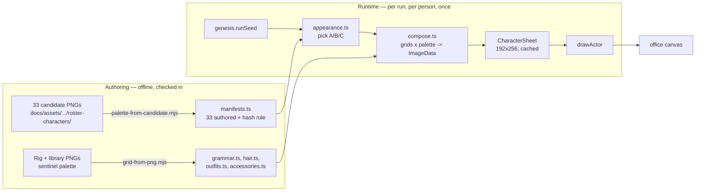
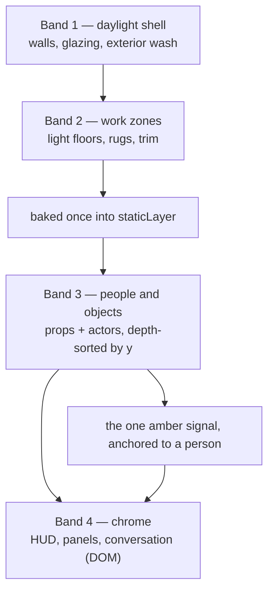
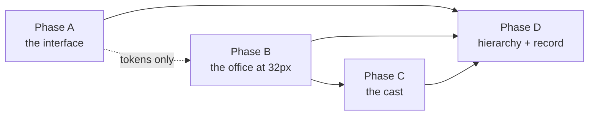

# feat: The daylight pixel visual system — a lit office, a cast with faces, and chrome that gets out of the way

## Summary

Replace the night-shift control room with a lit workplace, across the whole product. The
palette inverts from ink to ivory, the office doubles its art resolution so a person can be
two tiles tall instead of one, and the ten-pixel-wide procedural figures become a 48×64
layered cast with hair, outfits, faces and four directions of walk. The chrome loses weight so
the room and the people in it are what the eye lands on first.

Seventeen units in four phases. No behaviour changes: the kernel, the wire, the movement model,
the metrics and every control keep their current meaning. Nothing in the Product Contract is
deferred — the A/B/C runtime cast variation, the procedural coworkers and the responsive
verification are all in this plan.

---

## Problem Frame

The origin document establishes what the product should look like and why (see origin:
`docs/plans/2026-08-16-1527-feat-company-os-visual-redesign-plan.md`). `VISUAL_DESIGN.md`
carries the derived rendering specification. This plan resolves how to get there from the code
as it sits today.

Three findings from reading the client change the approach rather than merely informing it.

**The 48×64 cast is not a swap — it forces the world's art resolution up.** The 33 approved
candidates put a figure of roughly 22×62 pixels inside their canvas. Against today's 16-pixel
floor tile that person stands almost four tiles tall and one and a half wide, which is not a
character in an office, it is a character wearing one. Doubling the tile's *art* size to 32
pixels puts the same figure at 0.7 tiles wide by 1.9 tall — the proportion the reference games
use, and the one the candidates were drawn for. Tile *units* are the kernel's and do not move:
`plan_floor` still emits a 31×18 grid, `walkable` still reads the same cells, milli-tile
positions still arrive unchanged. What moves is every painter in `frontend/src/render/floor.ts`
and every prop grid in `frontend/src/render/sprites.ts`, which the redesign was going to rewrite
anyway.

**Doubling the tile makes the office bigger than the stage, so the camera has to start
following.** At 32 pixels a tile the floor is 992×576 logical pixels at zoom 1, and
`chooseZoom` currently refuses a zoom that cannot show 26×16 tiles at once. On a 1280×800
laptop the stage gets roughly 450 pixels of height after the chrome, which does not fit 18
rows at any integer zoom. Today's renderer has no camera: it sizes the canvas to the whole
floor and lets `.stage` scroll, which is survivable at 496×288 and is not at 992×576 — the CEO
walks off the visible area and the player loses them. Acceptance example AE4 asks that no
character become obscured at any supported width, so a viewport that follows the CEO is part of
this plan rather than a nicety.

**The reserved amber is currently two colours, and the two documents disagree about the
player's.** `BEAM_COLOUR` in `frontend/src/render/actors.ts` is `#f0a92b`; `PAL.beam` in
`frontend/src/design/tokens.ts` is `#f2c46b`. Both mean "a person is waiting on your decision",
and the whole value of that signal is that there is exactly one of it. Separately, the Product
Contract assigns 天蓝 `#1677b3` to player emphasis while `VISUAL_DESIGN.md` and the shipped
candidate art give the CEO fresh teal `#57c3c2` — and the sales department already wears flower
blue `#2376b7`, which a 天蓝 CEO would sit next to indistinguishably. Both are resolved below
rather than carried forward as ambiguity.

---

## Key Technical Decisions

### The palette and where its authority lives

**天蓝 `#1677b3` is the chrome's action colour; fresh teal `#57c3c2` stays the CEO's in-world
signal.** (session-settled: user-directed.) The Product Contract's palette table and
`VISUAL_DESIGN.md` disagree, and the disagreement is real rather than clerical: teal measures
2.1:1 against ivory `#fffef8`, which fails as a border or a label, while 天蓝 measures 4.9:1 and
passes. In the office the constraint runs the other way — the sales room and its people already
wear flower blue `#2376b7`, and a 天蓝 CEO standing in it would read as a sales hire. Splitting
the role by surface satisfies both: the world's strongest cool accent is the player in teal, the
chrome's is the action in 天蓝, and neither competes with the other because they never share a
surface. R12 is preserved in the sense it was written — one cool focus per surface, one warm
one, and the warm one outranks it.

**`#f2c46b` is the single reserved amber, on canvas and in CSS.** `BEAM_COLOUR` collapses onto
`PAL.beam`. Auditing all 33 candidate sprites found the value used by none of them, so the
`VISUAL_DESIGN.md` acceptance check — no ordinary asset uses `#f2c46b` — already holds for the
cast and only has to be held for the new environment art.

**`frontend/src/design/tokens.ts` keeps its export names and changes only its values.** Every
surface already reads slots from it by name (`PAL.shilv`, `PAL.jingyuhui`, `deptColour`,
`loadColour`), and the suites assert against those names rather than against hexes. Renaming to
the Zhongguose light names would be truthful and would rewrite eight files and four test suites
for no behavioural gain; the names stay, the comment block says what each now denotes, and the
diff is legible as a palette change rather than a refactor. Two tests pin literal hexes
(`frontend/tests/stage.test.ts` on the CEO's top, `frontend/tests/render.test.ts` on
`BEAM_COLOUR`) and both are updated deliberately.

**The load ramp is re-derived for a light ground rather than re-tinted.** Today's ramp drains
from 竹绿 through 苍绿 to 朱红 against ink, and its middle steps are chosen to be *dark enough not
to read as amber*. On ivory that reasoning inverts — a desaturated mid-green disappears into
the surface instead of reading as strain. The ramp is rebuilt to hold its distance from
`#f2c46b` in hue while gaining contrast against `#fffef8`, and the existing property test —
no ramp stop equals the beam — is joined by a second: every stop clears 3:1 against the product
ground.

### The office

**`TILE` goes from 16 to 32; tile units do not move.** The constant in
`frontend/src/render/floor.ts` describes how many logical pixels one floor tile is *drawn*
as, and nothing else reads it as a unit of geometry — `toTile` divides milli-tiles by 1000,
`buildGrid` and `walkable` work in cells, and the kernel is untouched. Every painter, prop grid
and pixel offset that consumed 16 is re-derived at 32. This is the enabling change for the whole
character direction and it is the plan's largest single risk, which is why it lands as its own
unit before any new art depends on it.

**`chooseZoom` yields {1, 2} instead of {1, 2, 3}, and stops being the only answer to
"does it fit".** At 32 pixels a tile, zoom 1 is exactly today's zoom 2 in screen terms, so no
display loses fidelity; zoom 2 is reserved for stages above roughly 2000×1150. The
"can I see 26×16 tiles" clamp is retired because the camera now answers that question.

**The environment stays ASCII grids; the cast does not.** A 32×32 prop is 1,024 glyphs — a
diff a reviewer can read, and the format `paint()` already consumes. The cast at 48×64 across
a body rig and three feature libraries is closer to 240,000 glyphs, at which point a grid file
stops being a review artifact and becomes a binary in disguise. So props, walls, floors and
windows stay authored as ASCII in `frontend/src/render/sprites.ts` and `floor.ts`, and the cast
moves to a different arrangement described next.

**The vignette goes and does not come back as something else.** `buildStatic` currently paints a
34%-black radial over the whole floor. R10 forbids the dark overlay outright, and the lamp pools
that read as warmth against ink read as grubby smudges against ivory. Both are replaced by a
daylight gradient anchored on the window walls — light falls *from* the glazing rather than
pooling under fixtures.

### The cast

**A layered rig with per-identity skins, authored as PNG and committed as ASCII grids.**
(session-settled: user-directed.) One body rig — three views (down, up, side) by four frames
(idle plus three walk) — plus hair, outfit and accessory libraries, composed against a
six-slot per-identity palette. This is what the code already does at 10×16 with one hair
option; the change is fidelity and library size, not architecture, which is why `characterSheet`,
its cache and its `dispose()` contract survive intact.

The authoring format is PNG, because that is what a pixel artist works in and what the
candidates already are. The *committed* format is ASCII grids produced by a checked-in
converter (`frontend/scripts/grid-from-png.mjs`) that maps a fixed sentinel palette to glyphs.
This buys three things at once: runtime palette substitution stays free, because `paint()` is
already a glyph-to-colour function; the suites keep testing pure data with no canvas, which
jsdom cannot give them; and a one-pixel change shows up in review as one changed character
rather than as a changed blob.

Per-identity palettes are *extracted* from the approved candidates rather than retyped
(`frontend/scripts/palette-from-candidate.mjs`). The 33 candidates share a disciplined 33-colour
union and are indexed PNGs, so pulling six slots out of each is mechanical and cannot introduce
a hex typo the way transcription would.

**The candidates remain the casting reference and the review target, not the shipped frames.**
`VISUAL_DESIGN.md` §8 already says this: the candidate art is production-style reference and
the directional frames need an authored pass. Each identity's rig-composed down-idle is judged
side by side against its candidate, and that comparison is the acceptance gate for the casting
work.

**A person's appearance is chosen client-side from the run seed and reaches nothing else.**
(origin R9a.) `genesis.runSeed` already lands in `frontend/src/net/store.ts`. Selecting A, B or
C from `(runSeed, personId)` in the client makes "cosmetic choice has no simulation effect" true
by construction rather than by discipline — the kernel never learns which one was picked, so
there is no path by which it could matter. Procedural coworkers use the same function with a
hash-derived manifest instead of an authored one, which is what makes R9 hold: they are not
*compatible* with the leads, they are the same rig.

**The walk frame is keyed to distance travelled, not elapsed ticks.** `walkFrame` currently reads
`animTicks / 7`, which is the store's tick and therefore the same cadence for everyone — but the
CEO covers a tile in about 7 ticks and staff take about 13, so one of the two is always
skating. A stride accumulator in the renderer, advanced by the actor's own movement each frame,
gives both the right cadence from one rule and makes a stopped person's legs stop mid-stride
rather than mid-air. The accumulator is renderer state keyed by actor id, dropped by
`dispose()` alongside the sheet cache.

**Sheets are composed into an `ImageData` buffer and written once.** A 48×64 cell across four
frames and four facings is 192×256 — 49,152 pixels, against today's 1,920. Painting that with
one `fillRect` per pixel, per person, is fifty thousand canvas calls where one `putImageData`
will do. The composition step becomes a pure function over a typed array, which is both faster
and the only shape jsdom can test without a native canvas dependency.

---

## High-Level Technical Design

### How a person gets drawn



The seam that matters is `compose.ts`: everything left of it is data, everything right of it is
canvas. The suites test the data and the composition; the canvas side keeps the recording-context
tests it already has.

### The sheet, and what a cell contains

Directional guidance for review, not an implementation specification.

```
one identity's sheet — 192 x 256

           frame 0      frame 1      frame 2      frame 3
           idle         contact L    pass         contact R
  down     (  0,  0)    ( 48,  0)    ( 96,  0)    (144,  0)
  up       (  0, 64)    ( 48, 64)    ( 96, 64)    (144, 64)
  left     (  0,128)    ...          mirrored from `side` at compose time
  right    (  0,192)    ...          `side` as authored

  walk cycle = [1, 2, 3, 2]      standing = frame 0
  cell = 48 x 64, figure occupies ~22 x 62, feet planted on the last row

  one cell composes as:
    body    <- grammar[view][frame]        skin, limbs, silhouette
    outfit  <- outfits[manifest.outfit][view][frame]
    hair    <- hair[manifest.hair][view]   offset by the frame's head bob
    extra   <- accessories[manifest.accessory][view]   optional
```

### Scale, before and after

| | today | after | why |
|---|---:|---:|---|
| Floor tile, drawn | 16 px | 32 px | hosts a 48×64 figure at correct proportion |
| Character cell | 10 × 16 | 48 × 64 | origin R5 |
| Figure, occupied | 10 × 16 | ~22 × 62 | measured across all 33 candidates |
| Figure, in tiles | 0.6 × 1.0 | 0.7 × 1.9 | a person, not a bollard |
| Floor at zoom 1 | 496 × 288 | 992 × 576 | why the camera has to follow |
| Integer zooms | 1, 2, 3 | 1, 2 | zoom 1 after = zoom 2 before, on screen |
| Sheet per person | 30 × 64 | 192 × 256 | 4 frames × 4 facings |

### Draw order, and the four depth bands

`VISUAL_DESIGN.md` §4 names four bands. They map onto the existing two-layer renderer without
adding a third: the first two bake into the static layer, the third is the depth-sorted pass,
and the fourth is DOM chrome over the canvas.



The rule the bands encode is that nothing in band 4 may darken band 3. The conversation overlay
keeps its position but loses its 45%-black shadow; the vignette that currently sat between bands
2 and 3 is deleted rather than lightened.

### Phase dependency



Phase A and Phase B are independent after the token unit; Phase C cannot begin until the tile
change has landed, because every cell offset it authors is expressed against it.

---

## Output Structure

New directories this plan creates. The per-unit file lists remain authoritative.

```
frontend/
  scripts/
    grid-from-png.mjs          authoring PNG -> committed ASCII grid
    palette-from-candidate.mjs candidate PNG -> six-slot palette
    contact-sheet.mjs          renders the cast for side-by-side review
  src/render/cast/
    slots.ts                   glyph -> slot contract, sentinel palette
    grammar.ts                 body rig: 3 views x 4 frames
    hair.ts                    hair library
    outfits.ts                 outfit library
    accessories.ts             accessory library
    manifests.ts               33 authored manifests + the procedural rule
    appearance.ts              seeded A/B/C selection
    compose.ts                 grids x palette -> ImageData (pure)
  src/render/camera.ts         viewport that follows the CEO
  art/                         authoring sources, not bundled
    rig/, hair/, outfits/, accessories/
  tests/
    tokens.test.ts  cast.test.ts  appearance.test.ts
    world.test.ts   camera.test.ts  visual.test.ts
```

`frontend/art/` holds the PNGs an artist edits. It is excluded from the bundle and from the
Docker build context — only the generated grids ship, which is `VISUAL_DESIGN.md` §8's rule that
raw sources stay out of the frontend asset graph.

---

## Requirements

Carried from origin (see origin:
`docs/plans/2026-08-16-1527-feat-company-os-visual-redesign-plan.md`). Restated compactly; the
origin's wording governs where this is shorter.

**Experience hierarchy and visual language**

- **R1.** The office and its people are the primary visual surface; metrics and work status are
  supporting context.
- **R2.** Contemporary startup identity in original pixel art — not dungeon, medieval,
  rustic-farm, or corporate dashboard.
- **R3.** The Zhongguose palette roles are the default authority, with accessible tonal variants
  permitted where a state must stay readable.
- **R4.** Pokémon, Stardew Valley and Gather are quality benchmarks only; every shipped asset is
  original.

**Character system**

- **R5.** Lead and interaction-critical characters render on transparent 48×64 canvases at native
  game scale; all 11 MVP identities keep three reviewable candidates until final casting.
- **R6.** Compact ~3.5-head proportions, oversized readable hair, short limbs, planted feet,
  restrained shading.
- **R7.** Every refined character carries the directional idle and walking states the existing
  movement model requires.
- **R8.** Each identity is distinguishable without a name label, by silhouette, hair, skin tone,
  outfit shape and at most one restrained accent.
- **R9.** Procedural background coworkers use the same body grammar, outline treatment and
  palette logic as the authored leads.
- **R9a.** A new run may select one A/B/C appearance per named identity from the run seed; the
  selection is stable within the run and affects no simulation state.

**Environment and interface**

- **R10.** Light architectural shells, daylight glazing, team floor zones, warm wood, plants,
  rugs, artwork and recognisable collaboration spaces replace dark walls and overlays.
- **R11.** Bright surfaces, restrained borders, compact typography and clear grouping keep
  operational information professional beside the warmer world.
- **R12.** The person needing attention is the strongest warm accent; the player is the strongest
  cool accent; ordinary working states stay quieter.
- **R13.** Navigation, actions, metrics, movement, responsive behaviour and data meaning are
  preserved, and pixel assets stay crisp without smoothing.

**Key flows and acceptance examples** carried verbatim from origin: F1 read the company, F2 walk
to a person, F3 read across product surfaces; AE1 office hierarchy, AE2 character movement, AE3
mixed authored and procedural cast, AE4 responsive composition.

---

## Requirement coverage

| Requirement | Units |
|---|---|
| R1 | U2, U3, U15, U16 |
| R2 | U1, U2, U5, U6, U7 |
| R3 | U1, U2, U3 |
| R4 | U9, U10, U12, U17 |
| R5 | U8, U9, U12, U13 |
| R6 | U9, U10 |
| R7 | U9, U11 |
| R8 | U10, U12, U16 |
| R9 | U12, U11 |
| R9a | U13 |
| R10 | U4, U5, U6, U7 |
| R11 | U2, U3, U15 |
| R12 | U1, U11, U15 |
| R13 | U4, U11, U14, U16 |
| F1 | U15, U16 |
| F2 | U9, U11, U14, U16 |
| F3 | U2, U3, U15, U16 |
| AE1 | U15, U16 |
| AE2 | U11, U16 |
| AE3 | U12, U11 |
| AE4 | U14, U16 |

---

## Implementation Units

### Phase A — The interface

#### U1. The daylight token set

**Goal:** Turn `tokens.ts` from an ink palette into the Zhongguose light palette, keeping every
export name and every consumer untouched.

**Requirements:** R2, R3, R12.

**Dependencies:** none.

**Files:** `frontend/src/design/tokens.ts`, `frontend/tests/tokens.test.ts` (new),
`frontend/tests/hud.test.ts`, `frontend/tests/dag.test.ts`.

**Approach:** Re-value `PAL` slot by slot against the origin's palette table — ground slots to
象牙白/粉白/月白, structure to 远天蓝/星蓝, text to 鲸鱼灰/鸽蓝, progress to 竹绿/粉绿, warmth to
淡桃红/初桃粉红 — and add 天蓝 `#1677b3` as a new action slot.

`PAL.shilv` is the one slot that changes meaning rather than value. It keeps `#57c3c2` and
narrows to *the CEO's in-world signal only*; `ACCENT` re-points to the new 天蓝 slot, and every
chrome consumer of the old accent moves with it. That list is short and worth naming, because a
missed one is a 2.1:1 control nobody can read: the DAG's delivered node (U3), and in `shell.css`
the active stage-toggle and rate buttons, the item and decision action buttons, the conversation
decision button, and the ask box's focus border (U2). After this unit the only readers of
`PAL.shilv` are the CEO's manifest and the office canvas.

`ROOM_FLOOR` re-points to the department *identity* colours `VISUAL_DESIGN.md` §2 names — bamboo
green, flower blue, whale gray, warm clay, muted violet — which are chrome-strength values,
because this map feeds the 3-pixel person and item stripes in the panels, not the office floor.
The canvas's floors are `FLOORS` in `frontend/src/render/palettes.ts` and are U6's, deliberately
pale. Where an identity colour lands within a hair of 3:1 against ivory — bamboo green does —
R3's accessible tonal variant is the correction, not an exception to the assertion.

Rebuild `LOAD_RAMP` for the light ground per the decision above. `pressureColour` and
`directionColour` re-read the new slots without changing shape. Add a `contrastRatio(a, b)`
helper so the accessibility rules below are assertions rather than intentions. Update the
module's comment block: it currently explains why the console stays ink, which is now the
opposite of true.

**Patterns to follow:** the existing `RESERVED_BEAM` export — a rule stated as a value a test can
name. Mirror it with an exported `PRODUCT_GROUND` so contrast assertions have a fixed reference.

**Test scenarios:**
- Covers R3. Every slot in `PAL` is a six-digit hex.
- Covers R12. `RESERVED_BEAM` is `#f2c46b`, and no other slot in `PAL` equals it.
- Covers R12. No `LOAD_RAMP` stop equals `RESERVED_BEAM`, and no stop is within a small hue
  distance of it (the existing property, re-asserted on the new ramp).
- Covers R3. Every `LOAD_RAMP` stop clears 3:1 against `PRODUCT_GROUND`.
- Covers R3. `PAL.text` clears 7:1 and `PAL.textMuted` clears 4.5:1 against `PRODUCT_GROUND`;
  `ACCENT` clears 4.5:1.
- Covers R3. Every `ROOM_FLOOR` value clears 3:1 against `PRODUCT_GROUND`, so a department
  stripe is visible rather than implied.
- Covers R12. `ACCENT` is the 天蓝 slot and is not `PAL.shilv` — the split settled above, stated
  as a property so a later re-merge is a failing test rather than a quiet regression.
- `loadColour(0, 1000)` returns the first stop and `loadColour(1400, 1000)` the last; a load at
  the ceiling returns neither end — the existing bucket arithmetic is unchanged, re-asserted
  against the new ramp.
- `deptColour` returns the mapped colour for each of the eight known rooms and the panel
  fallback for an unknown one.
- `contrastRatio` returns 21 for black against white and 1 for a colour against itself.
- Covers R12. `pressureColour` never returns `RESERVED_BEAM` at any waiting count.

**Verification:** `hud.test.ts` and `dag.test.ts` pass unchanged apart from the two literal-hex
pins; every colour the product renders is traceable to a named slot.

---

#### U2. The chrome, rebuilt bright

**Goal:** Replace the dark console with the disciplined light interface — surfaces, borders,
typography, grouping — without moving a single control.

**Requirements:** R1, R2, R3, R11.

**Dependencies:** U1.

**Files:** `frontend/src/ui/shell.css`, `frontend/src/index.css`, `frontend/src/App.css`,
`frontend/src/ui/Shell.tsx`, `frontend/src/ui/Marking.tsx`,
`frontend/tests/hud.test.ts`.

**Approach:** The `:root` custom properties in `shell.css` mirror `tokens.ts` slot for slot, so
the two cannot drift; the module comment says which file is the source. `--shilv` leaves the
chrome entirely, per U1's split: the active stage-toggle and rate buttons, the item and decision
action buttons, the conversation decision button and the ask box's focus border all re-point to
the new action property. Surfaces move from
`--gangqing` panels on a `--ganglan` gradient to 象牙白 ground with 月白 cards and 粉白 quiet
regions. The shell's radial gradient goes — a light ground with a gradient reads as a
smudge — replaced by a flat surface with a 远天蓝 hairline separating regions. Borders drop from
1px solid at full strength to 远天蓝 hairlines, and the several `border-top`/`border-bottom`
rules that currently fence every list row are replaced by spacing where the grouping is already
obvious. Typography compacts: the HUD tile label and the panel heading share one small-caps
scale, `tile__value` loses a step, and line heights tighten so the chrome gives the stage back
vertical room (which U14 needs). `index.css` switches `color-scheme` to `light` and drops its
placeholder ground; its comment about a second opinion landing with U12/U13 is now stale and
goes. `App.css` — the pre-shell diagnostic card — is brought onto the same tokens rather than
left as a third palette. The conversation overlay keeps its anchor and loses its black
box-shadow for a 远天蓝 border and a soft neutral shadow. `.person__beam`, `.conversation
[data-state='blocked']`, `.said[data-tacit='true']` and the authored-tuning marking keep their
exact semantics — this unit changes what the chrome weighs, not what it means.

**Patterns to follow:** the existing `prefers-reduced-motion` block, which disables motion and
never the signal; keep that shape for anything new.

**Test scenarios:**
- Covers R11. Every custom property declared in `:root` in `shell.css` has an equal-valued slot
  in `PAL`, asserted by reading both files — the drift this unit's structure exists to prevent.
- Covers R12. No rule in `shell.css` other than `.person__beam` and
  `.conversation[data-state='blocked']` references `--beam`.
- Covers R12. No rule in `shell.css` references `--shilv` — the CEO's in-world signal does not
  appear in the chrome, which is what keeps the split from collapsing back.
- Covers R11. Every interactive control's text or border colour clears 4.5:1 against the surface
  it sits on, asserted over the resolved token values for each control rule.
- Covers R1. The rendered HUD contains no colour equal to `RESERVED_BEAM` (existing assertion,
  re-run against the light chrome).
- Covers R11. The authored-tuning marking still renders its glyph and label on every figure the
  HUD and panels show, and still carries no hue (existing sweep, unchanged).
- Covers R13. Every control the shell rendered before renders after: stage toggle, rate buttons,
  banner action, tray options, item actions, conversation ask form, comparison open and close.
- A rate button at `data-active='true'` is visually distinguished by a token, not by a hex
  literal.

**Verification:** the client renders on ivory with no dark region anywhere in the chrome; every
existing suite passes; a screenshot at 1440×900 shows no control missing or relocated.

---

#### U3. The DAG and the chain strip on a light ground

**Goal:** Bring the two canvas surfaces outside the office onto the daylight palette.

**Requirements:** R1, R3, R11.

**Dependencies:** U1.

**Files:** `frontend/src/dag/draw.ts`, `frontend/src/dag/nodes.ts`, `frontend/src/dag/strip.ts`,
`frontend/tests/dag.test.ts`.

**Approach:** These read `PAL` already, so most of the work is done by U1 — but four places
resolve wrongly on a light ground and need judgement rather than a re-read. `nodes.ts` uses the
literal `'#0c1019'` for a done node's fill, which was "darker than the panel" and now has to
become "quieter than the panel". The edge polylines drawn in `PAL.qinghui` and `PAL.jingyuhui`
were a lit line on ink and become a dark line on ivory, so their weight drops. `strip.ts` fills
its ground with `PAL.yanhanlan`, which was the shell's own ground and now must be the strip's
own quiet surface. And the delivered node draws `PAL.shilv`, which U1 narrowed to the CEO's
in-world signal — it re-points to `ACCENT`, and `frontend/tests/dag.test.ts`'s assertion moves
with it. The status legend in `nodes.ts` keeps its remaining slots; only the ground beneath it
moves.

**Patterns to follow:** `nodes.ts`'s existing separation of hue from label colour — keep it, it
is what lets a status stay legible when its fill lightens.

**Test scenarios:**
- Covers R12. Neither the DAG nor the strip ever draws `RESERVED_BEAM` (existing assertions,
  re-run).
- Covers R3. No colour drawn by `nodes.ts`, `draw.ts` or `strip.ts` is a literal hex; every one
  resolves through `PAL` or `loadColour`.
- Covers R3. Every node fill clears 3:1 against the strip and DAG ground.
- A node over its ceiling still draws `PAL.zhuhong` and one under it does not (existing).
- Covers R12. A delivered node draws `ACCENT` and an open one `PAL.jingyuhui`; nothing in the
  DAG or the strip draws `PAL.shilv`.
- The chain strip's tick markers remain distinguishable from its ground at every zoom the strip
  supports.

**Verification:** `dag.test.ts` passes; the DAG view read beside the office reads as the same
product rather than as a second one.

---

### Phase B — The office at 32 pixels a tile

#### U4. The base resolution

**Goal:** Move `TILE` from 16 to 32 and re-derive every offset, size and zoom decision that
consumed it, with the existing art scaled rather than redrawn.

**Requirements:** R10, R13.

**Dependencies:** U1.

**Files:** `frontend/src/render/floor.ts`, `frontend/src/render/actors.ts`,
`frontend/src/render/index.ts`, `frontend/src/render/sprites.ts`,
`frontend/tests/render.test.ts`, `frontend/tests/world.test.ts` (new).

**Approach:** This unit is deliberately mechanical and deliberately alone: it changes the number
and proves nothing else moved. `TILE` becomes 32.

The existing art is *scaled at the blit*, not rewritten. The prop grids stay 16×16 and the prop
atlas stays 16 pixels tall; `blitProp` draws each prop into a 32-pixel tile at 2×, and U7 removes
the scaling when the real 32×32 grids land. The character sheet likewise stays 10×16 and is drawn
at 2× so people keep their current apparent size until U11 replaces the cell. Committing
mechanically doubled ASCII here would be several hundred lines authored to be deleted two units
later, and would make U7's diff unreadable — the interesting change would be buried in noise the
converter produced.

What *is* re-authored here is the pixel-level geometry that cannot be scaled: `paintFloorTile`,
`paintWall` and `paintWindow` have their band offsets re-derived against 32 rather than doubled,
because a doubled 1-pixel seam is a 2-pixel seam and reads as a gap rather than a joint.
`chooseZoom` drops to {1, 2} with thresholds re-derived, and its "26×16 tiles must fit" clamp is
removed — U14 owns fitting from here. The static layer grows 4× in area; assert the budget rather
than assume it.

**Execution note:** characterise first. Before changing the constant, add the world tests below
against the current renderer so the diff has something to be measured against.

**Test scenarios:**
- Covers R13. `TILE` is 32, and `buildStatic` returns a canvas of exactly `cols * 32` by
  `rows * 32` for a fixture floor.
- Covers R13. `buildGrid` returns identical cell values before and after the change for the same
  fixture floor — geometry is in tile units and did not move.
- Covers R13. `walkable` answers identically before and after for every cell of the fixture
  floor, including out-of-bounds probes.
- `chooseZoom` returns 1 for a 1280×450 stage, 1 for 992×576, 2 for 2400×1400, and never 0 or 3.
- `chooseZoom` returns 1 rather than refusing when the stage is smaller than the floor — the
  clamp is gone.
- `buildPropAtlas` still returns a canvas `16 * PROP_KEYS.length` wide and 16 tall — the atlas is
  unchanged in this unit, and U7 is where it grows.
- `blitProp` places a prop at exactly `(tx * 32, ty * 32)`, draws it 32 pixels square from a
  16-pixel source, and keeps its contact shadow within the tile's last four rows.
- `drawActor` places a person's feet on the same tile row before and after, given the same
  milli-tile position.
- Covers R13. The renderer still builds exactly one sheet set per instance and drops it on
  `dispose()` (existing lifecycle assertions, re-run).

**Verification:** the office renders at twice its previous size with identical geometry, and
every position the kernel echoes still lands on the same tile.

---

#### U5. The daylight shell

**Goal:** Replace the walls, glazing and lighting with the light architectural shell R10
describes, and delete the vignette.

**Requirements:** R2, R10.

**Dependencies:** U4.

**Files:** `frontend/src/render/floor.ts`, `frontend/src/render/palettes.ts`,
`frontend/tests/world.test.ts`.

**Approach:** `WALLC` moves from a slate 2.5D block to a light partition: 远天蓝 face, a 月白 cap
catching the light, a 鲸鱼灰 skirting thin enough to read as trim rather than as a plinth. Walls
lose height in apparent terms — the cap band narrows and the face lightens — so the room reads as
a partitioned studio rather than a fortress. `paintWindow` becomes real glazing at 32×32: a wide
mullioned frame, sky beyond, a sill with a plant or a stack of books on a fraction of them
(deterministic from the tile coordinate, like `speck`, so a resize does not reshuffle them). The
lamp pools and the 34%-black vignette in `buildStatic` are both deleted; in their place a
directional daylight wash is baked from the window walls inward, a light-additive gradient that
falls off over roughly six tiles. Doors get a frame rather than being a floor tile that happens
to sit in a wall.

**Patterns to follow:** `speck`'s determinism — a pure function of the pixel coordinate, so the
static layer is identical on every rebuild.

**Test scenarios:**
- Covers R10. `buildStatic` draws no fill with an alpha-composited result darker than the
  product ground at any pixel — the vignette is gone and nothing replaced it.
- Covers R10. The recorded fills for a wall tile include the 远天蓝 face, the 月白 cap and the
  鲸鱼灰 skirting, and no colour outside `PAL`.
- Covers R10. A window tile draws its frame, glass, sky band and sill within the tile's bounds
  and never outside them.
- Covers R2. No fill drawn by `buildStatic` equals `RESERVED_BEAM`.
- The daylight wash is brightest adjacent to a window wall and monotonically decreases with
  distance from it, sampled at three distances.
- Two calls to `buildStatic` with the same floor produce an identical recorded call sequence —
  the sill dressing is deterministic.
- A floor with no windows still builds, with an even ambient level rather than a crash.

**Verification:** a screenshot at 1440×900 shows a lit room with no dark mass at the edges and
no pooled light under a fixture.

---

#### U6. Team floor zones and the things underfoot

**Goal:** Give each department a light floor carrying its identity through rugs, trim and seams
rather than through a saturated slab.

**Requirements:** R2, R10, R12.

**Dependencies:** U4, U5.

**Files:** `frontend/src/render/palettes.ts`, `frontend/src/render/floor.ts`,
`frontend/tests/world.test.ts`.

**Approach:** `FLOORS` inverts: every style becomes a light base — 粉白 for warm rooms, 月白 for
cool ones — with the department colour appearing only in a seam, a border course and a rug laid
inside the room's box rather than across its whole area. The wood style becomes warm timber
rather than the current dark mahogany, with the board rhythm re-derived at 32 pixels so the
joints do not read as brickwork at the new scale. The hall gets its own quiet treatment so a
corridor still reads as circulation. `ROOM_FLOORS` gains the two rooms `ROOM_FLOOR` in
`tokens.ts` already knows about but `floor.ts` does not (`cs`, `people`), so a room never falls
through to slate silently. The rug is a room-scoped feature painted into the static layer from
the room's own box, inset by one tile — which is also what gives the walkable centre the
readable clearing `VISUAL_DESIGN.md` §7.4 asks for.

**Test scenarios:**
- Covers R10. Every style in `FLOORS` has a base above a luminance floor — a floor is a ground,
  not a state, and the deliberately pale bases are the opposite of the 3:1 rule `ROOM_FLOOR`'s
  chrome stripes carry in U1.
- Covers R10. Within each style, the seam and trim are distinguishable from the base by at least
  a minimum ratio, so a department reads without the floor shouting.
- Covers R12. No `FLOORS` value equals `RESERVED_BEAM`; the support room in particular does not
  return to amber.
- Covers R10. Each of the eight rooms paints a rug inset by one tile from its box, and the rug
  never overlaps the room's door tile.
- The department seam colour for a room matches `deptColour` for the same department — one
  answer, not two.
- Covers R2. A wood room's board joints fall on the re-derived 32-pixel rhythm, asserted by the
  recorded fill positions for two adjacent tiles.
- `ROOM_FLOORS` covers every room id `plan_floor` can emit; an unknown id still falls back
  without throwing.
- The hall's treatment differs from every room's, so circulation is distinguishable.

**Verification:** each department is identifiable by its floor at a glance, and no floor competes
with the people standing on it.

---

#### U7. The prop set at 32×32

**Goal:** Redraw the ten existing props at the new resolution and add the ones that make the
office inhabited.

**Requirements:** R2, R10.

**Dependencies:** U4.

**Files:** `frontend/src/render/sprites.ts`, `frontend/src/render/floor.ts`,
`frontend/tests/world.test.ts`, `frontend/tests/render.test.ts`.

**Approach:** `ART` is re-derived from the daylight palette — the current glyph colours are a
dark-room set and every one of them is wrong on ivory. The ten existing props (desk, chair,
plant, sofaL, sofaR, table, shelf, board, cooler, coffee) are redrawn as 32×32 grids at the
fidelity the new resolution affords. The atlas grows to 32 pixels tall and U4's 2× blit scaling
is removed in the same change, so at no point is a 32×32 grid being drawn through a doubling
path. Redrawn: a desk with a monitor that reads as a monitor, a plant with
distinguishable leaves, a whiteboard with strokes rather than blocks. New props R10 names
explicitly: a rug is floor-level and belongs to U6, but wall art, a pinboard, a floor plant, a
coffee table, a stool and a standing lamp are props. `PROP_KEYS` grows, `PROP_INDEX` follows
automatically, and `buildStatic` gains the placement rules for the new props — deterministic
from room geometry, in the same style as the existing furniture derivation in
`backend/packages/simcore/world.py`. Because placement is the kernel's (`floor.furniture`
arrives at genesis), new props that need kernel placement instead attach to room features the
client already knows: wall art on an interior wall run, a floor plant in a room corner not
occupied by a desk slot.

**Approach note:** this unit adds no new furniture to the kernel's `floor.furniture` list, so no
walkability changes and no genesis payload change. Client-placed dressing is non-solid by
construction.

**Test scenarios:**
- Covers R10. Every prop grid is exactly 32 rows of 32 columns, every glyph in `PROP_PALETTE`
  (the existing contract, re-asserted at the new size).
- Covers R2. Every glyph in `PROP_PALETTE` except transparent maps to a six-digit hex in `ART`,
  and no `ART` value equals `RESERVED_BEAM`.
- Covers R2. Every `ART` value is drawn from the daylight palette family — asserted as a minimum
  luminance floor, so a dark-room colour cannot survive by accident.
- Client-placed dressing never lands on a tile the grid marks `SOLID`, `WALL`, or on a desk slot.
- Client-placed dressing is deterministic: two builds of the same floor place the same props at
  the same tiles.
- `buildPropAtlas` returns a canvas `32 * PROP_KEYS.length` wide and 32 tall, and `blitProp`
  draws source and destination at the same size — U4's scaling path is gone.
- A prop blits within its own tile at `(tx * 32, ty * 32)` and never bleeds into the next.
- Covers R10. The prop count assertion in `render.test.ts` is updated to the new total, and the
  assertion itself survives — it is what catches a grid deleted by accident.

**Verification:** the office reads as furnished rather than as populated boxes; nothing floats
and nothing overlaps a walkable route.

---

### Phase C — The cast

#### U8. The rig format, its slots, and the converter

**Goal:** Establish the format the whole cast is authored and committed in, and the tooling that
moves art between the two, before any art exists.

**Requirements:** R5.

**Dependencies:** U4.

**Files:** `frontend/src/render/cast/slots.ts`, `frontend/scripts/grid-from-png.mjs`,
`frontend/scripts/palette-from-candidate.mjs`, `frontend/tests/cast.test.ts`,
`frontend/tests/fixtures/rig/`, `frontend/package.json`, `frontend/.dockerignore`.

**Approach:** `slots.ts` declares the sentinel palette: a fixed glyph per material slot — skin
base, skin shadow, skin line, hair base, hair light, hair dark, top base, top shade, top line,
trousers, trousers shade, shoes, shoe shade, outline, eye, mouth, accent — each bound to a
sentinel RGB an artist paints with. This is the same idea as the existing `CHARACTER_PALETTE`
set, widened from sixteen glyphs to the number 48×64 needs and given an explicit sentinel colour
so a PNG can round-trip. `grid-from-png.mjs` reads a PNG, asserts every pixel is either fully
transparent or an exact sentinel, and emits a TypeScript grid module; an unrecognised colour is
an error naming the pixel, never a nearest-match. `palette-from-candidate.mjs` reads a candidate
PNG's index palette and emits its six-slot assignment by clustering on the known roles — skin
from the face region, hair from above it, top from the torso band, trousers and shoes from the
lower bands, accent from whatever remains with the highest chroma.

Both scripts are dev-only and need a PNG decoder in Node; a small `devDependency` such as `pngjs`
is enough and nothing in `src/` may import it, so the bundle is unaffected. `frontend/art/` is
committed — it is the authoring source of truth and losing it would mean losing the ability to
edit the cast — but it lives outside `src/` so Vite never bundles it, and it is added to
`frontend/.dockerignore` so the image does not carry it.

**Patterns to follow:** the existing grid contract documented at the head of
`frontend/src/render/sprites.ts` — state the shape, then assert it.

**Test scenarios:**
- Covers R5. Every sentinel RGB in `slots.ts` is unique, and no sentinel equals another slot's.
- Covers R5. No sentinel equals `RESERVED_BEAM`.
- `grid-from-png.mjs` converts a fixture 48×64 PNG of known sentinels into the expected grid,
  character for character.
- `grid-from-png.mjs` rejects a fixture PNG containing one off-by-one colour, and the error names
  the pixel coordinate and the offending value.
- `grid-from-png.mjs` rejects a PNG whose dimensions are not a multiple of the cell size.
- `grid-from-png.mjs` treats semi-transparent pixels as an error rather than rounding them —
  R13's no-smoothing rule starts at the source.
- `palette-from-candidate.mjs` extracts six distinct slots from each of three fixture candidates,
  and every extracted value appears in that candidate's own index palette.
- `palette-from-candidate.mjs` never assigns `RESERVED_BEAM` to any slot.
- Round trip: a grid emitted from a PNG, re-rendered to pixels through the sentinel map,
  reproduces the source PNG exactly.

**Verification:** an artist can hand over a PNG and get a reviewable grid, and a wrong pixel is
an error rather than a silent approximation.

---

#### U9. The body rig

**Goal:** Author the shared body — three views by four frames — that every person in the product
is built on.

**Requirements:** R4, R5, R6, R7.

**Dependencies:** U8.

**Files:** `frontend/art/rig/`, `frontend/src/render/cast/grammar.ts`,
`frontend/tests/cast.test.ts`.

**Approach:** Twelve 48×64 cells: down, up and side, each as idle, contact-left, pass and
contact-right. Proportions follow `VISUAL_DESIGN.md` §3 — roughly 3.5 heads, head and hair mass
readable at native scale, short limbs, arms close to the torso, feet planted on the cell's last
row so a person's contact point is unambiguous for the depth sort. The rig carries skin, limb
silhouette and the outline only; hair, clothing and accessories are U10's. The side view is
authored as the right-facing pose and mirrored at compose time, which is the existing rule and
the reason two profiles cannot drift. Shading holds to two or three value groups per material
with the darkest dove-blue family reserved for separation rather than used as an all-round
sticker outline. Originality is a hard constraint, not a preference: the reference games set the
quality bar and nothing is traced, and the candidate art in `docs/assets/` is the visual target
for the down-idle.

**Execution note:** vertical slice before volume. The origin's dependencies say the movement-state
contract must be verified before asset production expands, and this is the unit where that bites:
once U10's ~66 library cells are authored against a wrong frame count or a wrong anchor row, they
are all wrong together. So author the rig, then take *one* identity end to end — a throwaway
manifest, U11's composition, the real renderer, a walk in four directions — and only then let
U10 begin. The slice is discarded; what it buys is the certainty that 48×64 by four frames by
three views is the shape the movement model actually wants.

**Test scenarios:**
- Covers R5. Every cell in `grammar.ts` is exactly 64 rows of 48 columns.
- Covers R5. Every glyph in every cell is transparent or a declared slot in `slots.ts`.
- Covers R5. All four corners of every cell are transparent.
- Covers R7. `grammar.ts` exports exactly three views, each with exactly four frames.
- Covers R6. The occupied bounding box of every cell is between 18 and 28 columns wide and
  between 58 and 63 rows tall — the measured envelope of the approved candidates.
- Covers R6. The lowest occupied row of every cell is row 63, so feet are planted and the depth
  anchor is the same for every frame.
- Covers R6. The head region (the top 18 rows) is between 14 and 22 columns wide in every cell —
  the compact big-head geometry, asserted rather than eyeballed.
- Covers R7. The idle frame's two feet are within one column of each other; the contact frames'
  are not — a standing pose and a stride are mechanically distinguishable.
- Covers R7. Contact-left and contact-right are horizontal mirrors of each other in the down and
  up views, within the tolerance the rig's asymmetric details allow.
- Covers R6. No cell uses more than three distinct value slots for any one material family.

**Verification:** the rig's down-idle, composed with a candidate's palette, is judged against
that candidate side by side and reads as the same person.

---

#### U10. The feature libraries

**Goal:** Author the hair, outfit and accessory sets that turn one body into a cast.

**Requirements:** R4, R6, R8.

**Dependencies:** U8, U9.

**Files:** `frontend/art/hair/`, `frontend/art/outfits/`, `frontend/art/accessories/`,
`frontend/src/render/cast/hair.ts`, `frontend/src/render/cast/outfits.ts`,
`frontend/src/render/cast/accessories.ts`, `frontend/tests/cast.test.ts`.

**Approach:** Hair is authored per view as a single overlay that rides the head, offset
vertically per frame by the rig's head bob rather than redrawn per frame — that is what keeps
the library at three cells per shape instead of twelve. Enough shapes to make eleven leads and
an arbitrary number of coworkers distinguishable by silhouette alone: short crop, side part,
tight curls, bob, long straight, tied back, locs, shaved. Outfits are authored per view per
frame, because sleeves and hems move with the arms and legs: shirt, shirt and open jacket,
blazer, knit, polo, hoodie, blouse, apron. Accessories are one optional overlay per view:
glasses, lanyard, headset, cap, scarf, watch — at most one per person, per R8's "one restrained
accent". Every overlay is drawn in sentinel slots so a person's palette reaches all of it.

**Test scenarios:**
- Covers R8. Every library cell is 64 rows of 48 columns in declared slots, with transparent
  corners.
- Covers R8. Each hair shape exports exactly three views; each outfit exports three views by four
  frames; each accessory exports three views.
- Covers R8. Any two hair shapes differ in occupied silhouette by more than a threshold share of
  their pixels — near-duplicates that would fail the no-label identity test are caught here.
- Covers R6. No hair shape's occupied region extends below the rig's head region by more than the
  long-hair allowance, and none extends outside the 48-column cell.
- Covers R6. Every outfit's occupied region falls within the rig body's silhouette plus a
  one-pixel drape allowance — clothing sits on the body rather than beside it.
- Covers R8. Every accessory occupies fewer pixels than a threshold share of the cell, so an
  accent stays an accent.
- Covers R4. No library cell uses `RESERVED_BEAM` in any slot.
- Composing the same body with two different hair shapes yields two cells that differ; with the
  same shape twice, identical cells.

**Verification:** eleven leads built from the libraries are distinguishable from each other with
labels hidden, judged from the contact sheet.

---

#### U11. Composition, the sheet, and the drawing pass

**Goal:** Turn grids plus a palette into a cached sheet, and draw a 48×64 person correctly on a
32-pixel floor.

**Requirements:** R5, R7, R9, R12, R13.

**Dependencies:** U9, U10.

**Files:** `frontend/src/render/cast/compose.ts`, `frontend/src/render/actors.ts`,
`frontend/src/render/index.ts`, `frontend/src/render/palettes.ts`,
`frontend/src/render/sprites.ts`, `frontend/tests/cast.test.ts`,
`frontend/tests/render.test.ts`.

**Approach:** `compose.ts` is pure: given the rig, a manifest and a palette, it writes an
`ImageData`-shaped buffer for one 192×256 sheet, layering body, outfit, hair and accessory in
that order, mirroring the side view for the left row. `characterSheet` keeps its signature, its
cache and its `dispose()` relationship and gains one `putImageData` in place of fifty thousand
`fillRect` calls. `SPRITE_WIDTH` and `SPRITE_HEIGHT` become 48 and 64; `FRAMES` becomes 4 and
`WALK_CYCLE` becomes `[1, 2, 3, 2]` with frame 0 as standing. `drawActor` re-derives its anchor:
a person's feet sit on the tile their milli-tile position names, so the cell is drawn offset
upward by `64 - TILE` and centred horizontally on the tile — and the depth key becomes the feet
row rather than the cell's top, or a person will sort behind a desk they are standing in front
of. `walkFrame` is replaced by a stride accumulator held in the renderer, keyed by actor id,
advanced by each actor's own movement per frame and dropped by `dispose()`; a stride of 250
milli-tiles per frame step gives a full cycle per tile for both the CEO's 144 and staff's ~78
milli-tiles per tick. The contact shadow widens to the new figure. `drawWaitingBeam` re-anchors
above a 64-pixel head and adopts `PAL.beam` — the `#f0a92b` literal is deleted. `BODY`, `LEGS`
and `LONG_HAIR` leave `sprites.ts`, and `SKINS`/`HAIRS`/`TOPS`/`PANTS`/`SHOES` leave
`palettes.ts`, both superseded by the cast modules; `PALETTE_OVERRIDE`'s CEO teal moves into the
CEO's manifest.

**Execution note:** start from the composition test — the layer order and the mirror are the two
things that fail silently and look nearly right.

**Test scenarios:**
- Covers R5. A composed sheet is exactly 192×256, and each of the sixteen cells is 48×64.
- Covers R5. Every pixel in a composed sheet is either fully transparent or fully opaque — no
  smoothing was introduced anywhere in the pipeline.
- Covers R5. Every non-transparent pixel's colour appears in the identity's palette; a sentinel
  colour surviving into output is a failure.
- Covers R7. The left row of a sheet is the exact horizontal mirror of the right row, cell for
  cell.
- Layer order: an outfit pixel overwrites a body pixel at the same coordinate; hair overwrites
  outfit; an accessory overwrites hair.
- A manifest with no accessory composes without one, and the resulting cell equals the same
  manifest with an empty accessory.
- Covers R13. `characterSheet` issues exactly one `putImageData` per sheet and no `fillRect`.
- Covers R13. `characterSheet` returns the cached sheet on a second call for the same id, and the
  renderer still builds one sheet set per instance and drops it on `dispose()`.
- Covers R7. The stride accumulator advances a CEO moving at 144 milli-tiles per tick through a
  full four-frame cycle in about one tile, and a staff member at ~78 in about the same distance.
- Covers R7. An actor that stops holds the frame it stopped on rather than snapping to idle
  mid-air; an actor that has never moved shows frame 0.
- The accumulator is dropped for an actor no longer present, and `dispose()` clears it — the leak
  the renderer's lifecycle exists to prevent.
- Covers R13. A person's depth key equals their feet row, so a person one tile below a desk sorts
  in front of it and one tile above sorts behind — asserted through `depthSort`.
- Covers R12. `drawWaitingBeam` draws `PAL.beam` and nothing else draws it; the beam clears the
  64-pixel head.
- Covers R9. A person with no authored manifest composes from a hash-derived one and produces a
  valid sheet by every assertion above.

**Verification:** people walk in four directions at the right size with the right cadence, sort
correctly against furniture, and the one waiting person is unmistakable.

---

#### U12. The eleven identities, cast

**Goal:** Produce the 33 manifests — three appearances for each of the eleven MVP identities —
from the approved candidates, plus the rule that dresses anyone else.

**Requirements:** R4, R5, R8, R9, AE3.

**Dependencies:** U10, U11.

**Files:** `frontend/src/render/cast/manifests.ts`, `frontend/scripts/contact-sheet.mjs`,
`frontend/tests/cast.test.ts`.

**Approach:** For each of the 33 candidates, extract the six-slot palette with U8's script and
choose the hair, outfit and accessory from the libraries that best match what the candidate
shows. The eleven identities are the backend roster plus the CEO: `you`, `dir_sales`,
`stf_order`, `stf_field`, `dir_admin`, `stf_ap`, `stf_buyer`, `dir_cs`, `stf_cs`, `dir_hr`,
`stf_rec` — the same set `backend/packages/simcore/people.py` declares, so a roster addition
that has no manifest is a caught error rather than a person who renders as a stranger. Within an
identity, A, B and C must stay recognisably the same role while differing materially: the
success criterion is a difference in at least two of face, hair, silhouette, clothing
construction and accessory. The CEO's manifest carries fresh teal `#57c3c2` in the top slot, per
U1's decision, and is the only manifest permitted to. Anyone not on the roster — the procedural
coworkers R9 names — gets a manifest derived from `idHash` across the same libraries, using the
same stride-through-the-hash trick `personPalette` already uses so adjacent hashes differ in
several features rather than one. `contact-sheet.mjs` renders all 33 composed down-idles beside
their candidates as the review artifact.

**Test scenarios:**
- Covers R5. `manifests.ts` contains exactly 33 entries: three for each of the eleven identities.
- Covers R5. Every identity in `backend/packages/simcore/people.py` plus `CEO_ID` has a manifest
  set, and no manifest exists for an id that is not on the roster.
- Covers R8. Every manifest references a hair, outfit and accessory that exist in the libraries.
- Covers R8. Within each identity, each pair of A/B/C differs in at least two of hair, outfit,
  accessory and skin slot.
- Covers R8. Across all 33, no two manifests are identical.
- Covers R12. No manifest's palette contains `RESERVED_BEAM` in any slot.
- Covers R12. Only the CEO's manifests carry the player's teal in the top slot.
- Covers R9. The procedural rule produces a valid manifest for an arbitrary id, and two adjacent
  ids differ in at least two features.
- Covers R9. The procedural rule is pure: the same id yields the same manifest every time.
- Covers AE3. Composing a lead and a procedural coworker yields cells sharing the rig's occupied
  envelope, outline slot and value-group discipline — the same game, not two.
- Covers R4. Every palette slot value in every manifest appears in the source candidate's own
  index palette, so no colour was invented during casting.

**Verification:** the contact sheet shows 33 recognisable people; each identity's three
appearances read as the same role; leads and coworkers share a visual family.

---

#### U13. Appearance chosen from the run seed

**Goal:** Pick one of A, B or C per identity per run, stably, with no path to the simulation.

**Requirements:** R5, R9a.

**Dependencies:** U12.

**Files:** `frontend/src/render/cast/appearance.ts`, `frontend/src/ui/stage.ts`,
`frontend/src/render/index.ts`, `frontend/tests/appearance.test.ts`.

**Approach:** A pure function of `(runSeed, personId)` selects the index. `genesis.runSeed`
already lands in the store; the renderer reads it once when the floor arrives and threads it into
sheet construction, which is also the moment the sheet cache is keyed — so the cache key becomes
`(personId, appearanceIndex)` and a resync that changes runs cannot serve the previous run's
face. Nothing is sent anywhere: the kernel never learns the selection, so R9a's "affects no
simulation state" is true because there is no channel, not because nothing writes to it. A run
with no genesis yet has no seed and no people to draw, which is the existing guard in
`Renderer.draw`.

**Test scenarios:**
- Covers R9a. The same `(runSeed, personId)` returns the same index on every call.
- Covers R9a. Two different seeds produce a different selection for at least one identity across
  the roster — the variation is real rather than nominal.
- Covers R9a. The returned index is always 0, 1 or 2, for arbitrary seeds including 0 and large
  values.
- Covers R9a. Within one run, drawing the same person a thousand frames apart returns the same
  appearance.
- Covers R9a. No command the client can send carries an appearance index — asserted over the
  gateway's command surface.
- A fork or resync into a different run rebuilds the sheet cache; the new run's faces are not the
  old run's, asserted through the cache key.
- Two identities in one run may independently land on different letters — selection is per
  person, not per run.
- The renderer draws nothing rather than guessing when genesis has not yet arrived (existing
  guard, re-asserted).

**Verification:** two runs of the same scenario open with visibly different casts; one run holds
its cast from genesis to horizon.

---

### Phase D — Hierarchy, verification and the record

#### U14. The camera that keeps the CEO on screen

**Goal:** Make the office usable at every supported width now that the floor is larger than the
stage.

**Requirements:** R13, AE4, F2.

**Dependencies:** U4, U11.

**Files:** `frontend/src/render/camera.ts`, `frontend/src/render/index.ts`,
`frontend/src/ui/Shell.tsx`, `frontend/src/ui/shell.css`,
`frontend/tests/camera.test.ts`.

**Approach:** The renderer stops sizing its canvas to the whole floor and sizes it to the stage,
drawing a translated viewport instead. The viewport follows the CEO with a dead zone — the
camera does not move while the player is within the central region, so ordinary walking does not
swim the room — and clamps to the floor's bounds so no frame shows outside the building. When the
whole floor fits, the viewport centres and the follow logic never engages, which is the
large-display case. Translation is in whole logical pixels before the integer zoom, never
fractional, or the pixel grid breaks and R13's crispness rule goes with it. `.stage` loses its
`overflow: auto`: scrolling was the old answer and having both would let a player scroll away
from a camera that then fights them back.

**Approach note:** the proximity rules in `stage.ts` are in tile space and are untouched — the
camera changes what is drawn, not what is near.

**Test scenarios:**
- Covers AE4. At a stage of 1280×450 the viewport keeps the CEO within its bounds for a walk
  across the full width of the floor.
- Covers AE4. The camera does not move while the CEO stays inside the dead zone, and begins
  moving on the first step outside it.
- Covers AE4. The viewport never shows a coordinate outside the floor: clamped at every edge and
  at both corners of a diagonal walk into a corner.
- Covers AE4. When the floor fits entirely, the viewport is centred and constant regardless of
  where the CEO walks.
- Covers R13. The translation is always an integer number of logical pixels, over a walk of a
  thousand ticks including diagonals.
- Covers R13. The canvas is sized to the stage, and a stage resize re-sizes it without rebuilding
  the sprite sheets or the static layer.
- A person at the edge of the viewport is drawn clipped rather than omitted — nothing pops in.
- Covers AE4. The waiting person's beam remains drawn when that person is within the viewport,
  at every supported width.
- The renderer with no floor still resizes without throwing (existing guard).

**Verification:** at 1280×800, 1440×900 and 1920×1080 the CEO is always visible and the office
never scrolls under the player.

---

#### U15. People first, across the chrome

**Goal:** Make the office and its people the first thing the eye lands on, and the waiting person
unambiguous, at the composition level rather than the colour level.

**Requirements:** R1, R11, R12, AE1, F1, F3.

**Dependencies:** U2, U3, U14.

**Files:** `frontend/src/ui/Shell.tsx`, `frontend/src/ui/Hud.tsx`,
`frontend/src/ui/Panels.tsx`, `frontend/src/ui/Conversation.tsx`,
`frontend/src/ui/shell.css`, `frontend/tests/hud.test.ts`.

**Approach:** The shell's grid currently gives the HUD a full band of six tiles above the stage
and the panels a full band below, so the office is a letterbox between two dashboards. The HUD
compacts to a single quiet row — the same figures, the same markings, less weight — and the
panels move beside the stage at wide widths rather than under it, so the office claims the
centre. The tray's entry for a waiting person becomes the chrome's strongest element and the only
one carrying amber, matching the beam in the office so the two read as one signal seen twice
rather than two signals. Metrics keep every figure and every authored-tuning marking; what
changes is that a metric is no longer heavier than a person. The 2-second recognition check in
`VISUAL_DESIGN.md` §7.1 — a new viewer finds the player, the waiting person and the active
department without reading a label — is this unit's acceptance bar and U16's harness measures it.

**Test scenarios:**
- Covers R1. Every metric the HUD rendered before renders after, with its unit, delta and
  authored-tuning marking (existing HUD assertions, re-run against the compacted layout).
- Covers R12. The tray entry for a waiting person carries the beam; no other chrome element does,
  across a state with several open items and one waiting decision.
- Covers R12. With no one waiting, no chrome element carries the beam at all.
- Covers R1. The stage region receives a larger share of the viewport height than the HUD and
  panels combined, at 1440×900.
- Covers R11. Panels sit beside the stage above the wide breakpoint and below it beneath, and
  every panel is reachable in both.
- Covers R13. Every action available before this unit is available after: assign, decide,
  compare, ask, follow, rate change, stage toggle.
- Covers F1. The conversation overlay does not obscure the HUD or the tray when open.
- Covers R11. Heading, label and value type scales resolve to the compact set — no surface keeps
  the old scale.

**Verification:** a screenshot at 1440×900 with one waiting decision has the office as its
largest region and the waiting person as its single strongest signal.

---

#### U16. The visual verification harness

**Goal:** Make the success criteria measurable rather than asserted, and produce the screenshots
the human judgements need.

**Requirements:** R1, R8, R13, AE1, AE2, AE3, AE4, F1, F2, F3.

**Dependencies:** U11, U14, U15.

**Files:** `frontend/tests/visual.test.ts`, `frontend/scripts/contact-sheet.mjs`,
`frontend/package.json`, `docs/assets/company-os-visual-redesign/verification/`.

**Approach:** Two halves, because two different kinds of claim are being checked. The mechanical
half runs headlessly against the renderer with a fixture floor and roster, and asserts the
properties the success criteria actually encode: no pixel in a rendered frame is darker than a
luminance floor (no vignette, no dungeon wall mass); the reserved amber appears in the frame if
and only if someone is waiting; every drawn pixel is fully opaque or fully transparent at every
supported zoom (crispness); the composed cast's cells satisfy the identity envelope. The human
half drives the built client with Playwright at 1280×800, 1440×900 and 1920×1080 with a
fixed seed, captures the office with one waiting decision, and writes the images under
`docs/assets/company-os-visual-redesign/verification/` alongside the contact sheet — the
artifacts the origin's success criteria are judged from. No pixel-diff baselines: a redesign in
flight would spend its life regenerating them, and the claims worth automating are the ones above.

**Test scenarios:**
- Covers AE1. In a rendered frame with metrics, active teams and one waiting decision, the
  waiting person's beam is present exactly once.
- Covers AE1. No pixel in the rendered office is darker than the luminance floor — the vignette
  and the dark wall mass are provably gone.
- Covers AE2. A character walking in each of the four directions and then stopping renders a walk
  frame while moving and a stationary frame after, on a 48×64 cell, with no partial alpha.
- Covers AE2. The same character's apparent identity — palette slots present in the cell — is
  unchanged across all four directions and all four frames.
- Covers AE3. In a frame containing an authored lead and a procedural coworker, both occupy the
  rig's envelope and share the outline slot.
- Covers AE4. At each of the three widths, the frame contains the CEO, contains the waiting
  person's beam, and clips no control.
- Covers R13. At zoom 1 and zoom 2, every pixel is fully opaque or fully transparent.
- Covers R8. Given the contact sheet's composed cells, no two of the eleven leads share an
  identical occupied silhouette.
- The harness fails loudly when the client cannot be built or served, rather than passing
  vacuously.

**Verification:** the mechanical suite passes in CI; the three screenshots and the contact sheet
exist and are reviewed against the origin's success criteria.

---

#### U17. The record

**Goal:** Leave the documents saying what the product now is, so the next surface built inherits
the system rather than re-deriving it.

**Requirements:** R2, R4, R13.

**Dependencies:** U1 through U16.

**Files:** `docs/design/art-direction.html`, `VISUAL_DESIGN.md`, `CONTEXT.md`,
`docs/plans/2026-08-16-1527-feat-company-os-visual-redesign-plan.md`,
`docs/2026-08-16-progress-checklist.md`, `frontend/src/design/tokens.ts`.

**Approach:** `docs/design/art-direction.html` is the approved specimen three client units cite
and it currently specifies the ink console — it is superseded rather than edited around, rebuilt
as the daylight specimen with the same structure so the citations in `tokens.ts`, `shell.css` and
the MVP plan still resolve. `VISUAL_DESIGN.md` §2 is updated with the split cool accent settled
in U1, and §8's handoff note is updated from "directional frames still require an authored pass"
to what the rig actually is. `CONTEXT.md` gains the terms this plan introduces that carry
project-specific meaning and are not implementation detail — the rig, the manifest, an
appearance — following the existing entry format including the `_Avoid_` lines. The origin
document's frontmatter `artifact_readiness` moves off `requirements-only` with a line pointing at
this plan; its Product Contract is not edited. The progress checklist gains this plan's row.

**Test expectation:** none — documentation only. The mechanical guarantee that the docs and the
code agree is U1's assertion that `shell.css` and `tokens.ts` carry equal values, and U2's that
every rule resolves through a token; a prose file cannot be asserted beyond that.

**Verification:** every citation of `docs/design/art-direction.html` resolves to a document
describing the shipped product; no document still describes the console.

---

## Scope Boundaries

### In scope

Everything the Product Contract lists: product-wide palette, surface, border, typography and
hierarchy; office architecture, floors, furniture, plants, art and collaboration spaces; the
refined 48×64 cast including all 33 candidates, the procedural coworkers, the movement-state
artwork and the seeded A/B/C variation; and visual verification across the office, the supporting
surfaces and the responsive widths.

**There is no deferred-to-follow-up bucket in this plan.** Every requirement the origin states is
discharged by a unit above.

### Out of scope

Carried verbatim from origin:

- New gameplay mechanics, simulation rules, data models, metrics, or navigation destinations.
- Gather-style video calling, multiplayer presence, or other new communication features.
- Direct copies, edits, or traced derivatives of third-party game characters and assets.
- Photorealistic, painterly, 3D, or non-pixel visual directions.

Plan-local, and not a deferral of anything the contract asked for:

- The client surfaces the MVP plan introduces — director memory, the decisions surface, the
  universe tree and diff. They have no code yet; per the sequencing decision they are authored
  against this system rather than retrofitted to it, which is the MVP plan's work and not this
  one's.
- Kernel-side floor generation. `plan_floor` keeps its 31×18 grid, its room boxes and its
  furniture list; every change here is in how those are drawn.
- The root `company-os.html` prototype and `test/sprites.js`. They are the historical source the
  client was ported from and are not a shipped surface.

---

## Risks & Dependencies

**The tile change is the plan's single point of failure.** Every unit in Phases B, C and D is
expressed against `TILE = 32`. U4 exists to land it alone, with characterisation tests written
before the constant moves, so that a geometry regression is caught while the change is one line
rather than after twelve units of art have been authored on top of it. The mitigation that
matters most is the assertion that `buildGrid` and `walkable` answer identically before and
after — if those hold, the kernel and the client still agree about where a wall is.

**The rig may not reach the candidates' fidelity, and that is a judgement the tests cannot
make.** U9 and U10 have mechanical assertions for proportion, envelope and slot discipline, but
"this reads as the same person" is a human call against the contact sheet. If a composed lead
does not hold up beside its candidate, the correction is more library shapes rather than
per-identity sheets — the moment the answer becomes a bespoke sheet for one person, R9's
"coworkers belong to the same game" starts to fail. This is the risk the layered decision was
taken knowing about; the contact sheet at U12 is where it becomes visible, early enough to add
shapes.

**The chrome and the office are being lightened by different units and could disagree.** U2
lightens the DOM, U5 and U6 lighten the canvas, and nothing forces them to arrive at the same
brightness. The mitigation is that both read `PAL`, that U1 asserts the CSS and the tokens carry
equal values, and that U16's luminance floor is measured over the composited frame rather than
over either surface alone.

**Two plans are active against the same files.** The MVP plan
(`docs/plans/2026-08-16-001-feat-company-os-mvp-plan.md`) touches `frontend/src/ui/Shell.tsx`,
`frontend/src/ui/Hud.tsx`, `frontend/src/ui/Panels.tsx`, `frontend/src/ui/Conversation.tsx`,
`frontend/src/net/store.ts` and `frontend/src/render/index.ts`. Per the sequencing decision this
plan lands first, so those units inherit the daylight system; if the order slips, U2 and U15 are
the two that would need to widen, and the coupling is worth re-checking before either starts.

**Sheet construction cost grows twenty-five-fold per person.** A 192×256 sheet is 49,152 pixels
against today's 1,920. The `ImageData` decision holds it to one canvas write per person, and the
existing lazy-and-cached construction amortises it across the first seconds of a run rather than
paying it at genesis. The assertion that exactly one `putImageData` and no `fillRect` is issued
per sheet is what keeps the decision from silently regressing.

**Two contrast values sit on the boundary and will need tonal variants.** Bamboo green `#1ba784`
measures roughly 3.05:1 against ivory and fresh teal `#57c3c2` roughly 2.1:1 — the first barely
passes U1's assertion for a department stripe, the second fails it outright, which is exactly why
teal left the chrome. R3 permits accessible tonal variants and this is what they are for; the
plan asserts the ratio rather than the hex so the correction is available without an exception.

**Dependencies.** No new runtime dependency. Dev-only additions: a PNG decoder such as `pngjs`
for the authoring scripts and asset validation, and Playwright for U16's screenshot half. Both
live in `devDependencies`, neither is imported from `src/`, and neither reaches the bundle or the
Docker image.

---

## System-Wide Impact

**The kernel, the wire and the store are untouched.** No event, command, payload field or schema
version changes. `plan_floor` emits the same geometry, the gateway carries the same envelope,
`genesis.runSeed` is read where it already lands. The parity suite and the golden vectors in
`frontend/tests/golden.test.ts` are unaffected, and this is worth stating because a visual
redesign that moved the movement model would show up there and nowhere else.

**Every existing client suite is in the blast radius.** `render.test.ts` changes most —
dimensions, frame counts, the beam literal and the grid contracts. `hud.test.ts`, `dag.test.ts`
and `stage.test.ts` change at their colour pins. `store.test.ts`, `gateway.test.ts`,
`conversation.test.ts` and `golden.test.ts` should not change at all, and if one of them does it
is a signal that a unit reached further than it should have.

**The people affected.** A player gets a product that reads as a workplace; the change is
entirely in what they see and nothing in what they can do, which is R13 stated as an outcome.
A developer building the MVP's new surfaces gets a token set, a specimen and a rig to build
against instead of a palette to invent. An artist gets an authoring format that is a PNG and a
committed format that is reviewable, which is the seam U8 exists to create.

**The Docker image and CI.** `frontend/art/` is excluded from both the bundle and the build
context, so the image does not grow with the authoring sources. U16's screenshot half needs a
browser in CI; the mechanical half does not, and the split is deliberate so a CI without a
browser still checks the claims that matter most.

---

## Open Questions

### Deferred to implementation

These depend on seeing real pixels and are not answerable from a document.

- The exact tonal variants R3 permits. The palette roles are fixed; which states need a lighter
  or darker sibling to stay readable only becomes visible once the chrome is on ivory.
- The stride constant. 250 milli-tiles per frame step is derived from the CEO's 144 and staff's
  ~78 per tick, and the right value is the one whose feet do not skate on screen.
- The camera's dead-zone size. Too small and the room swims on every step; too large and the
  player reaches the edge before it moves.
- The daylight wash's falloff distance and strength. Six tiles is a starting point; the constraint
  is that a room far from a window stays readable.
- How many hair, outfit and accessory shapes the libraries actually need. The counts in U10 are
  what eleven leads look like they need from the candidates; the test that any two hair shapes
  differ materially is what will say whether more are required.
- Whether any candidate's palette extraction needs hand correction. The script is mechanical and
  the candidates are disciplined, but a figure whose jacket and trousers share a value will need
  a slot assigned by eye.

### Carried from origin, now resolved

The origin's three planning-deferred questions are answered above and are not open: the rollout
sequence is the four phases; animation frame count, timing and reuse are settled in U9 and U11;
and the A/B/C casting defaults with their seed selection are U12 and U13.

---

## Sources / Research

- Origin: `docs/plans/2026-08-16-1527-feat-company-os-visual-redesign-plan.md` — the Product
  Contract, its requirements, flows, acceptance examples and success criteria.
- Derived specification: `VISUAL_DESIGN.md` — rendering rules, feedback effects, the AI-slop
  suppression rules, and the asset handoff.
- Glossary: `CONTEXT.md` — the language this plan is written in.
- Current visual system: `frontend/src/design/tokens.ts`, `frontend/src/ui/shell.css`,
  `frontend/src/render/palettes.ts`, `frontend/src/render/floor.ts`,
  `frontend/src/render/sprites.ts`, `frontend/src/render/actors.ts`,
  `frontend/src/render/index.ts`, `frontend/src/dag/nodes.ts`.
- Movement and geometry the redesign must not disturb: `frontend/src/render/interpolate.ts`,
  `frontend/src/ui/stage.ts`, `backend/packages/simcore/world.py`.
- Roster the cast must cover: `backend/packages/simcore/people.py`.
- Approved casting board and candidates: `docs/assets/company-os-visual-redesign/`. Measured
  during planning: 33 candidates, indexed PNGs, 48×64 canvases, figures occupying 20–24 by 62
  pixels, a 33-colour union palette, and no use of `#f2c46b` by any of them.
- Approved prototype and its record:
  `.context/compound-engineering/ce-prototype/2026-08-16-daylight-pixel-office/decisions.md` and
  `01-whole-product-visual-direction/screens/001-daylight-studio.html`.
- Superseded specimen: `docs/design/art-direction.html` — the ink console, cited by three client
  units and rebuilt by U17.
- Coordination: `docs/plans/2026-08-16-001-feat-company-os-mvp-plan.md` and
  `docs/2026-08-16-progress-checklist.md`.
- Palette authority: [Zhongguose](https://zhongguose.com/ai/docs/mcp).
