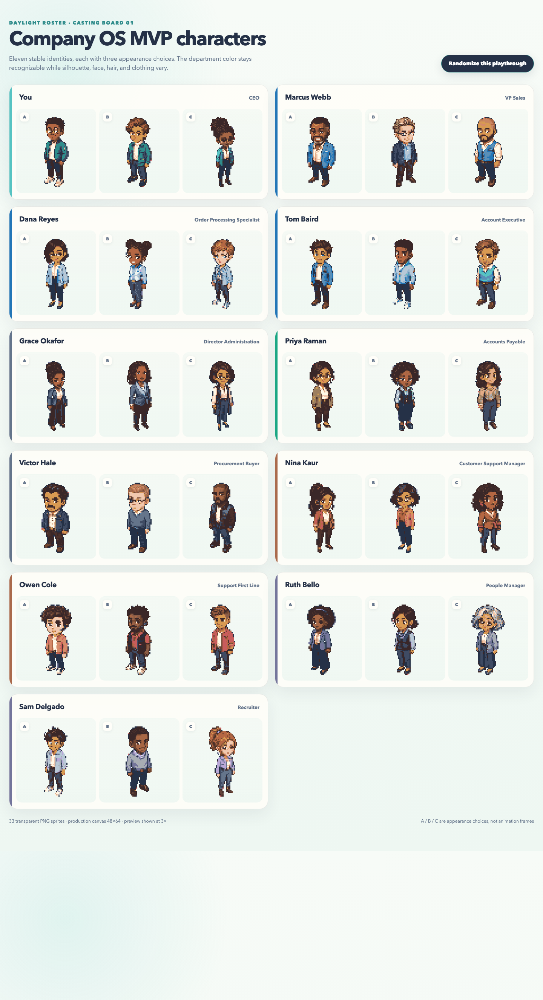
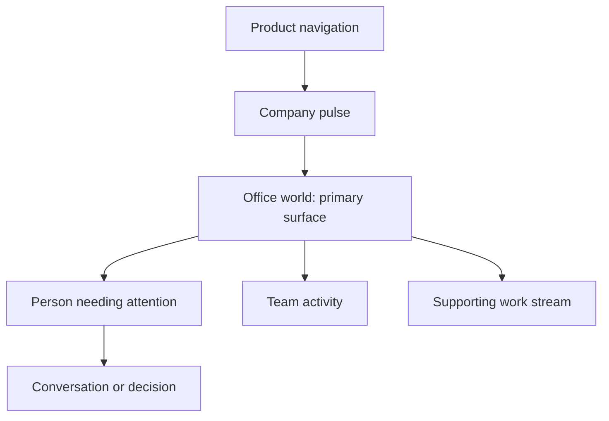

# Company OS Daylight Pixel Visual Redesign - Plan

## Goal Capsule

- **Objective:** Redesign Company OS as a bright, people-first modern pixel workplace across the office and surrounding interface while preserving the existing product behavior.
- **Product authority:** The Product Contract below owns visual hierarchy, palette roles, character scale, and scope; existing product behavior remains authoritative where this plan is silent.
- **Open blockers:** None. Planning may decide rollout order, asset integration, animation timing, and verification tooling without changing the Product Contract.

---

## Product Contract

### Summary

Company OS will present a warm, modern pixel workplace inside a clean professional interface.
People and conversations remain the primary focus, supported by brighter environments, coherent Zhongguose palette roles, and expressive 48×64 map characters.

### Problem Frame

The current product reads as a dark control room or dungeon rather than a living office.
Heavy charcoal architecture, low-value floor colors, and dark overlays flatten department identity and make the simulation feel more severe than collaborative.

The coarse procedural characters also conflict with the product's people-first interaction model.
When faces, hair, clothing, and posture collapse into a few blocks, the people carrying company context feel interchangeable even when the underlying simulation treats them as distinct.

### Key Decisions

- **Redesign the whole product, not only the office.** (session-settled: user-directed — chosen over an office-only refresh: the dark framing and weak hierarchy continue into the surrounding interface.) Governs R1, R10–R13.
- **Use a modern pixel startup identity.** (session-settled: user-directed — chosen over rustic or fantasy framing: the company should feel contemporary while retaining the warmth of a game world.) Governs R2, R4, R10.
- **Make people the first visual focus.** (session-settled: user-directed — chosen over metric-first dashboard emphasis: conversations explain the meaning behind company numbers.) Governs R1, R11, R12.
- **Pair a warm world with a disciplined interface.** (session-settled: user-approved — chosen over uniformly playful pastel styling: environmental charm must not weaken operational clarity.) Governs R2, R3, R10, R11.
- **Use compact 48×64 lead-character sprites.** (session-settled: user-directed — chosen over 32×48 and tall illustration proportions: faces, hair, and outfits remain readable while the office stays dominant.) Governs R5–R9.

#### Approved Character Direction

The MVP casting board covers all 11 visible identities with A/B/C appearance options: 33 candidate sprites in total.
The visualization uses nearest-neighbor enlargement; every tracked candidate PNG retains its validated transparent 48×64 canvas.

The approved information hierarchy is:

### Requirements

**Experience hierarchy and visual language**

- R1. The office and its people must remain the primary visual surface, with metrics and work status presented as supporting context rather than competing focal points.
- R2. The visual identity must feel like a contemporary startup expressed through original pixel art, avoiding dungeon, medieval, rustic-farm, or generic corporate-dashboard framing.
- R3. Product surfaces must use the palette roles below as the default visual authority, with accessible tonal variants allowed when required for readable states.
- R4. References to Pokémon, Stardew Valley, and Gather define quality, warmth, and readability benchmarks only; shipped characters, environments, and interface art must remain original.

| Palette role | Color | Hex | Primary use |
|---|---|---:|---|
| 象牙白 | Ivory white | `#fffef8` | Primary product surfaces |
| 粉白 | Powder white | `#fbf2e3` | Warm floors and quiet regions |
| 月白 | Moon white | `#eef7f2` | Cool cards and office rugs |
| 远天蓝 | Far-sky blue | `#d0dfe6` | Partitions and subdued structure |
| 星蓝 | Star blue | `#93b5cf` | Secondary accents and inactive states |
| 天蓝 | Sky blue | `#1677b3` | Primary action and player emphasis |
| 粉绿 | Powder green | `#83cbac` | Working and active team signals |
| 竹绿 | Bamboo green | `#1ba784` | Positive progress and healthy status |
| 淡桃红 | Pale peach | `#f6cec1` | Warmth, social spaces, and soft emphasis |
| 初桃粉红 | First-peach pink | `#f6dcce` | Meeting and collaboration regions |
| 鲸鱼灰 | Whale gray | `#475164` | Secondary text and furniture structure |
| 鸽蓝 | Dove blue | `#1c2938` | Primary text, outlines, and strong borders |
| Decision amber | Attention amber | `#f2c46b` | The single person or decision needing attention |

**Character system**

- R5. Lead and interaction-critical map characters must render on transparent 48×64 canvases at their native game scale; the 11-person MVP roster must retain three reviewable appearance candidates per identity until final casting.
- R6. Refined map characters must use compact approximately 3.5-head proportions, oversized readable hair silhouettes, short limbs, planted feet, and restrained pixel shading.
- R7. Every refined map character must include the directional idle and walking states required by the existing office movement model.
- R8. Each character identity must remain distinguishable without a name label through a combination of silhouette, hair, skin tone, outfit shape, and one restrained accent or accessory.
- R9. Procedural background coworkers must adopt the same compact body grammar, outline treatment, and palette logic so authored leads do not appear to belong to a different game.
- R9a. A new playthrough may select one A/B/C appearance per named identity from the run seed, but the selected appearance must stay stable within that run and must not affect simulation behavior.

**Environment and interface**

- R10. Office environments must replace heavy dark walls and overlays with light architectural shells, daylight windows, team-specific floor zones, warm wood, plants, rugs, artwork, and recognizable collaboration spaces.
- R11. The surrounding interface must use bright surfaces, restrained borders, compact typography, and clear grouping so operational information stays professional beside the warmer game world.
- R12. The person needing attention must remain the strongest warm semantic accent, while the player remains the strongest cool accent and ordinary working states remain quieter.
- R13. The redesign must preserve existing navigation, actions, metrics, movement, responsive behavior, and data meaning while keeping pixel assets crisp without smoothing.

### Key Flows

- F1. Read the company
  - **Trigger:** The user opens the main company view.
  - **Steps:** The user scans the company pulse, reads the office as the primary surface, and identifies the person or team requiring attention.
  - **Outcome:** The company state is understandable without the metrics overpowering the people who explain it.
  - **Covers:** R1, R11, R12.
- F2. Walk to a person
  - **Trigger:** The user moves through the office toward a coworker.
  - **Steps:** The player shows the correct directional walking state, returns to the matching idle state, and approaches a visually distinct coworker.
  - **Outcome:** Movement feels coherent with the refined art and the coworker's identity remains readable throughout.
  - **Covers:** R5–R9, R13.
- F3. Read across product surfaces
  - **Trigger:** The user moves between the office, supporting work information, and responsive layouts.
  - **Steps:** Visual hierarchy and semantic colors remain consistent while the composition adapts to available space.
  - **Outcome:** The product feels like one visual system rather than a bright game embedded in an unrelated dashboard.
  - **Covers:** R1–R3, R10–R13.

### Acceptance Examples

- AE1. Office hierarchy
  - **Covers R1, R11, R12.**
  - **Given:** The main company view is loaded with metrics, active teams, and one waiting decision.
  - **When:** The view is inspected at its standard desktop size.
  - **Then:** The office and people form the first focal region, the waiting person is unambiguous, and metrics remain legible without becoming the dominant surface.
- AE2. Character movement
  - **Covers R5–R8, R13.**
  - **Given:** A refined character is visible in the office.
  - **When:** The character walks in any direction supported by the current movement model and then stops.
  - **Then:** The appropriate walk and idle states render on a 48×64 canvas without smoothing, clipping, or a change in apparent identity.
- AE3. Mixed authored and procedural cast
  - **Covers R8, R9.**
  - **Given:** Authored lead characters and procedural background coworkers appear in the same room.
  - **When:** The scene is viewed at native game scale.
  - **Then:** Leads carry more identity detail, but every person shares compatible proportions, outlines, palette roles, and visual weight.
- AE4. Responsive composition
  - **Covers R1, R11–R13.**
  - **Given:** The product is viewed across its supported responsive widths.
  - **When:** The attention panel or metrics reposition to fit the viewport.
  - **Then:** the office remains usable, the waiting person remains discoverable, and no control or character becomes obscured.

### Success Criteria

- The casting board contains 33 valid candidates: three appearance options for each of the 11 MVP identities.
- Within each named identity, A/B/C remain recognizable as the same role while differing materially in face, hair, silhouette, clothing construction, or restrained accessories.
- A fixed desktop screenshot preserves the approved warm-world, disciplined-interface hierarchy without a dark vignette or dungeon-like wall mass.
- Existing product controls, metrics, navigation, and movement remain available and retain their current meaning after the redesign.
- Pixel sprites and environment art remain crisp at supported zoom levels and responsive layouts.
- Interface text, controls, and semantic states remain readable against the brighter palette.

### Scope Boundaries

**In scope**

- Product-wide palette, surface, border, typography, and hierarchy changes.
- Office architecture, floor treatment, furniture, plants, art, and collaboration-space styling.
- Refined 48×64 lead characters, compatible procedural coworkers, and movement-state artwork.
- Visual verification across the main office, supporting information surfaces, and responsive layouts.

**Out of scope**

- New gameplay mechanics, simulation rules, data models, metrics, or navigation destinations.
- Gather-style video calling, multiplayer presence, or other new communication features.
- Direct copies, edits, or traced derivatives of third-party game characters and assets.
- Photorealistic, painterly, 3D, or non-pixel visual directions.

### Dependencies and Assumptions

- Existing application behavior and current product plans remain the source of truth for interactions and data meaning.
- The current canvas renderer can display transparent pixel assets at native scale; planning must verify the exact movement-state contract before asset production expands.
- The local directional prototype under `.context/compound-engineering/ce-prototype/2026-08-16-daylight-pixel-office/` is a visual reference, while this Product Contract remains authoritative if the prototype is unavailable.
- Generated character concepts are source material for original production assets, not a requirement to use a particular generation provider in the shipped product.

### Outstanding Questions

**Deferred to Planning**

- Determine the rollout sequence across palette, environment, interface chrome, and character assets.
- Determine animation frame count, timing, and reuse rules within the existing movement model.
- Determine the final A/B/C casting defaults and how the existing run seed selects cosmetic variants.

### Sources and Research

- Existing visual system: `frontend/src/render/palettes.ts`, `frontend/src/render/floor.ts`, `frontend/src/render/sprites.ts`, `frontend/src/ui/shell.css`, and `frontend/src/design/tokens.ts`.
- Approved local prototype: `.context/compound-engineering/ce-prototype/2026-08-16-daylight-pixel-office/01-whole-product-visual-direction/screens/001-daylight-studio.html`.
- Character working assets and scale comparison: `.context/compound-engineering/ce-prototype/2026-08-16-daylight-pixel-office/02-character-fidelity/`.
- Full MVP roster casting sources, prompts, and gallery: `.context/compound-engineering/ce-prototype/2026-08-16-daylight-pixel-office/03-roster-casting/`.
- Approved tracked character references: `docs/assets/company-os-visual-redesign/characters/product-designer-48x64.png`, `docs/assets/company-os-visual-redesign/characters/engineer-48x64.png`, and `docs/assets/company-os-visual-redesign/characters/customer-lead-48x64.png`.
- Tracked MVP casting candidates: `docs/assets/company-os-visual-redesign/roster-characters/` and `docs/assets/company-os-visual-redesign/roster-casting-board.png`.
- Palette authority: [Zhongguose MCP documentation](https://zhongguose.com/ai/docs/mcp).
